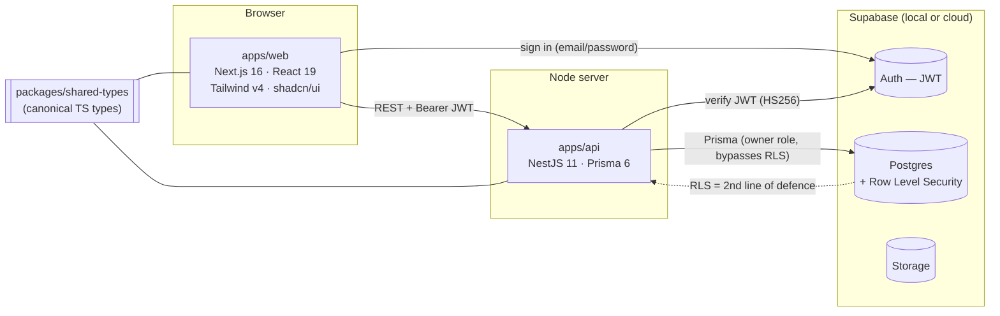

<div align="center">

# TonyAI

**Enterprise Carbon Accounting & ESG Platform for Multi‑Subsidiary Holdings**

Track Scope 1/2/3 emissions across subsidiaries with audit‑ready, tenant‑isolated, compliance‑first data management.

[](https://github.com/tonyaiukco/TonyAI-mono-repo/actions/workflows/ci.yml)

</div>

---

## Table of Contents

- [What is TonyAI?](#what-is-tonyai)
- [Project status](#project-status)
- [Architecture](#architecture)
- [Monorepo layout](#monorepo-layout)
- [The AI subagent team](#the-ai-subagent-team)
- [How it works (request lifecycle)](#how-it-works-request-lifecycle)
- [Security model](#security-model)
- [Getting started](#getting-started)
- [Scripts](#scripts)
- [API reference (current slice)](#api-reference-current-slice)
- [Data model](#data-model)
- [Roles (RBAC)](#roles-rbac)
- [Testing](#testing)
- [Environment variables](#environment-variables)
- [Roadmap](#roadmap)
- [Conventions](#conventions)
- [License](#license)

---

## What is TonyAI?

TonyAI is a **B2B SaaS platform** that lets large holding companies collect, validate, calculate, and report greenhouse‑gas emissions across their subsidiaries and locations. It is built around four ideas:

- **Granular visibility** — a subsidiary × category "tracking matrix" surfaces exactly where data is missing.
- **Audit integrity** — every calculation stores the emission factor and version it used; historic results never change.
- **Tenant isolation** — a user only ever sees the organisation / subsidiaries they are entitled to, enforced in two independent layers.
- **Compliance‑first** — aligned with ISO 14064‑1, GHG Protocol and GRI 305; KVKK/GDPR‑aware data residency.

**Target users:** sustainability officers, ESG consultants, corporate auditors, and executives in multi‑entity groups across the UK, Türkiye and the EU.

---

## Project status

This repository currently delivers **Milestone 0 (foundation)** and the **Milestone 1 vertical slice** — a working end‑to‑end path running entirely on a local machine.

| Area | Status |
| --- | --- |
| Turborepo monorepo (web + api + shared packages) | ✅ |
| Supabase Auth login + route‑protecting middleware | ✅ |
| NestJS API with JWT auth guard + **tenant isolation** | ✅ |
| Subsidiaries CRUD + dashboard KPIs wired to live data | ✅ |
| RBAC (only `super_admin` may mutate) + **audit logging** | ✅ |
| Postgres **Row Level Security** (defense‑in‑depth) | ✅ |
| Prisma schema + migrations + idempotent seed | ✅ |
| Automated tests (61 unit + 2 E2E) | ✅ |
| One-command local bootstrap (`pnpm setup`) | ✅ |
| 7 AI subagents + reusable skills + `CLAUDE.md` rules | ✅ |
| Data Entry UI wired to the live calculation engine (activity value + unit → tCO₂e preview, draft → submit) | ✅ |
| Emissions Analytics wired to a live aggregation endpoint (scope totals, category/subsidiary breakdown, trends) | ✅ |
| Targets & intensity metrics | ⏳ Phase 1 (labelled "not yet available") |
| Reports | ⏳ Phase 1/2 |

**What's proven by tests today:** an `admin` sees all 5 seeded subsidiaries, a `data_entry` user sees only their 2, non‑admins are blocked from writes (HTTP 403), unauthenticated requests are rejected (HTTP 401), and every mutation writes an immutable `audit_log` row — verified at the API layer **and** the database (RLS) layer.

---

## Architecture

TonyAI uses a **headless architecture**: the frontend and backend are fully decoupled and communicate over a versioned JSON API. This keeps the door open for future clients (e.g. a mobile app) without touching the backend. All code lives in a single **Turborepo** so that frontend and backend share one source of truth for types.



### Tech stack

| Layer | Technology |
| --- | --- |
| **Frontend** | Next.js 16 (App Router), React 19, TypeScript, Tailwind CSS v4, shadcn/ui, Recharts, Zustand, `@supabase/ssr` |
| **Backend** | NestJS 11, Prisma 6 ORM, `class-validator`, `jsonwebtoken` (Supabase JWT verification) |
| **Database / Auth / Storage** | Supabase (PostgreSQL + RLS, Auth, Storage) |
| **Shared** | `@tonyai/shared-types` — domain + API contracts used by both apps |
| **Tooling** | Turborepo, pnpm workspaces, Vitest, Playwright, GitHub Actions |
| **Planned** | Resend (email), Puppeteer / exceljs (reports), Sentry, Python/FastAPI (Phase 2 analytics) |

---

## Monorepo layout

```
TonyAI-mono-repo/
├── apps/
│   ├── web/                 # Next.js frontend
│   │   ├── app/             # routes: /login, / (dashboard), /subsidiaries, /emissions, …
│   │   ├── components/      # shadcn/ui + feature components
│   │   └── lib/             # api client, supabase client, zustand store, types
│   └── api/                 # NestJS backend
│       └── src/
│           ├── auth/        # SupabaseAuthGuard, /me, decorators
│           ├── subsidiaries/# CRUD + tenant-scoped service
│           ├── kpi/         # dashboard summary
│           └── prisma/      # PrismaService
├── packages/
│   ├── shared-types/        # single source of truth for TS types
│   └── db/                  # Prisma schema, migrations, seed
├── e2e/                     # Playwright smoke tests
├── docs/                    # product + technical specs (md_docs, tech_docs)
├── .claude/
│   ├── agents/              # the 7-subagent development team
│   └── skills/              # reusable procedures (tenant-api-module, rls-for-table)
├── .github/workflows/       # CI
├── CLAUDE.md                # project rules, auto-loaded by Claude Code
└── README.md
```

---

## The AI subagent team

TonyAI is built by a **simulated software team of specialised AI subagents**, each owning a clear slice of the codebase. A human Tech Lead orchestrates them, splits work, reviews output and integrates it. The definitions live in [`.claude/agents/`](.claude/agents) and are usable directly from Claude Code.

| Subagent | Role | Owns |
| --- | --- | --- |
| **architect** | Data model, API contracts, calculation‑engine design | `packages/db` (Prisma schema), `packages/shared-types` |
| **backend-integrator** | NestJS endpoints & services, frontend↔API wiring | `apps/api/src`, `apps/web/lib/api.ts` |
| **frontend-engineer** | UI, auth flow, state, wiring pages to live data | `apps/web` |
| **security-rls** | RBAC, RLS policies, tenant isolation, KVKK/GDPR, audit immutability | `apps/api` guards, `packages/db` RLS |
| **data-factors** | Emission‑factor library (DEFRA/Türkiye/AIB), versioning, unit normalization, methodology | `packages/db` seed |
| **qa-auditor** | Unit + E2E tests, RBAC/tenant tests, ISO/GHG conformance | `apps/**/test`, `e2e/` |
| **devops-cloud** | Monorepo, Supabase, Docker, CI/CD, cloud deploy | repo root, `supabase/`, `.github/` |

> Each definition encodes the agent's scope, principles, a Definition of Done, and explicit "don't do without asking" boundaries — e.g. `security-rls` must never weaken a policy, `frontend-engineer` must never re‑enable `ignoreBuildErrors`.

### Skills

Recurring procedures are packaged as **skills** in [`.claude/skills/`](.claude/skills) — progressively disclosed playbooks that capture the canonical "right way" so it never has to be re-derived:

| Skill | What it does |
| --- | --- |
| **tenant-api-module** | Scaffold a new tenant-scoped, RBAC-guarded, audit-logged NestJS resource (+ DTOs, shared types, Vitest spec) |
| **rls-for-table** | Add Supabase RLS to a new table (enable-not-force, `auth.uid()` policies, shadow-DB shim, verification) |

The relevant subagents (`backend-integrator`, `architect`, `security-rls`) have `Skill` access and invoke these automatically.

---

## How it works (request lifecycle)

1. The user signs in on **`/login`**; `@supabase/ssr` stores the session (a JWT) in cookies.
2. **`middleware.ts`** protects every route — unauthenticated users are redirected to `/login`.
3. The frontend calls the API through **`apps/web/lib/api.ts`**, attaching `Authorization: Bearer <access_token>`.
4. The NestJS **`SupabaseAuthGuard`** verifies the JWT (HS256, `SUPABASE_JWT_SECRET`), loads the user's `Profile`, and computes **`accessibleSubsidiaryIds`** (a `data_entry` user is limited to explicit access rows; other roles get organisation‑wide visibility).
5. Services scope **every query** to that set; only `super_admin` may create/update/delete; each mutation writes an `audit_log` row.
6. **Row Level Security** in Postgres independently denies cross‑tenant reads, so even a direct database/PostgREST client is contained.

---

## Security model

Tenant isolation is enforced in **two independent layers** — neither replaces the other:

| Layer | Where | Purpose |
| --- | --- | --- |
| **Primary** | NestJS guards/services (`accessibleSubsidiaryIds`) | Application‑level enforcement on every query |
| **Defense‑in‑depth** | Supabase **RLS** policies (`auth.uid()`‑keyed) | Database denies cross‑tenant access even if the app layer is bypassed |

Additional guarantees:

- **RBAC** — writes require `super_admin`; reads are tenant‑scoped for everyone.
- **Audit immutability** — `audit_log` has SELECT‑only policies (super_admin) and **no** UPDATE/DELETE; it is append‑only.
- **No secrets in git** — all `.env*` files are git‑ignored; only `.env.example` templates are committed.
- The backend connects as the Postgres **owner role**, which bypasses RLS by design; the seeded service path is therefore unaffected while client‑side access stays locked down.

---

## Getting started

### Prerequisites

- **Node ≥ 20**, **pnpm**, **Docker Desktop** (running), **Supabase CLI**

### First‑time setup

```bash
# Option A — one command (recommended). Idempotent; safe to re-run anytime.
pnpm setup          # deps -> Supabase up -> sync .env -> migrate -> generate -> seed
pnpm dev            # web :3000 · api :3001

# ---------------------------------------------------------------------------
# Option B — manual, step by step:

# 1. Install dependencies
pnpm install

# 2. Start local Supabase (Postgres, Auth, Storage in Docker)
supabase start

# 3. (If the printed keys differ from the defaults) copy them into env files:
#    supabase status -o env
#      apps/web/.env.local  -> NEXT_PUBLIC_SUPABASE_ANON_KEY
#      apps/api/.env        -> SUPABASE_JWT_SECRET, SUPABASE_SERVICE_ROLE_KEY
#      packages/db/.env     -> SUPABASE_SERVICE_ROLE_KEY
#    (copy each app's .env.example to the real file first)

# 4. Create the schema and seed demo data
pnpm db:migrate     # applies Prisma migrations (incl. RLS policies)
pnpm db:seed        # 1 org, 5 subsidiaries, 2 users, factors + 96 demo Scope 1&2 activity records

# 5. Run everything
pnpm dev            # web -> http://localhost:3000   api -> http://localhost:3001/api/v1
```

### Seed users

| Email | Password | Role | Sees |
| --- | --- | --- | --- |
| `admin@tonyai.local` | `TonyAI!2026` | `super_admin` | all 5 subsidiaries |
| `entry@tonyai.local` | `TonyAI!2026` | `data_entry` | 2 subsidiaries (tenant‑isolation demo) |

---

## Troubleshooting

| Symptom | Fix |
| --- | --- |
| `Docker daemon is not running` | Start Docker Desktop, wait until ready, re‑run `pnpm setup`. |
| `supabase: command not found` | Install the Supabase CLI (`brew install supabase/tap/supabase`). |
| Port `3000` / `3001` / `54321` already in use | Stop the other process (or `supabase stop`) and re‑run. |
| `401 Invalid or expired token` after restarting Supabase | Keys rotated — re‑run `pnpm setup` to re‑sync the `.env` files. |
| Login works but no data shows | Make sure the DB was seeded (`pnpm db:seed`); or `pnpm db:reset`. |
| Stale schema / weird data | `pnpm db:reset` (drops, re‑migrates, re‑seeds). |
| `pnpm: command not found` | `npm i -g pnpm` (or enable via Corepack). |

---

## Scripts

Run from the repo root (Turborepo fans out to each package):

| Script | Description |
| --- | --- |
| `pnpm setup` | One‑command local bootstrap (deps, Supabase, `.env` sync, migrate, seed) |
| `pnpm dev` | Run web + api in watch mode |
| `pnpm build` | Build all packages |
| `pnpm typecheck` | Type‑check the whole repo |
| `pnpm test` | Unit tests (Vitest) |
| `pnpm e2e` | Playwright smoke tests (requires Supabase running) |
| `pnpm db:migrate` | `prisma migrate dev` |
| `pnpm db:deploy` | Apply committed migrations (`prisma migrate deploy`) |
| `pnpm db:seed` | Seed demo data |
| `pnpm db:reset` | Drop, re‑migrate and re‑seed |

---

## API reference (current slice)

Base URL: `http://localhost:3001/api/v1` · all routes (except `/health`) require `Authorization: Bearer <jwt>`.

| Method | Path | Description | Auth |
| --- | --- | --- | --- |
| `GET` | `/health` | Liveness check | public |
| `GET` | `/me` | Current user + role + `accessibleSubsidiaryIds` | any |
| `GET` | `/subsidiaries` | List (tenant‑scoped) | any |
| `GET` | `/subsidiaries/:id` | Get one (404 if outside access set) | any |
| `POST` | `/subsidiaries` | Create | `super_admin` |
| `PATCH` | `/subsidiaries/:id` | Update | `super_admin` |
| `DELETE` | `/subsidiaries/:id` | Delete | `super_admin` |
| `GET` | `/kpi` | Dashboard summary (totals + geography breakdown) | any |
| `POST` | `/calculations/preview` | Live emissions preview: normalises the unit, applies the matching factor, returns `tCo2e` + factor snapshot | any |
| `GET` | `/factors` | List emission factors (optional `?category=&geographyCode=&year=`) | any |
| `GET` | `/activity-records` | List (tenant‑scoped; filters `?subsidiaryId=&year=&period=&category=&status=`) | any |
| `GET` | `/activity-records/:id` | Get one (404 if outside access set) | any |
| `POST` | `/activity-records` | Create (status `draft`; stores an immutable calc snapshot) | `data_entry` / `consultant` / `super_admin` |
| `PATCH` | `/activity-records/:id` | Update (only while `draft`/`rejected`; recomputes the snapshot; author‑or‑`super_admin`) | `data_entry` / `consultant` / `super_admin` |
| `DELETE` | `/activity-records/:id` | Delete (only while `draft`/`rejected`; author‑or‑`super_admin`) | `data_entry` / `consultant` / `super_admin` |
| `POST` | `/activity-records/:id/submit` | `draft` → `submitted` | any accessor |
| `POST` | `/activity-records/:id/approve` | `submitted`/`under_review` → `approved` | `consultant` / `super_admin` |
| `POST` | `/activity-records/:id/reject` | `submitted`/`under_review` → `rejected` (body `{ varianceReason }`) | `consultant` / `super_admin` |
| `GET` | `/emissions/summary` | Tenant‑scoped analytics aggregation from committed records: scope totals, category & subsidiary breakdown, monthly/quarterly/yearly trends (filters `?subsidiaryId=&year=&scope=&category=`) | any |

Activity-record workflow: `draft → submitted → under_review → approved | rejected`. `approved` and `locked` records are immutable; `rejected` records can be edited and re‑submitted. The `calculation` snapshot is written at create/update time and never recomputed on read, so historic results survive factor-library changes. Every transition writes an `audit_log` row (`entity: 'activity_record'`).

---

## Data model

Postgres `public` schema (managed by Prisma); Supabase owns the `auth` schema. `Profile.id` mirrors `auth.users.id`.

| Table | Purpose |
| --- | --- |
| `profiles` | App user: role, organisation, locale/theme (1:1 with an auth user) |
| `organisations` | The holding company (top of the hierarchy) |
| `subsidiaries` | Companies within an organisation (geography, sector, status, included scopes) |
| `locations` | Facilities within a subsidiary |
| `user_subsidiary_access` | Which subsidiaries a `data_entry` user may access (tenant‑isolation source) |
| `audit_log` | Append‑only record of every mutation (`action`, `entity`, `entityId`, `diff`) |
| `emission_factors` | Reference data (not tenant‑scoped): Scope 1 & 2 factors by category / geography / reporting year / version, with `source` + `methodology` for traceability |
| `activity_records` | Core data‑entry unit (child of `subsidiaries`): one activity input per (subsidiary, period, category) with a derived `scope`, an immutable `calculation` snapshot, and a `status` workflow (`draft` → `submitted` → `under_review` → `approved`/`rejected`/`locked`) |

---

## Roles (RBAC)

| Role | Capability |
| --- | --- |
| `super_admin` | Full control; manage subsidiaries, factors, approvals |
| `consultant` | Organisation‑wide read + review/flag |
| `data_entry` | Limited to assigned subsidiaries; submit activity data |
| `executive_viewer` | Read‑only dashboards and reports |

---

## Testing

- **Unit (Vitest, DB‑free):** 21 tests in `apps/api` covering tenant scoping, RBAC, audit writes and KPI aggregation with a mocked Prisma client. Run `pnpm test`.
- **E2E (Playwright):** `e2e/smoke.spec.ts` logs in as `admin` (dashboard KPI → subsidiaries create/delete) and as `data_entry` (asserts only 2 rows visible). Auto‑starts the api + web servers; Supabase must be running. Run `pnpm e2e`.

CI (`.github/workflows/ci.yml`) runs install → Prisma generate → typecheck → build → unit tests on every push/PR. E2E is intentionally kept out of the default CI pipeline.

---

## Environment variables

Templates live in each package's `.env.example`. Never commit real `.env*` files.

| File | Key | Used for |
| --- | --- | --- |
| `apps/web/.env.local` | `NEXT_PUBLIC_SUPABASE_URL`, `NEXT_PUBLIC_SUPABASE_ANON_KEY`, `NEXT_PUBLIC_API_BASE_URL` | Browser Supabase client + API base |
| `apps/api/.env` | `SUPABASE_JWT_SECRET`, `SUPABASE_SERVICE_ROLE_KEY`, `DATABASE_URL`, `PORT`, `WEB_ORIGIN` | JWT verification, CORS, server |
| `packages/db/.env` | `DATABASE_URL`, `DIRECT_URL`, `SUPABASE_SERVICE_ROLE_KEY` | Prisma + seed |

---

## Roadmap

- **Milestone 1 — vertical slice** ✅ *(this release)*: auth, tenant isolation, subsidiaries CRUD, dashboard KPIs, RLS, tests.
- **Phase 1 — Core MVP (Scope 1 & 2):** Data Entry workspace, calculation engine + emission‑factor seeding (DEFRA/Türkiye), draft→submit workflow, evidence upload (Supabase Storage), period locking, anomaly detection, Emissions Analytics; cloud staging deploy.
- **Phase 2 — Advanced:** Scope 3 + supplier management, report generation (PDF/Excel), bulk upload, email notifications (Resend), Sentry, i18n (TR/EN), and a Python/FastAPI analytics microservice.

---

## Conventions

- **Types:** never duplicate a domain type — add it to `@tonyai/shared-types` and import from there (`@/lib/types` on the web side re‑exports it).
- **Type safety:** `typescript.ignoreBuildErrors` stays **off**; fix types rather than suppress them.
- **Data access:** pages call the API only through `apps/web/lib/api.ts`; the backend persists only via Prisma (`@tonyai/db`).
- **Project rules:** [`CLAUDE.md`](CLAUDE.md) (auto-loaded by Claude Code) is the source of truth for architecture, security and workflow rules — including that **all project artifacts are written in English** and that this README is kept current with every change.
- **Branching & commits:** feature branches → PR into `main`; CI must be green; conventional-commit messages.

---

## License

Proprietary — © TonyAI. All rights reserved. Not licensed for redistribution.
