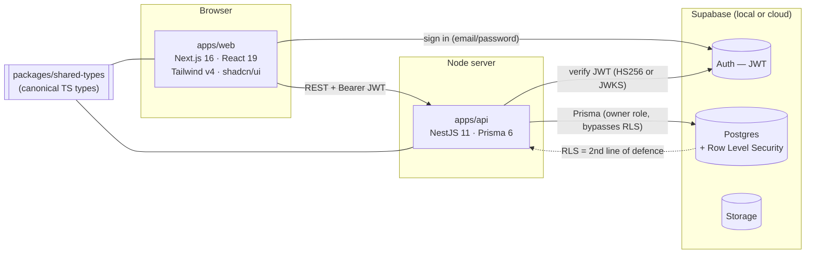

<div align="center">

# TonyAI

**Enterprise Carbon Accounting & ESG Platform for Multi‑Subsidiary Holdings**

Track Scope 1/2/3 emissions across subsidiaries with audit‑ready, tenant‑isolated, compliance‑first data management.

[](https://github.com/tonyaiukco/TonyAI-mono-repo/actions/workflows/ci.yml)

</div>

---

## Table of Contents

- [What is TonyAI?](#what-is-tonyai)
- [Project status](#project-status)
- [Architecture](#architecture)
- [Monorepo layout](#monorepo-layout)
- [The AI subagent team](#the-ai-subagent-team)
- [How it works (request lifecycle)](#how-it-works-request-lifecycle)
- [Security model](#security-model)
- [Getting started](#getting-started)
- [Troubleshooting](#troubleshooting)
- [Scripts](#scripts)
- [API reference (current slice)](#api-reference-current-slice)
- [Data model](#data-model)
- [Roles (RBAC)](#roles-rbac)
- [Observability](#observability)
- [Testing](#testing)
- [Environment variables](#environment-variables)
- [Roadmap](#roadmap)
- [Conventions](#conventions)
- [License](#license)

---

## What is TonyAI?

TonyAI is a **B2B SaaS platform** that lets large holding companies collect, validate, calculate, and report greenhouse‑gas emissions across their subsidiaries and locations. It is built around four ideas:

- **Granular visibility** — a subsidiary × category "tracking matrix" surfaces exactly where data is missing.
- **Audit integrity** — every calculation stores the emission factor and version it used; historic results never change.
- **Tenant isolation** — a user only ever sees the organisation / subsidiaries they are entitled to, enforced in two independent layers.
- **Compliance‑first** — aligned with ISO 14064‑1, GHG Protocol and GRI 305; KVKK/GDPR‑aware data residency.

**Target users:** sustainability officers, ESG consultants, corporate auditors, and executives in multi‑entity groups across the UK, Türkiye and the EU.

---

## Project status

**Phase 1 (Scope 1 & 2 core MVP) is complete** and running end‑to‑end on a local machine; UAT round 1 is closed and **Phase 3** is active — WP7 (audit viewer, reviewer UI, subsidiary edit), WP15 (UAT quick wins) and WP16 (locations in the subsidiary flow) have all shipped. Phase 2 (staging on Azure) is waiting on the cloud credit; its cloud‑independent prep is done. The checkbox‑level plan lives in [`docs/roadmap_docs/project-status.md`](docs/roadmap_docs/project-status.md).

| Area | Status |
| --- | --- |
| Turborepo monorepo (web + api + shared packages) | ✅ |
| Supabase Auth login + route‑protecting proxy (Next.js `proxy` convention) | ✅ |
| NestJS API with JWT auth guard + **tenant isolation** | ✅ |
| Subsidiaries CRUD + dashboard KPIs wired to live data | ✅ |
| Operational locations (Holding › Subsidiary › Location) — tenant‑scoped CRUD, managed in place on the subsidiary's own page or from the register's drawer, and creatable **inline with the subsidiary**; records can target a location, which drives the factor geography (FR §5.2) | ✅ |
| Evidence upload (Supabase Storage) — files linked to records, required before submit for billed categories (FR §4.1) | ✅ |
| Period locking (FR §4.2) — super_admin closes a reporting period; locked periods reject new/edited/submitted records | ✅ |
| RBAC — org structure (subsidiaries, locations, factors, approvals) is `super_admin`‑only; `data_entry` writes activity data for its own subsidiaries; `consultant` is review‑only — + **audit logging** on every mutation | ✅ |
| Destructive operations **refuse instead of cascading** — a subsidiary or location holding committed data returns 409 with counts and named blockers; record‑free locations go with their subsidiary, one audit row each | ✅ |
| Evidence files are reclaimed when their rows go (record delete, `db:reset`, E2E teardown, `pnpm evidence:reclaim`) — a retention obligation, not disk housekeeping | ✅ |
| Postgres **Row Level Security** (defense‑in‑depth) | ✅ |
| Prisma schema + migrations + idempotent seed | ✅ |
| Automated tests (551 unit — 476 api + 27 shared-types + 48 web — plus 77 E2E) + live RLS containment probes (30) | ✅ |
| A category with **no emission factor can still be recorded**, and every surface says so — the entry stores an explicit "not calculated" snapshot instead of a number, and contributes to no total (WP17; today only Water, which is tracked by invoice while no authoritative water factor exists) | ✅ |
| Reporting years 2015–2026 (WP15/DE-9); the demo dataset and factor library live in one `DEMO_YEAR`, and any year without factors says so instead of failing silently | ✅ |
| One-command local bootstrap (`pnpm setup`) | ✅ |
| 7 AI subagents + reusable skills + `CLAUDE.md` rules | ✅ |
| Data Entry UI wired to the live calculation engine (activity value + unit → tCO₂e preview, draft → submit), with a **collection-status panel** saying whether the subsidiary's year is actually finished — how many invoices it needs, how many are keyed in, how many anyone has approved (WP17) | ✅ |
| A record can be **re-attributed** between reporting entities — moving a whole-company entry onto a site (or back) edits the row and recalculates its factor for the new geography, instead of leaving a second row that double-counts the month (WP18) | ✅ |
| Emissions Analytics wired to a live aggregation endpoint (scope totals, category/subsidiary breakdown, trends) | ✅ |
| Home dashboard Emissions Overview + tracking matrix (FR §2 red/yellow/green) on live data | ✅ |
| Targets & intensity (WP5) — reduction targets with live progress + per-year intensity denominators | ✅ |
| Reports (WP6) — audit-ready PDF (Puppeteer) + Excel/CSV export, year+subsidiary scoped (FR §5.3 partial), audited generation | ✅ |
| Audit-trail viewer (WP7) — read-only `/audit`, tenant-scoped and paginated, showing each actor's role **as recorded at the time** | ✅ |
| Review queue (WP7) — `/review` turns the submit → review → approve/reject API into a screen: evidence and factor provenance in the detail sheet, rejection reason returned to the submitter | ✅ |
| Subsidiary control panel at `/subsidiaries/[id]` (WP16) — detail, reporting contact, locations managed in place, and a dependents card that explains a refused delete in the API's own words. The geography change is confirmed and states what does **not** move (committed records keep their factor snapshot) | ✅ |
| Dashboard matrix drill-in (WP7) — a cell opens Data Entry for that subsidiary **and** category, reopening the existing record when there is one; the grid is scoped to one reporting year | ✅ |

**What's proven by tests today:** an `admin` sees all 5 seeded subsidiaries, a `data_entry` user sees only their 2, non‑admins are blocked from writes (HTTP 403), unauthenticated requests are rejected (HTTP 401), and every mutation writes an immutable `audit_log` row — verified at the API layer **and** the database (RLS) layer.

---

## Architecture

TonyAI uses a **headless architecture**: the frontend and backend are fully decoupled and communicate over a versioned JSON API. This keeps the door open for future clients (e.g. a mobile app) without touching the backend. All code lives in a single **Turborepo** so that frontend and backend share one source of truth for types.


```mermaid
flowchart LR
  subgraph Browser
    Web["apps/web<br/>Next.js 16 · React 19<br/>Tailwind v4 · shadcn/ui"]
  end

  subgraph "Node server"
    API["apps/api<br/>NestJS 11 · Prisma 6"]
  end

  subgraph Supabase["Supabase (local or cloud)"]
    Auth[("Auth — JWT")]
    DB[("Postgres<br/>+ Row Level Security")]
    Storage[("Storage")]
  end

  Shared[["packages/shared-types<br/>(canonical TS types)"]]

  Web -- "sign in (email/password)" --> Auth
  Web -- "REST + Bearer JWT" --> API
  API -- "verify JWT (HS256 or JWKS)" --> Auth
  API -- "Prisma (owner role, bypasses RLS)" --> DB
  DB -. "RLS = 2nd line of defence" .-> API
  Shared --- Web
  Shared --- API
```

### Tech stack

| Layer | Technology |
| --- | --- |
| **Frontend** | Next.js 16 (App Router), React 19, TypeScript, Tailwind CSS v4, shadcn/ui, Recharts, Zustand, `@supabase/ssr` |
| **Backend** | NestJS 11, Prisma 6 ORM, `class-validator`, `jose` (Supabase JWT verification — HS256 + JWKS) |
| **Database / Auth / Storage** | Supabase (PostgreSQL + RLS, Auth, Storage) |
| **Shared** | `@tonyai/shared-types` — domain + API contracts used by both apps |
| **Tooling** | Turborepo, pnpm workspaces, Vitest, Playwright, GitHub Actions |
| **Reports** | Puppeteer (branded PDF), exceljs (multi‑sheet Excel), CSV |
| **Planned** | Azure Container Apps + ACR + Key Vault (staging/prod hosting, Phase 2), Resend (email), Sentry, Python/FastAPI (later phases) |

---

## Monorepo layout

```
TonyAI-mono-repo/
├── apps/
│   ├── web/                 # Next.js frontend
│   │   ├── app/             # /login · / (dashboard) · /subsidiaries · /subsidiaries/[id]
│   │   │                    # /data-entry · /emissions · /review · /audit · /reports
│   │   ├── components/      # shadcn/ui + feature components
│   │   └── lib/             # api client, supabase client, zustand store, types
│   └── api/                 # NestJS backend
│       └── src/
│           ├── auth/            # SupabaseAuthGuard, token verifier, /me, decorators
│           ├── subsidiaries/    # CRUD + summary + delete guards (tenant-scoped)
│           ├── locations/       # CRUD + the shared writer the nested create reuses
│           ├── activity-records/# lifecycle, gates, anomaly detection
│           ├── calculations/    # factor resolution + unit normalization
│           ├── evidence/ storage/  # upload-through-API, signed URLs, blob reclaim
│           ├── emissions/ kpi/ targets/ intensity/  # aggregation + goals
│           ├── period-locks/ reports/ audit/        # closing, exports, trail
│           ├── observability/   # JSON logs, request context, exception filter
│           ├── common/          # shared pipes/transforms
│           └── prisma/          # PrismaService
├── packages/
│   ├── shared-types/        # single source of truth for TS types
│   └── db/                  # Prisma schema, migrations, seed
├── e2e/                     # Playwright E2E (demo flow, gates, RBAC) + shared helpers/fixtures
├── docs/                    # product + technical specs (md_docs, tech_docs) + status log (roadmap_docs)
├── .claude/
│   ├── agents/              # the 7-subagent development team
│   └── skills/              # reusable procedures (tenant-api-module, rls-for-table)
├── .github/workflows/       # CI
├── CLAUDE.md                # project rules, auto-loaded by Claude Code
└── README.md
```

---

## The AI subagent team

TonyAI is built by a **simulated software team of specialised AI subagents**, each owning a clear slice of the codebase. A human Tech Lead orchestrates them, splits work, reviews output and integrates it. The definitions live in [`.claude/agents/`](.claude/agents) and are usable directly from Claude Code.

| Subagent | Role | Owns |
| --- | --- | --- |
| **architect** | Data model, API contracts, calculation‑engine design | `packages/db` (Prisma schema), `packages/shared-types` |
| **backend-integrator** | NestJS endpoints & services, frontend↔API wiring | `apps/api/src`, `apps/web/lib/api.ts` |
| **frontend-engineer** | UI, auth flow, state, wiring pages to live data | `apps/web` |
| **security-rls** | RBAC, RLS policies, tenant isolation, KVKK/GDPR, audit immutability | `apps/api` guards, `packages/db` RLS |
| **data-factors** | Emission‑factor library (DEFRA/Türkiye/AIB), versioning, unit normalization, methodology | `packages/db` seed |
| **qa-auditor** | Unit + E2E tests, RBAC/tenant tests, ISO/GHG conformance | `apps/**/test`, `e2e/` |
| **devops-cloud** | Monorepo, Supabase, Docker, CI/CD, cloud deploy | repo root, `supabase/`, `.github/` |

> Each definition encodes the agent's scope, principles, a Definition of Done, and explicit "don't do without asking" boundaries — e.g. `security-rls` must never weaken a policy, `frontend-engineer` must never re‑enable `ignoreBuildErrors`.

### Skills

Recurring procedures are packaged as **skills** in [`.claude/skills/`](.claude/skills) — progressively disclosed playbooks that capture the canonical "right way" so it never has to be re-derived:

| Skill | What it does |
| --- | --- |
| **tenant-api-module** | Scaffold a new tenant-scoped, RBAC-guarded, audit-logged NestJS resource (+ DTOs, shared types, Vitest spec) |
| **aggregation-endpoint** | Add a server-side rollup endpoint (the status/total math lives in the API, never in the browser) |
| **rls-for-table** | Add Supabase RLS to a new table (enable-not-force, `auth.uid()` policies, shadow-DB shim, verification) |
| **wire-page** | Wire a page to live API data with real loading / empty / error (incl. 401/403) states |
| **supabase-storage** | Add a private-bucket file capability: upload through the API, signed-URL download, RLS, reclaim on delete |
| **workflow-gate** | Add a lifecycle gate (status/lock/authorship) that refuses consistently across every affected route |
| **e2e-flow** | Add a Playwright E2E spec or an RLS/API probe against the running local stack (shared login / API-token / safe-period / evidence-upload / teardown helpers) |
| **report-generation** | Add a server-generated, tenant-scoped file artifact (PDF via Puppeteer / Excel / CSV) streamed as an audited download |

The relevant subagents (`backend-integrator`, `architect`, `security-rls`) have `Skill` access and invoke these automatically.

---

## How it works (request lifecycle)

1. The user signs in on **`/login`**; `@supabase/ssr` stores the session (a JWT) in cookies.
2. **`proxy.ts`** protects every route — unauthenticated users are redirected to `/login`. (Next.js 16 renamed the `middleware` file convention to `proxy`; same behaviour.)
3. The frontend calls the API through **`apps/web/lib/api.ts`**, attaching `Authorization: Bearer <access_token>`.
4. The NestJS **`SupabaseAuthGuard`** verifies the JWT (shared HS256 secret or asymmetric via JWKS — see Security model), loads the user's `Profile`, and computes **`accessibleSubsidiaryIds`** (a `data_entry` user is limited to explicit access rows; other roles get organisation‑wide visibility).
5. Services scope **every query** to that set. Write authority splits by what is being written: **organisation structure** (subsidiaries, locations, period locks, targets, denominators) is `super_admin`‑only, **activity data + evidence** is `data_entry` or `super_admin`, **review/reject** is `consultant` or `super_admin`, and **approve** is `super_admin` alone. Each mutation writes an `audit_log` row.
6. **Row Level Security** in Postgres independently denies cross‑tenant reads, so even a direct database/PostgREST client is contained.

---

## Security model

Tenant isolation is enforced in **two independent layers** — neither replaces the other:

| Layer | Where | Purpose |
| --- | --- | --- |
| **Primary** | NestJS guards/services (`accessibleSubsidiaryIds`) | Application‑level enforcement on every query |
| **Defense‑in‑depth** | Supabase **RLS** policies (`auth.uid()`‑keyed) | Database denies cross‑tenant access even if the app layer is bypassed |

Additional guarantees:

- **Token verification** — Supabase access tokens are accepted under both signing schemes: the legacy shared **HS256** secret and **asymmetric** keys (ES256/RS256) fetched from the project's JWKS. The key material fixes the algorithm allow‑list on each path, so a token can never downgrade a public key into an HMAC secret, and `alg: none` matches neither path. Tokens must carry `aud: authenticated`, `sub` and `exp`, which is what keeps the anon/service‑role keys (JWTs signed with the same secret) from being replayed as user tokens. `SUPABASE_JWT_SCHEME` pins the accepted scheme; a boot-time check **refuses to start** with an unpinned scheme or the public demo secret. That check is on by default and is relaxed only by an explicit `ALLOW_INSECURE_LOCAL_AUTH=true` **together with** a loopback `SUPABASE_URL` — deliberately not keyed on `NODE_ENV`, since the container image sets it locally and a plain `node dist/main.js` deployment sets nothing, so a copied `.env` pointed at a real project always fails closed.
- **RBAC** — reads are tenant‑scoped for everyone; writes are split by object, not blanket‑`super_admin` (see the request lifecycle above and the Roles table below). The one rule that never bends: **only `super_admin` approves**, and only `super_admin` mutates organisation structure.
- **Audit immutability** — `audit_log` has SELECT‑only policies (super_admin) and **no** UPDATE/DELETE; it is append‑only.
- **No secrets in git** — all `.env*` files are git‑ignored; only `.env.example` templates are committed.
- The backend connects as the Postgres **owner role**, which bypasses RLS by design; the seeded service path is therefore unaffected while client‑side access stays locked down.

---

## Getting started

### Prerequisites

- **Node ≥ 20**, **pnpm** (enable Corepack so the pinned version is used: `corepack enable`), **Docker Desktop** (running), **Supabase CLI ≥ 2.0** (`brew install supabase/tap/supabase`)

`pnpm setup` enforces the CLI floor and finishes with a login smoke check that prints how your project signs tokens (`HS256` shared secret or asymmetric via JWKS) — both are supported, so a newer CLI is fine.

### First‑time setup

```bash
# Option A — one command (recommended). Idempotent; safe to re-run anytime.
pnpm setup          # deps -> Supabase up -> sync .env -> migrate -> generate -> seed
pnpm dev            # web :3000 · api :3001

# ---------------------------------------------------------------------------
# Option B — manual, step by step:

# 1. Install dependencies
pnpm install

# 2. Start local Supabase (Postgres, Auth, Storage in Docker)
supabase start

# 3. (If the printed keys differ from the defaults) copy them into env files:
#    supabase status -o env
#      apps/web/.env.local  -> NEXT_PUBLIC_SUPABASE_ANON_KEY
#      apps/api/.env        -> SUPABASE_JWT_SECRET, SUPABASE_SERVICE_ROLE_KEY
#      packages/db/.env     -> SUPABASE_SERVICE_ROLE_KEY
#    (copy each app's .env.example to the real file first)

# 4. Create the schema and seed demo data
pnpm db:migrate     # applies Prisma migrations (incl. RLS policies)
pnpm db:seed        # 1 org, 5 subsidiaries, 8 locations, 3 users, demo factors for DEMO_YEAR (2026)
                    # + 102 approved Scope 1&2 records (96 subsidiary-level monthly, 6 location-level),
                    # one demo evidence file each, 3 targets + 10 intensity denominators

# 5. Run everything
pnpm dev            # web -> http://localhost:3000   api -> http://localhost:3001/api/v1
```

### Seed users

| Email | Password | Role | Sees |
| --- | --- | --- | --- |
| `admin@tonyai.local` | `TonyAI!2026` | `super_admin` | all 5 subsidiaries |
| `entry@tonyai.local` | `TonyAI!2026` | `data_entry` | 2 subsidiaries (tenant‑isolation demo) |
| `review@tonyai.local` | `TonyAI!2026` | `consultant` | organisation‑wide read; review/reject only (cannot enter, edit, submit or approve) |

---

## Troubleshooting

| Symptom | Fix |
| --- | --- |
| `Docker daemon is not running` | Start Docker Desktop, wait until ready, re‑run `pnpm setup`. |
| `supabase: command not found` | Install the Supabase CLI (`brew install supabase/tap/supabase`). |
| Port `3000` / `3001` / `54321` already in use | Stop the other process (or `supabase stop`) and re‑run. |
| `401 Invalid or expired token` after restarting Supabase | Keys rotated — re‑run `pnpm setup` to re‑sync the `.env` files. |
| Login succeeds but every page is empty and shows an auth error | The API could not verify the token. Re‑run `pnpm setup` and read its final "Verifying the login chain" line: it reports the signing algorithm and, for asymmetric projects, whether the JWKS endpoint is reachable. A stale `apps/api/.env` (secret from a previous Supabase instance) is the usual cause. |
| API exits at startup: *"SUPABASE_JWT_SCHEME must be pinned…"* or *"…demo secret"* | Working as designed — the boot check refuses an unpinned scheme or the public demo secret unless the run is explicitly local. Re‑run `pnpm setup`, which writes `ALLOW_INSECURE_LOCAL_AUTH=true` into `apps/api/.env`. `.env` files predating this check do not have it. For a real deployment, pin `SUPABASE_JWT_SCHEME` and set the project's own secret instead. |
| Login works but no data shows | Make sure the DB was seeded (`pnpm db:seed`); or `pnpm db:reset`. |
| Stale schema / weird data | `pnpm db:reset` (drops, re‑migrates, re‑seeds). |
| `pnpm: command not found` | `npm i -g pnpm` (or enable via Corepack). |
| `pnpm dev` eats memory / freezes the machine | Check that `outputFileTracingRoot` is **not** applied to the dev phase in `apps/web/next.config.mjs` — Next's Turbopack dev server adopts it as the project root and would then index and watch the whole monorepo. If a stale cache is suspected, delete `apps/web/.next`. |

---

### Running in containers (Phase-2 prep)

Both apps ship Dockerfiles (`apps/api/Dockerfile` includes distro Chromium for PDF generation; `apps/web/Dockerfile` uses Next.js standalone output). With the local Supabase running:

```bash
pnpm docker:up      # builds + starts web (:3000) and api (:3001) containers
pnpm docker:down
```

The wrapper sources `apps/api/.env` + `apps/web/.env.local` so the containers use your instance's real keys (supabase-cli demo JWTs differ per CLI version — never hardcoded). `NEXT_PUBLIC_*` values are inlined into the web bundle at build time, so images are environment-specific; server-side auth can override the Supabase URL at runtime via `SUPABASE_URL_INTERNAL`. CI builds both images on every PR (`docker-build` job, no push).

---

## Scripts

Run from the repo root (Turborepo fans out to each package):

| Script | Description |
| --- | --- |
| `pnpm setup` | One‑command local bootstrap (deps, Supabase, `.env` sync, migrate, seed) |
| `pnpm dev` | Run web + api in watch mode |
| `pnpm build` | Build all packages |
| `pnpm typecheck` | Type‑check the whole repo, `e2e/` and `playwright.config.ts` included (`tsconfig.e2e.json` — Playwright's own runner strips types without checking them) |
| `pnpm test` | Unit tests (Vitest) |
| `pnpm e2e` | Playwright E2E: demo flow, gates, RBAC, smoke (requires Supabase running) |
| `pnpm rls:probe` | Live RLS containment probes via PostgREST (requires Supabase running) |
| `pnpm evidence:reclaim` | Report evidence blobs no `evidence` row points at (dry run; add `-- --apply` to delete, `-- --older-than=<hours>` to widen the grace window) |
| `pnpm docker:up` / `docker:down` | Containerized web+api against the host's local Supabase (keys sourced from your real env files) |
| `pnpm db:migrate` | `prisma migrate dev` |
| `pnpm db:deploy` | Apply committed migrations (`prisma migrate deploy`) |
| `pnpm db:seed` | Seed demo data |
| `pnpm db:reset` | Drop, re‑migrate, re‑seed, then reclaim orphaned evidence blobs (the reset drops the schema but not the storage bucket) |

---

## API reference (current slice)

Base URL: `http://localhost:3001/api/v1` · all routes (except `/health`) require `Authorization: Bearer <jwt>`.

| Method | Path | Description | Auth |
| --- | --- | --- | --- |
| `GET` | `/health` | Liveness check | public |
| `GET` | `/me` | Current user + role + `accessibleSubsidiaryIds` | any |
| `GET` | `/subsidiaries` | List (tenant‑scoped). Includes the reporting contact (`designatedPerson` / `contactEmail` / `contactPhone`), which is **deliberately visible to every role in the tenant** — see `permissions_and_roles.md` §6.4 for the decision and its consequences | any |
| `GET` | `/subsidiaries/:id` | Get one (404 if outside access set) | any |
| `GET` | `/subsidiaries/:id/summary` | Counts of everything hanging off it (locations, records split into approved/locked · awaiting review · draft/rejected, period locks, targets, denominators), plus `hasBlockingDependents` and `blockers[]` — the delete guard's own sentences, so a UI never restates them. Exists so a caller can show "36 records" without downloading 36 records, and can see **why** a delete would be refused without attempting it | any |
| `POST` | `/subsidiaries` | Create — optionally with `locations[]`, written in the **same transaction** and audited one row per location, identically to `POST /locations`. The create form requires at least one; the contract does not (WP16 PR 3) | `super_admin` |
| `PATCH` | `/subsidiaries/:id` | Update — including `trackingGranularity` (`subsidiary` \| `location`), which decides how this entity's completeness is measured. Switching to `location` is refused while the subsidiary owns no locations: the denominator is `locations × 12`, so with none every slot is vacuously covered | `super_admin` |
| `DELETE` | `/subsidiaries/:id` | Delete — takes the subsidiary's own record-free locations with it, one audit row each. Refused (409) while records, targets, denominators, closed periods or a location holding records remain; a subsidiary holding an `approved`/`locked` record is retired via `reportingStatus: 'inactive'` instead, since those records can never be deleted | `super_admin` |
| `GET` | `/locations` | List operational locations (tenant‑scoped; filter `?subsidiaryId=`) | any |
| `GET` | `/locations/:id` | Get one (404 if outside access set) | any |
| `POST` | `/locations` | Create (child of a subsidiary; `geographyCode` required) | `super_admin` |
| `PATCH` | `/locations/:id` | Update (`subsidiaryId` immutable) | `super_admin` |
| `DELETE` | `/locations/:id` | Delete — refused (409) while activity records point at it, which would leave them showing a geography their frozen snapshot was not calculated with | `super_admin` |
| `GET` | `/kpi` | Dashboard summary (subsidiary totals + geography breakdown + operational location count) | any |
| `POST` | `/calculations/preview` | Live emissions preview: normalises the unit, applies the matching factor, returns `tCo2e` + factor snapshot | any |
| `GET` | `/factors` | List emission factors (optional `?category=&geographyCode=&year=`) | any |
| `GET` | `/activity-records` | List (tenant‑scoped; filters `?subsidiaryId=&year=&period=&category=&status=`). `status` takes one value or a comma‑separated set (`submitted,under_review`), which is how the review queue is fetched in a single call | any |
| `GET` | `/activity-records/:id` | Get one (404 if outside access set) | any |
| `POST` | `/activity-records` | Create (status `draft`; optional `locationId` targets a location; stores an immutable calc snapshot) | `data_entry` / `super_admin` |
| `PATCH` | `/activity-records/:id` | Update (only while `draft`/`rejected`; recomputes the snapshot; author‑or‑`super_admin`) | `data_entry` / `super_admin` |
| `DELETE` | `/activity-records/:id` | Delete (only while `draft`/`rejected`; author‑or‑`super_admin`) | `data_entry` / `super_admin` |
| `POST` | `/activity-records/:id/review` | Take a submitted record into review (FR §6.3) | `consultant` / `super_admin` |
| `POST` | `/activity-records/:id/submit` | `draft` → `submitted` | any accessor |
| `POST` | `/activity-records/:id/approve` | `submitted`/`under_review` → `approved` (records `reviewedBy`/`reviewedAt`) | **`super_admin` only** |
| `POST` | `/activity-records/:id/reject` | `submitted`/`under_review` → `rejected` (body `{ varianceReason }` → stored as `reviewNote`, never over the author's variance justification) | `consultant` / `super_admin` |
| `GET` | `/audit` | Audit trail, newest first — **paginated** (`?entity=&action=&entityId=&userId=&from=&to=&limit=&offset=`, `limit` capped at 200). Returns `{ items, total, limit, offset }`; each row carries the actor's role **as recorded at the time** | **`super_admin` only** |
| `GET` | `/emissions/summary` | Tenant‑scoped analytics aggregation from committed records: scope totals, category & subsidiary breakdown, monthly/quarterly/yearly trends (filters `?subsidiaryId=&year=&scope=&category=`) | any |
| `GET` | `/emissions/completeness` | Which `(location, month)` invoice slots are open for one subsidiary and year (`?subsidiaryId=&year=`, both required). Enumerates the complement of the same slot set the matrix cell counts, so the drill-down cannot disagree with the cell that opened it. Each slot also says whether its invoice is still awaiting review, so a screen can show "keyed in" and "approved" as the different claims they are. Also names the months already recorded at whole-company level — those close no site slot, and entering them again per site would count the month twice | any |
| `GET` | `/emissions/tracking-matrix` | Subsidiary × category completeness matrix (FR §2: missing/incomplete/complete) with committed tCO₂e per cell (filters `?year=&subsidiaryId=`). A cell's `tCo2e` is `null` when nothing in it produced a figure — never a stand-in `0`. On a **`location`-measured** subsidiary the three invoice-tracked categories carry a `coverage` object instead of a yes/no verdict (see below) | any |
| `GET` | `/activity-records/:id/evidence` | List evidence files linked to a record | any |
| `POST` | `/activity-records/:id/evidence` | Upload evidence (multipart `file`; PDF/JPG/PNG/XLSX/CSV, ≤10 MB) — author‑or‑`super_admin`, record editable | `data_entry` / `super_admin` |
| `GET` | `/evidence/:id/url` | Short‑lived signed download URL for a private file | any |
| `DELETE` | `/evidence/:id` | Remove an evidence file (while the record is editable) | `data_entry` / `super_admin` |
| `GET` | `/period-locks` | List locked periods (tenant‑scoped; filters `?subsidiaryId=&year=`) | any |
| `POST` | `/period-locks` | Close a reporting period (blocked while records await review) | `super_admin` |
| `DELETE` | `/period-locks/:id` | Reopen a period (locked records revert to `approved`) | `super_admin` |
| `GET` | `/targets` | List reduction targets (tenant‑scoped) | any |
| `GET` | `/targets/progress` | Live progress vs committed emissions (`null` = no post‑baseline data) | any |
| `POST` `PATCH` `DELETE` | `/targets`(`/:id`) | Manage a reduction target | `super_admin` |
| `GET` | `/denominators` | List intensity denominators (tenant‑scoped; `?year=`) | any |
| `POST` `PATCH` `DELETE` | `/denominators`(`/:id`) | Manage an intensity denominator | `super_admin` |
| `GET` | `/intensity` | Emissions per configured denominator, per metric (`?year=`) | any |
| `GET` | `/reports/meta` | Report completeness/status for a year (badge + data warning) | any |
| `GET` | `/reports/pdf` | Branded audit‑ready PDF (Puppeteer; methodology + evidence appendices) | all except `data_entry` |
| `GET` | `/reports/excel` | Excel export: Summary / Raw Activity Data / Factors Used sheets | all except `data_entry` |
| `GET` | `/reports/csv` | CSV export of the committed records ledger | all except `data_entry` |

Activity-record workflow: `draft → submitted → under_review → approved | rejected`. `approved` and `locked` records are immutable; `rejected` records can be edited and re‑submitted. The `calculation` snapshot is written at create/update time and never recomputed on read, so historic results survive factor-library changes. Every transition writes an `audit_log` row (`entity: 'activity_record'`).

Completeness (WP17): a subsidiary is measured either as a whole (`trackingGranularity: 'subsidiary'`, the default and the historic behaviour) or **per location**. Under `location`, `Electricity`, `Natural Gas` and `Water` expect **one monthly invoice per location** — `locations × 12` — and a slot closes only on a committed, monthly record carrying a file. The cell reports `covered/required` plus the records that closed nothing and why: attached to no location, not monthly, or carrying no document. The four counters exhaust the committed records on purpose, so "0 of 24 covered" beside "12 records exist" always reconciles. A fifth number, `awaitingReviewSlots`, is a **subset** of `covered` rather than a deduction from it: a `submitted` record still counts towards the emissions inventory (data queued for review must not vanish from the totals) but no longer lets a cell go green, which is round-1 **DE-2** — "on submit for review, the status turns green immediately". A cell therefore stays yellow until every slot is closed by an *approved* invoice. The dashboard shows the fraction on the cell face, names the shortfall in words, and drills into a per-site, per-month grid; Data Entry shows the same three numbers for the subsidiary being keyed in. The rule is year-scoped — an unscoped query falls back to the yes/no verdict rather than comparing several years against one year's denominator — and the location multiplier is taken as at the end of the reported year, so opening a new site does not retroactively make a closed year incomplete.

Evidence: files are uploaded **through the API** (validated, then stored via the service‑role in a private `evidence` bucket) — binaries never touch the browser, downloads use short‑lived signed URLs. Categories configured as *evidence‑required* (`Electricity`, `Natural Gas`, `Fuel`, `Water`) cannot be submitted without at least one file, and a cell only turns green in the tracking matrix once its evidence is attached (FR §2.2 / §4.1). `Water` is on that list for a different reason than the others: it has no emission factor, so it produces no figure and the anomaly baseline never sees it — the invoice is the only verification such a record can carry.

Calculation snapshots: a record's immutable `calculation` column holds **either** a full factor‑backed `CalculationResult` **or** an explicit `UncalculatedSnapshot` saying no figure was produced and why. Narrow with `isCalculated()` before reading `tCo2e` or any factor field. The uncalculated shape deliberately carries no `tCo2e` (absent, never `0` — a report that prints a measured zero where nothing was measured cannot be told apart afterwards) and no normalised value (`normalize()` is category‑blind and would convert a water meter's m³ at the natural‑gas calorific value).

Reporting entity: a record targets either the whole subsidiary or one of its **operational locations** (`locationId`); the chosen entity's `geographyCode` selects the emission factor (FR §5.2). Uniqueness is one record per `(subsidiary, location, year, period, periodValue, category)`, enforced by a `NULLS NOT DISTINCT` index so subsidiary‑level rows (no location) are deduplicated too — the same period+category can coexist at subsidiary level and per location.

Anomaly detection (VAR §4): on every create/update the server compares the record's tCO₂e to the **rolling average of the previous 3 committed periods** for the same reporting entity + category; a deviation **> ±50%** sets `anomalyFlag`. It's warning‑based — at submit, a flagged record must carry a `varianceReason` (the gate re‑evaluates the baseline as of submit time, so it never trusts a stale flag). The Data Entry page surfaces a warning banner + a mandatory variance field.

Period locking (FR §4.2): a `super_admin` closes one subsidiary's reporting period (e.g. `2026/Q1`) from the subsidiaries page. While locked, **no record in that period can be created, edited, deleted, submitted, approved or rejected** (409). Locking requires every record in the period to be reviewed first (no `submitted`/`under_review` left), flips `approved` records to `locked`, and unlocking reverts them — both bulk flips are audited inside the same transaction (`entity: 'period_lock'`).

---

## Data model

Postgres `public` schema (managed by Prisma); Supabase owns the `auth` schema. `Profile.id` mirrors `auth.users.id`.

| Table | Purpose |
| --- | --- |
| `profiles` | App user: role, organisation, locale/theme (1:1 with an auth user) |
| `organisations` | The holding company (top of the hierarchy) |
| `subsidiaries` | Companies within an organisation (geography, sector, status, included scopes, reporting contact, and `tracking_granularity` — whether completeness is measured for the whole entity or per location) |
| `locations` | Facilities within a subsidiary |
| `user_subsidiary_access` | Which subsidiaries a `data_entry` user may access (tenant‑isolation source) |
| `audit_log` | Append‑only record of every mutation (`action`, `entity`, `entityId`, `diff`) |
| `emission_factors` | Reference data (not tenant‑scoped): Scope 1 & 2 factors by category / geography / reporting year / version, with `source` + `methodology` for traceability |
| `activity_records` | Core data‑entry unit (child of `subsidiaries`): one activity input per (subsidiary, location, period, category) with a derived `scope`, an immutable `calculation` snapshot, and a `status` workflow (`draft` → `submitted` → `under_review` → `approved`/`rejected`/`locked`) |
| `evidence` | Files backing a record (private Storage object key + original filename); uploaded through the API, never browser→Storage |
| `period_locks` | One closed reporting period for one subsidiary `(subsidiary, year, period, periodValue)` — period‑level state, because record status alone cannot block a *new* record |
| `targets` | Subsidiary‑level reduction targets with a **declared** baseline (never a computed one) |
| `subsidiary_denominators` | Per‑year intensity denominators `(subsidiary, year, metric)` so intensity over time stays comparable |

---

## Roles (RBAC)

| Role | Capability |
| --- | --- |
| `super_admin` | Full control; manage subsidiaries, factors, approvals |
| `consultant` | Organisation‑wide read + review/reject (**review‑only** — may not enter, edit or submit data, and may not approve) |
| `data_entry` | Limited to assigned subsidiaries; submit activity data |
| `executive_viewer` | Read‑only dashboards and reports |

---

## Observability

The API emits **one structured JSON line per request** to stdout — the shape every log aggregator (Cloud Logging, Loki) expects from a container:

```json
{"ts":"2026-07-27T17:31:24.008Z","level":"info","msg":"request","requestId":"5c39d54a-…","method":"GET","path":"/api/v1/subsidiaries","status":200,"durationMs":2,"userId":"62db344f-…"}
```

- **Request ids** — an inbound `x-request-id` is honoured (so a load balancer's trace id stays stitched to our logs), otherwise one is minted. It is echoed in the response header (CORS‑exposed) and attached to every log line of that request via `AsyncLocalStorage`.
- **Levels** — 4xx are expected business outcomes (a blocked submit gate, a 403) and log at `warn`; 5xx and unhandled throws log at `error` with a stack and go to stderr.
- **`LOG_FORMAT`** — `pretty` (default in dev) or `json` (default in production).
- **Sentry** is opt‑in: without `SENTRY_DSN` / `NEXT_PUBLIC_SENTRY_DSN` the SDK is never initialised and every capture is a no‑op. `sendDefaultPii` is off by design — this product holds tenant emissions data.
- **Uptime targets** once a staging URL exists: `GET /api/v1/health` (public) and `GET /login`.

The web app has route (`error.tsx`), root (`global-error.tsx`) and 404 boundaries; client errors report to Sentry when a DSN is configured.

---

## Testing

- **Unit (Vitest, DB‑free):** **476 tests across 22 files** in `apps/api`, **27** in `packages/shared-types` and **48** in `apps/web` (`isCalculated()` is the predicate every total, export cell and screen branches on, and mutating it used to stay green across the whole API suite; the completeness view module is the other, since the sentences it builds are the whole of what a data-entry user is told about whether their year is finished), covering the calculation engine, tenant scoping, RBAC, lifecycle gates, delete guards, targets/intensity math, report assembly, DTO validation, request logging and JWT verification (both signing schemes, incl. algorithm‑confusion and `alg: none` forgeries) with a mocked Prisma client. The mock hands `$transaction` callbacks a **separate client with its own spies**, so "this write happened inside the transaction" is an assertion that can actually fail. Run `pnpm test`.
- **E2E (Playwright):** **73 tests across 18 specs** against the real UI + API + Supabase — the full demo lifecycle (enter → live preview → evidence → submit → approve → visible), the three submit gates (evidence / anomaly / locked-period), RBAC + tenant isolation, the review queue and audit trail, locations + the subsidiary control panel + the nested create, evidence retention, Turkish filenames, grid regions, targets, reports, and analytics/dashboard smoke. Every write lives in the unseeded `quarterly` space; `globalSetup`/`globalTeardown` wipe it so runs are idempotent and the seed is preserved. Auto‑starts the api + web servers; Supabase must be running. Run `pnpm e2e`. (Shared helpers, safe-period conventions and the API-token flow are captured in the `e2e-flow` skill.)
- **RLS containment probes:** `pnpm rls:probe` hits Supabase PostgREST directly (anon + a data_entry JWT) and asserts, per tenant table, that anon sees nothing, the user sees its own rows, and it sees **exactly** its own tenants' rows and no others (cross-tenant rows hidden — even a partial leak fails) — proving the database-layer defence holds independently of the API guard.

CI (`.github/workflows/ci.yml`, Node 22) runs install → Prisma generate → typecheck → build → unit tests on every push/PR, and builds both Docker images. E2E + RLS probes are intentionally kept out of it (they need a live Supabase). **Read that as a real gap, not just a deferral:** behaviour covered by E2E alone — locations, the subsidiary control panel, the nested create, evidence retention — has no automated gate on a merge today. Two separate fixes are planned (Phase 2): the full suite gating merges via `supabase start` in Actions, and a post-deploy staging smoke subset.

---

## Environment variables

Templates live in each package's `.env.example`. Never commit real `.env*` files.

| File | Key | Used for |
| --- | --- | --- |
| `apps/web/.env.local` | `NEXT_PUBLIC_SUPABASE_URL`, `NEXT_PUBLIC_SUPABASE_ANON_KEY`, `NEXT_PUBLIC_API_BASE_URL` | Browser Supabase client + API base |
| `apps/api/.env` | `SUPABASE_URL`, `SUPABASE_JWT_SECRET`, `SUPABASE_JWT_SCHEME`, `ALLOW_INSECURE_LOCAL_AUTH`, `SUPABASE_SERVICE_ROLE_KEY`, `DATABASE_URL`, `PORT`, `WEB_ORIGIN` | JWT verification (`SUPABASE_URL` is the JWKS origin; the flag is local-dev only), CORS, server |
| `packages/db/.env` | `DATABASE_URL`, `DIRECT_URL`, `SUPABASE_SERVICE_ROLE_KEY` | Prisma + seed |

---

## Roadmap

- **Phase 0 — Foundation & vertical slice** ✅: auth, tenant isolation, subsidiaries CRUD, dashboard KPIs, RLS, tests.
- **Phase 1 — Core MVP (Scope 1 & 2)** ✅: calc engine + factor library ✅, activity records + review workflow ✅, Data Entry UI ✅, Emissions Analytics ✅, dashboard Emissions Overview + tracking matrix ✅, locations level ✅, evidence upload ✅, anomaly detection ✅, period locking ✅, E2E + RLS probes ✅, Targets & intensity ✅, Reports ✅ — **Phase 1 complete**.
- **Phase 2 — Staging cloud & CI/CD** *(target: **Azure** — provider switched from GCP 2026-07-29, credit expected; cloud-independent prep is done)*: Supabase cloud (Frankfurt), **Azure Container Apps** deploy via GitHub Actions **OIDC** + **ACR**, Key Vault secrets, Log Analytics for the JSON logs + Sentry for errors, KVKK/GDPR EU residency (Germany West Central), staging smoke E2E in CI.
- **Phase 3 — Advanced** *(active)*: **WP7 UAT backlog & reviewer UI ✅ → WP15 UAT quick wins ✅ → WP16 locations in the subsidiary flow ✅ → WP17 completeness engine ✅** → bulk upload → email notifications + report sharing (Resend) → Scope 3 + supplier management → i18n/dark mode. A Python/FastAPI analytics microservice was **demoted to conditional** (2026-07-29): analytics lands in the existing API unless a concrete Python-library need is demonstrated.
- **Phase 4 — Production launch:** authoritative emission-factor data, security/pen-test + load test, backup/DR, user lifecycle, legal (KVKK/GDPR), go-live.

The detailed, checkbox-level plan lives in [`docs/roadmap_docs/project-status.md`](docs/roadmap_docs/project-status.md).

---

## Conventions

- **Types:** never duplicate a domain type — add it to `@tonyai/shared-types` and import from there (`@/lib/types` on the web side re‑exports it).
- **Type safety:** `typescript.ignoreBuildErrors` stays **off**; fix types rather than suppress them.
- **Data access:** pages call the API only through `apps/web/lib/api.ts`; the backend persists only via Prisma (`@tonyai/db`).
- **Project rules:** [`CLAUDE.md`](CLAUDE.md) (auto-loaded by Claude Code) is the source of truth for architecture, security and workflow rules — including that **all project artifacts are written in English** and that this README is kept current with every change.
- **Branching & commits:** feature branches → PR into `main`; CI must be green; conventional-commit messages.

---

## License

Proprietary — © TonyAI. All rights reserved. Not licensed for redistribution.
