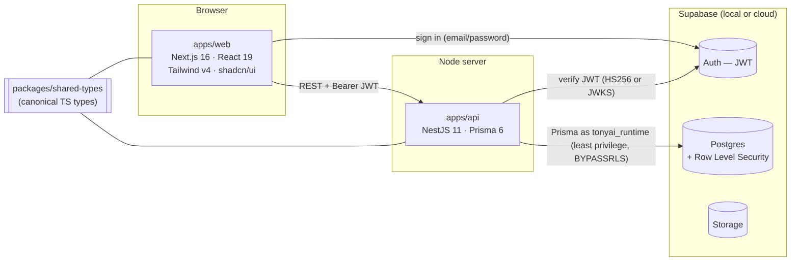

<div align="center">

# TonyAI

**Enterprise Carbon Accounting & ESG Platform for Multi‑Subsidiary Holdings**

Track Scope 1/2/3 emissions across subsidiaries with audit‑ready, tenant‑isolated, compliance‑first data management.

[](https://github.com/tonyaiukco/TonyAI-mono-repo/actions/workflows/ci.yml)

</div>

---

## Table of Contents

- [What is TonyAI?](#what-is-tonyai)
- [Project status](#project-status)
- [Architecture](#architecture)
- [Monorepo layout](#monorepo-layout)
- [The AI subagent team](#the-ai-subagent-team)
- [How it works (request lifecycle)](#how-it-works-request-lifecycle)
- [Security model](#security-model)
- [Getting started](#getting-started)
- [Troubleshooting](#troubleshooting)
- [Scripts](#scripts)
- [API reference (current slice)](#api-reference-current-slice)
- [Data model](#data-model)
- [Roles (RBAC)](#roles-rbac)
- [Observability](#observability)
- [Testing](#testing)
- [Environment variables](#environment-variables)
- [Roadmap](#roadmap)
- [Conventions](#conventions)
- [License](#license)

---

## What is TonyAI?

TonyAI is a **B2B SaaS platform** that lets large holding companies collect, validate, calculate, and report greenhouse‑gas emissions across their subsidiaries and locations. It is built around four ideas:

- **Granular visibility** — a subsidiary × category "tracking matrix" surfaces exactly where data is missing.
- **Audit integrity** — every calculation stores the emission factor and version it used; historic results never change.
- **Tenant isolation** — a user only ever sees the organisation / subsidiaries they are entitled to: the API scopes every query, the database refuses a cross-organisation grant from any writer, and RLS confines direct database clients.
- **Compliance‑first** — aligned with ISO 14064‑1, GHG Protocol and GRI 305; KVKK/GDPR‑aware data residency.

**Target users:** sustainability officers, ESG consultants, corporate auditors, and executives in multi‑entity groups across the UK, Türkiye and the EU.

---

## Project status

**Phase 1 (Scope 1 & 2 core MVP) is complete** and running end‑to‑end on a local machine; UAT round 1 is closed, **UAT round 2 is open** ([`docs/uat/uat_round2.md`](docs/uat/uat_round2.md)) and **Phase 3** is active — WP7 (audit viewer, reviewer UI, subsidiary edit), WP15 (UAT quick wins), WP16 (locations in the subsidiary flow), WP17 (completeness engine), WP18 (withdrawal + re-attribution), WP19 (the review gate on every cell), WP20 (report disclosure), WP21 (anomaly baseline provenance + recompute), WP22 (one column vocabulary behind all three report writers, and the names of who entered, decided and withdrew a record) and WP8 (bulk upload from CSV/XLSX with a dry run that provably writes nothing, plus bulk submit) have all shipped — as has the tooling around them: ESLint 9 gating CI, and a CI gate that runs the RLS containment probes on every PR with the full E2E suite nightly. Phase 2 (staging on Azure) has its credit approved and starts as LP2; its cloud‑independent prep is done. The launch plan — task cards, dates and task state — lives in [`docs/roadmap_docs/project_status_roadmap_phases.md`](docs/roadmap_docs/project_status_roadmap_phases.md).

| Area | Status |
| --- | --- |
| Turborepo monorepo (web + api + shared packages) | ✅ |
| Supabase Auth login + route‑protecting proxy (Next.js `proxy` convention) | ✅ |
| NestJS API with JWT auth guard + **tenant isolation** | ✅ |
| Subsidiaries CRUD + dashboard KPIs wired to live data | ✅ |
| Operational locations (Holding › Subsidiary › Location) — tenant‑scoped CRUD, managed in place on the subsidiary's own page or from the register's drawer, and creatable **inline with the subsidiary**; records can target a location, which drives the factor geography (data_entry_page.md §5.2) | ✅ |
| Evidence upload (Supabase Storage) — files linked to records, required before submit for billed categories (FR §4.1); since WP8 PR7 one file can back several records of one subsidiary, and the reviewer sees every record it backs | ✅ |
| Period locking (FR §4.2) — super_admin closes a reporting period; locked periods reject new/edited/submitted records | ✅ |
| RBAC — org structure (subsidiaries, locations, factors, approvals) is `super_admin`‑only; `data_entry` writes activity data for its own subsidiaries; `consultant` is review‑only — + **audit logging** on every mutation | ✅ |
| Destructive operations **refuse instead of cascading** — a subsidiary or location holding committed data returns 409 with counts and named blockers; record‑free locations go with their subsidiary, one audit row each | ✅ |
| Evidence files are reclaimed when their last record lets go of them (detach, record delete, `db:reset`, E2E teardown, `pnpm storage:reconcile`) — a retention obligation, not disk housekeeping — and every Storage write or removal is recoverable through a committed intent (LP1-02) | ✅ |
| Postgres **Row Level Security** (defense‑in‑depth) | ✅ |
| Prisma schema + migrations + idempotent seed | ✅ |
| Automated tests (unit + E2E) and live RLS containment probes — **the counts live in [Testing](#testing)**, so there is one place to keep in sync | ✅ |
| Every record names **who entered it, who decided it and who withdrew it** — resolved at read time from `profiles`, never copied onto the row | ✅ |
| A category with **no emission factor can still be recorded**, and every surface says so — the entry stores an explicit "not calculated" snapshot instead of a number, and contributes to no total (WP17; today only Water, which is tracked by invoice while no authoritative water factor exists) | ✅ |
| Reporting years 2015–2026 (WP15/DE-9); the demo dataset and factor library live in one `DEMO_YEAR`, and any year without factors says so instead of failing silently | ✅ |
| One-command local bootstrap (`pnpm setup`) | ✅ |
| 7 AI subagents + reusable skills + `CLAUDE.md` rules | ✅ |
| Data Entry UI wired to the live calculation engine (activity value + unit → tCO₂e preview, draft → submit), with a **collection-status panel** saying whether the subsidiary's year is actually finished — how many invoices it needs, how many are keyed in, how many anyone has approved (WP17) | ✅ |
| A record can be **re-attributed** between reporting entities — moving a whole-company entry onto a site (or back) edits the row and recalculates its factor for the new geography, instead of leaving a second row that double-counts the month (WP18 PR 1). Applies to records that are still editable (`draft`/`rejected`); a pair that is already committed is resolved by **withdrawing** one of the two (WP18 PR 2a/2b) | ✅ |
| Emissions Analytics wired to a live aggregation endpoint (scope totals, category/subsidiary breakdown, trends) | ✅ |
| Home dashboard Emissions Overview + tracking matrix (FR §2 red/yellow/green) on live data | ✅ |
| Targets & intensity (WP5) — reduction targets with live progress + per-year intensity denominators | ✅ |
| Reports (WP6) — audit-ready PDF (Puppeteer) + Excel/CSV export, year+subsidiary scoped (FR §5.3 partial), audited generation | ✅ |
| Audit-trail viewer (WP7) — read-only `/audit`, tenant-scoped and paginated, showing each actor's role **as recorded at the time** | ✅ |
| Review queue (WP7) — `/review` turns the submit → review → approve/reject API into a screen: evidence and factor provenance in the detail sheet, rejection reason returned to the submitter | ✅ |
| Subsidiary control panel at `/subsidiaries/[id]` (WP16) — detail, reporting contact, locations managed in place, and a dependents card that explains a refused delete in the API's own words. The geography change is confirmed and states what does **not** move (committed records keep their factor snapshot) | ✅ |
| Dashboard matrix drill-in (WP7) — a cell opens Data Entry for that subsidiary **and** category, reopening the existing record when there is one; the grid is scoped to one reporting year | ✅ |

**What's proven by tests today:** an `admin` sees all 5 seeded subsidiaries, a `data_entry` user sees only their 2, non‑admins are blocked from writes (HTTP 403), unauthenticated requests are rejected (HTTP 401), and every mutation writes an immutable `audit_log` row — verified at the API layer **and** the database (RLS) layer.

---

## Architecture

TonyAI uses a **headless architecture**: the frontend and backend are fully decoupled and communicate over a versioned JSON API. This keeps the door open for future clients (e.g. a mobile app) without touching the backend. All code lives in a single **Turborepo** so that frontend and backend share one source of truth for types.


```mermaid
flowchart LR
  subgraph Browser
    Web["apps/web<br/>Next.js 16 · React 19<br/>Tailwind v4 · shadcn/ui"]
  end

  subgraph "Node server"
    API["apps/api<br/>NestJS 11 · Prisma 6"]
  end

  subgraph Supabase["Supabase (local or cloud)"]
    Auth[("Auth — JWT")]
    DB[("Postgres<br/>+ Row Level Security")]
    Storage[("Storage")]
  end

  Shared[["packages/shared-types<br/>(canonical TS types)"]]

  Web -- "sign in (email/password)" --> Auth
  Web -- "REST + Bearer JWT" --> API
  API -- "verify JWT (HS256 or JWKS)" --> Auth
  API -- "Prisma as tonyai_runtime (least privilege, BYPASSRLS)" --> DB
  Shared --- Web
  Shared --- API
```

### Tech stack

| Layer | Technology |
| --- | --- |
| **Frontend** | Next.js 16 (App Router), React 19, TypeScript, Tailwind CSS v4, shadcn/ui, Recharts, Zustand, `@supabase/ssr` |
| **Backend** | NestJS 11, Prisma 6 ORM, `class-validator`, `jose` (Supabase JWT verification — HS256 + JWKS) |
| **Database / Auth / Storage** | Supabase (PostgreSQL + RLS, Auth, Storage) |
| **Shared** | `@tonyai/shared-types` — domain + API contracts used by both apps |
| **Tooling** | Turborepo, pnpm workspaces, Vitest, Playwright, GitHub Actions |
| **Reports** | Puppeteer (branded PDF), exceljs (multi‑sheet Excel), CSV |
| **Planned** | Azure Container Apps + ACR + Key Vault (staging/prod hosting, Phase 2), Resend (email), Sentry, Python/FastAPI (later phases) |

---

## Monorepo layout

```
TonyAI-mono-repo/
├── apps/
│   ├── web/                 # Next.js frontend
│   │   ├── app/             # /login · / (dashboard) · /subsidiaries · /subsidiaries/[id]
│   │   │                    # /data-entry · /emissions · /review · /audit · /reports
│   │   ├── components/      # shadcn/ui + feature components
│   │   └── lib/             # api client, supabase client, zustand store, types
│   └── api/                 # NestJS backend
│       └── src/
│           ├── auth/            # SupabaseAuthGuard, token verifier, /me, decorators
│           ├── subsidiaries/    # CRUD + summary + delete guards (tenant-scoped)
│           ├── locations/       # CRUD + the shared writer the nested create reuses
│           ├── activity-records/# lifecycle, gates, anomaly detection
│           ├── calculations/    # factor resolution + unit normalization
│           ├── evidence/ storage/  # upload-through-API, content checks, signed URLs, storage intents + sweeper, reconcile CLI
│           ├── emissions/ kpi/ targets/ intensity/  # aggregation + goals
│           ├── period-locks/ reports/ audit/        # closing, exports, trail
│           ├── bulk-upload/    # CSV/XLSX import: parse, dry-run, row report
│           ├── observability/   # JSON logs, request context, exception filter
│           ├── common/          # shared pipes/transforms
│           └── prisma/          # PrismaService
├── packages/
│   ├── shared-types/        # single source of truth for TS types
│   └── db/                  # Prisma schema, migrations, seed
├── e2e/                     # Playwright E2E (demo flow, gates, RBAC) + shared helpers/fixtures
├── docs/                    # product + technical specs (md_docs, tech_docs) + the one status/roadmap file (roadmap_docs)
├── .claude/
│   ├── agents/              # the 7-subagent development team
│   └── skills/              # reusable procedures (tenant-api-module, rls-for-table)
├── .github/workflows/       # CI (per-PR) + E2E (nightly); `.github/actions/` holds the shared Supabase-stack action
├── CLAUDE.md                # project rules, auto-loaded by Claude Code
├── AGENTS.md                # the same rules for Codex (points at CLAUDE.md) + its lane
└── README.md
```

---

## The AI subagent team

TonyAI is built by a **simulated software team of specialised AI subagents**, each owning a clear slice of the codebase. A human Tech Lead orchestrates them, splits work, reviews output and integrates it. The definitions live in [`.claude/agents/`](.claude/agents) and are usable directly from Claude Code.

| Subagent | Role | Owns |
| --- | --- | --- |
| **architect** | Data model, API contracts, calculation‑engine design | `packages/db` (Prisma schema), `packages/shared-types` |
| **backend-integrator** | NestJS endpoints & services, frontend↔API wiring | `apps/api/src`, `apps/web/lib/api.ts` |
| **frontend-engineer** | UI, auth flow, state, wiring pages to live data | `apps/web` |
| **security-rls** | RBAC, RLS policies, tenant isolation, KVKK/GDPR, audit immutability | `apps/api` guards, `packages/db` RLS |
| **data-factors** | Emission‑factor library (DEFRA/Türkiye/AIB), versioning, unit normalization, methodology | `packages/db` seed |
| **qa-auditor** | Unit + E2E tests, RBAC/tenant tests, ISO/GHG conformance | `apps/**/test`, `e2e/` |
| **devops-cloud** | Monorepo, Supabase, Docker, CI/CD, cloud deploy | repo root, `supabase/`, `.github/` |

> Each definition encodes the agent's scope, principles, a Definition of Done, and explicit "don't do without asking" boundaries — e.g. `security-rls` must never weaken a policy, `frontend-engineer` must never re‑enable `ignoreBuildErrors`.

### Skills

Recurring procedures are packaged as **skills** in [`.claude/skills/`](.claude/skills) — progressively disclosed playbooks that capture the canonical "right way" so it never has to be re-derived:

| Skill | What it does |
| --- | --- |
| **tenant-api-module** | Scaffold a new tenant-scoped, RBAC-guarded, audit-logged NestJS resource (+ DTOs, shared types, Vitest spec) |
| **aggregation-endpoint** | Add a server-side rollup endpoint (the status/total math lives in the API, never in the browser) |
| **rls-for-table** | Add Supabase RLS to a new table (enable-not-force, `auth.uid()` policies, shadow-DB shim, verification) |
| **wire-page** | Wire a page to live API data with real loading / empty / error (incl. 401/403) states |
| **supabase-storage** | Add a private-bucket file capability: upload through the API, content checks, signed-URL download, RLS, every write/removal recoverable through storage intents (LP1-02) |
| **workflow-gate** | Add a lifecycle gate (status/lock/authorship) that refuses consistently across every affected route |
| **e2e-flow** | Add a Playwright E2E spec or an RLS/API probe against the running local stack (shared login / API-token / safe-period / evidence-upload / teardown helpers) |
| **report-generation** | Add a server-generated, tenant-scoped file artifact (PDF via Puppeteer / Excel / CSV) streamed as an audited download |
| **bulk-ingest** | Import many rows from an uploaded CSV/XLSX through the resource's own create service, with a dry run that provably writes nothing |

The relevant subagents (`backend-integrator`, `architect`, `security-rls`) have `Skill` access and invoke these automatically.

---

## How it works (request lifecycle)

1. The user signs in on **`/login`**; `@supabase/ssr` stores the session (a JWT) in cookies.
2. **`proxy.ts`** protects every route — unauthenticated users are redirected to `/login`. (Next.js 16 renamed the `middleware` file convention to `proxy`; same behaviour.)
3. The frontend calls the API through **`apps/web/lib/api.ts`**, attaching `Authorization: Bearer <access_token>`.
4. The NestJS **`SupabaseAuthGuard`** verifies the JWT (shared HS256 secret or asymmetric via JWKS — see Security model), loads the user's `Profile`, and computes **`accessibleSubsidiaryIds`** (a `data_entry` user is limited to explicit access rows; other roles get organisation‑wide visibility).
5. Services scope **every query** to that set. Write authority splits by what is being written: **organisation structure** (subsidiaries, locations, period locks, targets, denominators) is `super_admin`‑only, **activity data + evidence** is `data_entry` or `super_admin`, **review/reject** is `consultant` or `super_admin`, and **approve** is `super_admin` alone. Each mutation writes an `audit_log` row.
6. **Row Level Security** in Postgres independently denies cross‑tenant reads, so even a direct database/PostgREST client is contained.

---

## Security model

Tenant isolation has three parts, and it matters which protects what (LP1-03, finding F06):

| Layer | Where | What it protects |
| --- | --- | --- |
| **Primary — the API** | The global guard computes `accessibleSubsidiaryIds` (data_entry: its grants, intersected with its own organisation; every other role: its organisation); every service scopes its queries by it | **The API's queries.** Nothing else filters them: the API connects as `tonyai_runtime`, which bypasses RLS. `apps/api/test/int/tenant-isolation.int.spec.ts` sends another organisation's ids to every tenant route, as all four roles, through the real application, and requires the same answer as for an id that does not exist |
| **Database invariants** | Composite foreign keys on `user_subsidiary_access`; the runtime role's privileges | A grant can only join a profile and a subsidiary of the **same organisation**, whoever writes it (API, seed, service role, owner) — short of a session in replica mode, as a restore runs, which skips foreign-key triggers; `runtime-role.mjs check` scans the data for that. The runtime role cannot alter policies or the schema, cannot rewrite or delete `audit_log`, cannot read `_prisma_migrations`, can change only a profile's `role`, and cannot move a subsidiary to another organisation |
| **Defense‑in‑depth — RLS** | Supabase **RLS** policies (`auth.uid()`‑keyed, SELECT-only) | **Direct database clients** (PostgREST with a user's JWT or the anon key). Every policy's explicit-grant branch also requires the same organisation, independently of the keys. RLS does **not** filter the API's queries, so it is not a second line behind a service that forgot its tenant predicate — the integration test above is |

**Two database credentials.** `DATABASE_URL` is the least‑privileged **runtime role** `tonyai_runtime` — the API, its Storage sweeper, `storage:reconcile` and `anomaly:recompute`. It owns nothing; its exact privileges are listed (and checked) in [`packages/db/scripts/runtime-role.mjs`](packages/db/scripts/runtime-role.mjs): no DDL, no TRUNCATE, `audit_log` INSERT/SELECT only, nothing on `_prisma_migrations`, SELECT on `storage.objects`, and **BYPASSRLS** — the API acts for every tenant and the sweeper's owned‑bytes guard must see every row. `DIRECT_URL` is the **owner** (`postgres`), used only by migrations, DDL, the seed and operator tooling. A migration creates the role without a password; `pnpm setup` generates a random local one (kept only in the `.env` files, re-generated on every run) and sets it as a SCRAM verifier, so the password never reaches the server's logs; the integration suite and CI's e2e API generate their own; a deployed environment's operator sets its own with psql's `\password`. The provisioning refuses any database that is not plainly local — a loopback host and no connection parameter that could redirect it (Prisma honours `?host=` over the URL's host); that is an accident guard, not proof of locality — a port forwarded to a deployed database looks local, so local tooling (`pnpm setup`, `test:int`, `e2e`) is never run through one. `node packages/db/scripts/runtime-role.mjs check` verifies, read-only, in any database: the role's privileges and attributes, that no grant in the data crosses an organisation, and — as warnings — what the role reaches only because the platform grants it to PUBLIC (locally Supabase's `pg_net` request queue and Storage's helper functions). A new table must be added to that file's privilege list — the integration suite and `rls:probe` fail until it is. **Never `FORCE` RLS**: it would not filter the runtime role's queries in any useful way (they carry no user context) and would break the owner's.

**Role and access changes** go through one boundary, `AccessAdminService` (`apps/api/src/auth/access-admin.service.ts`; LP4-01's onboarding adds its routes): only a `super_admin` of the organisation, never across organisations, never on their own role, serialised per organisation, and audited in the same transaction. There is no platform-wide administrator role; organisations and their first administrators are provisioned by the operator (decision D18, LP4-01).

Additional guarantees:

- **Token verification** — Supabase access tokens are accepted under both signing schemes: the legacy shared **HS256** secret and **asymmetric** keys (ES256/RS256) fetched from the project's JWKS. The key material fixes the algorithm allow‑list on each path, so a token can never downgrade a public key into an HMAC secret, and `alg: none` matches neither path. Tokens must carry `aud: authenticated`, `sub` and `exp`, which is what keeps the anon/service‑role keys (JWTs signed with the same secret) from being replayed as user tokens. `SUPABASE_JWT_SCHEME` pins the accepted scheme; a boot-time check **refuses to start** with an unpinned scheme or the public demo secret. That check is on by default and is relaxed only by an explicit `ALLOW_INSECURE_LOCAL_AUTH=true` **together with** a loopback `SUPABASE_URL` — deliberately not keyed on `NODE_ENV`, since the container image sets it locally and a plain `node dist/main.js` deployment sets nothing, so a copied `.env` pointed at a real project always fails closed.
- **RBAC** — reads are tenant‑scoped for everyone; writes are split by object, not blanket‑`super_admin` (see the request lifecycle above and the Roles table below). The one rule that never bends: **only `super_admin` approves** — and never a record they created (segregation of duties, decision D01; only a record's author may submit it, `super_admin` included, so the submitter is always the creator) — and only `super_admin` mutates organisation structure.
- **Lifecycle integrity (LP1-01)** — every write to an activity record, its evidence links or a period lock follows one protocol (`apps/api/src/activity-records/lifecycle-lock.ts`): a transaction-scoped advisory lock per reporting period (shared for record and evidence writers, exclusive for lock/unlock — so even a period with no lock row serialises a create against a lock), then `FOR UPDATE` row locks (records, then evidence files, each in key order), every gate re-checked against the locked row, and the change written **with its audit row through the same transaction** — neither commits without the other. A request that was valid against what it read, but lost a race to another writer, gets a **409 "This record was changed by someone else… Reload it and try again."** (`RecordChangedError`); nothing was written and the server never retries on its behalf. Evidence rows are deleted inside the transaction and their Storage objects only after it commits — through a `delete` intent that commits with them (LP1-02, below).
- **Recoverable Storage effects (LP1-02)** — Storage has no transaction, so every object an API path writes or removes is first named in `storage_intents` (`apps/api/src/storage/storage-intents.service.ts`). An **upload** commits an `upload` intent before sending the bytes; the transaction that writes the owning row (evidence, or an import batch) deletes it — as its first statement — in the same commit. If that transaction fails the intent becomes a delete and the object is removed — but only while the intent is still there, so a transaction that committed although its acknowledgement was lost keeps its bytes. A **removal** (detach of a file's last link, `DELETE /evidence/:id`, a record delete) writes a `delete` intent with the row delete and its audit row, and removes the object after the commit. An object that already has a pending `delete` gets that intent reset (due now) rather than a second one, and a sweep closes an intent only under the lease it took — so bytes that land after a removal stay named. Whatever fails — the database, Storage, the process — leaves an intent that the in-process **sweeper** retries: every `STORAGE_SWEEP_INTERVAL_SECONDS` (default 300; `0` turns it off), at most 100 intents a pass, by lease (`claimed_until`, `SKIP LOCKED`) so replicas never remove the same object twice and no transaction is held across a Storage call, with exponential backoff (30 s doubling to 6 h, never giving up). An upload intent is abandoned only after 15 minutes. **Bytes a row still owns are never removed**, whatever an intent says, and objects are written with `upsert: false`, so nothing overwrites existing evidence. **`STORAGE_CLEANUP_HOLD=1` stops every removal** — set it while a backup or restore runs: intents wait, nothing is lost. The sweeper never removes an orphan (an object no row owns and no intent names) on its own: after a database restore such an object may be the only copy of a file the restored database no longer remembers. `pnpm storage:reconcile` reports orphans, rows whose object is missing, hash mismatches and stuck intents; it removes orphans only with `--reclaim-orphans --apply`, older than 7 days by default, and never under the hold. **Removal fails closed under a database role that RLS filters** — the owned-bytes guard is only as good as the rows it can see, so the sweeper hands its intents back and the CLI refuses to run unless the role bypasses RLS on `evidence`, `import_batches` and `storage.objects` (the owner role does; LP1-03's runtime role must). **After a database restore:** set `STORAGE_CLEANUP_HOLD=1` on every API process *and* in the shell running the tool (it is per process), run `pnpm storage:reconcile --forget-uploads` — upload intents restored from the restore point name bytes committed later, in the history the restore discarded, so they become reported orphans instead of being abandoned and removed — then `--verify`, and lift the hold only after reading the report.
- **Audit immutability** — `audit_log` has SELECT‑only policies (super_admin) and **no** UPDATE/DELETE; it is append‑only, and the runtime role holds only INSERT and SELECT on it (LP1-03).
- **Bounded input** — every free‑text column a write DTO accepts is length‑capped from one constant in `@tonyai/shared-types`: `periodValue` (records *and* period locks), `activityUnit` (records *and* the calculation preview), `varianceReason` (sharing `EXPLANATION_MAX_LENGTH` with the void reason and the reviewer's note — three explanations about a figure, one number), and all six subsidiary descriptors. All of them are unbounded `text` in Postgres and all of them reach a generated PDF, Excel sheet and CSV cell verbatim. The caps are app‑side only and deliberately so: `@MaxLength` counts Unicode code points while a Postgres `varchar(n)` counts them differently again, so a database bound would turn a would‑be 400 into a 500. Groundwork for bulk upload, where the multi‑megabyte cell actually arrives. A cap bounds how much padding can be stored, not whether it is stored, so `activityUnit` is also **whitespace‑normalised before it is bounded** (`storableUnit`): one plain space per run, matching the `\s` class `canonicalUnit` itself uses. The vocabulary trims AND collapses `\s+` to `_` before it looks a unit up, so a run does not have to vanish to be ignored — it maps onto the `_` of a multi‑word key. `us`, a **carriage return** and `gallons` was a valid ten‑character `us_gallons`, far under the cap, stored as sent into the column, the immutable snapshot's `inputUnit`, the audit row and all three exports; LF, TAB, VT, FF, U+2028, U+00A0 and U+FEFF behave the same, interior or not, and #111's derived aliases brought `kw`+CR+`h` down to four characters. Case and alias are resolved once, **at the write**: `activity_records.activity_unit` stores the vocabulary's canonical value (`kWh`, `MWh`, `cubic_metres`, …) via `storedUnit`, while the calculation snapshot keeps the entered spelling as `inputUnit` until the record is next edited — so `kw h`, `KWH` and `MWH` are one unit to every export and `GROUP BY`, `unitSymbol` never falls back to raw text, and the U+212A KELVIN SIGN homoglyph can no longer reach the column. A hand‑written migration (`20260917210000_canonical_stored_unit`) brings rows stored before the rule onto it without touching their snapshots.
- **Caller text is cleaned where the API stores it, and named where it quotes it** — an upload's filename, the header cells an import refusal quotes, and every sentence that repeats a value back (the import report's cell refusals, the unit and period refusals, the calc engine's unit sentences, so the single-record API is covered too) pass through one rule in `apps/api/src/common/caller-text.ts`. It drops control characters and unpaired surrogates (Postgres refuses U+0000 inside `jsonb`, and half a surrogate pair fails the write too), the line and paragraph separators U+2028/U+2029, every format character except ZWJ, ZWNJ and the prepended concatenation marks that are drawn (U+0600-U+0605, U+06DD, U+070F, U+0890, U+0891, U+08E2, U+110BD, U+110CD), and the code points Unicode reserves as invisible but has not assigned. That takes the bidi controls and marks, the zero-width space and the word joiner, the invisible operators, and the tag characters, which spell out ASCII nobody sees. Text that is STORED (`sanitiseCallerText`: the filename and a refusal's reason, the only caller text the append-only `audit_log` holds) keeps everything else and is bounded in code points, so a cut never lands inside a character. A sentence instead QUOTES a value through `quoteCallerText`, which NAMES every character it cannot show — the dropped ones, the invisible ones the rule keeps (a variation selector, ZWJ), U+2800, and the `<`, `…` and `"` its own syntax is made of, so a file cannot forge one — writing each run in place: `Unrecognised column(s): "category<U+200B>", "<U+2063 x40>tco2e". Expected: …`. Naming rather than cleaning matters because the value is matched as written: a quote cleaned in silence named a column the file got right, and told a user their unit was `cubicmetres` when the cell held a BOM and a tab. Each quote is delimited and bounded twice — in units (a character or a whole marker, so padding cannot push a value out) and in code points (so the longest possible refusal still fits an audit row whole). A `$` is dropped from what the unit refusal quotes, because class-validator replaces `$value` in a finished message with the raw value as a `String.replace` replacement string: a 99,994-byte unit of `$value` tokens came back as an 18,563,231-byte 400. The import report bounds every message at `BULK_UPLOAD_MESSAGE_MAX_LENGTH` as well, after the failure has been classified by its raw text; before that, one XLSX shared string behind a thousand rows turned a 12,416-byte workbook into a 32,092,008-byte report, and the same file now returns 135,008 bytes. The issue count needs no cap of its own: each row is accepted or refused once, so the row cap bounds it.
- **No secrets in git** — all `.env*` files are git‑ignored; only `.env.example` templates are committed.

---

## Getting started

### Prerequisites

- **Node ≥ 20**, **pnpm** (enable Corepack so the pinned version is used: `corepack enable`), **Docker Desktop** (running), **Supabase CLI ≥ 2.0** (`brew install supabase/tap/supabase`)

`pnpm setup` enforces the CLI floor and finishes with a login smoke check that prints how your project signs tokens (`HS256` shared secret or asymmetric via JWKS) — both are supported, so a newer CLI is fine.

### First‑time setup

```bash
# Option A — one command (recommended). Idempotent; safe to re-run anytime.
pnpm setup          # deps -> Supabase up -> sync .env -> migrate -> generate -> seed
pnpm dev            # web :3000 · api :3001

# ---------------------------------------------------------------------------
# Option B — manual, step by step:

# 1. Install dependencies
pnpm install

# 2. Start local Supabase (Postgres, Auth, Storage in Docker)
supabase start

# 3. (If the printed keys differ from the defaults) copy them into env files:
#    supabase status -o env
#      apps/web/.env.local  -> NEXT_PUBLIC_SUPABASE_ANON_KEY
#      apps/api/.env        -> SUPABASE_JWT_SECRET, SUPABASE_SERVICE_ROLE_KEY
#      packages/db/.env     -> SUPABASE_SERVICE_ROLE_KEY
#    (copy each app's .env.example to the real file first)

# 4. Create the schema and seed demo data
pnpm db:migrate     # applies Prisma migrations (incl. RLS policies)
pnpm db:seed        # 1 org, 5 subsidiaries, 8 locations, 3 users, demo factors for DEMO_YEAR (2026)
                    # + 96 approved Scope 1&2 records (90 subsidiary-level monthly, 6 location-level),
                    # one demo evidence file each, 3 targets + 12 intensity denominators
                    # A month reported per site is NOT also reported company-wide: the two
                    # attribution levels coexist across the year, never for the same month.
                    # Jan-Mar for TonyAI Energy (Electricity) and TonyAI Logistics (Fuel) are
                    # therefore reported per site ONLY, by one site of two — so those months
                    # are deliberately incomplete at company level. The company figure is
                    # withdrawn, not redistributed; the coverage grid shows the open slots.

# 5. Run everything
pnpm dev            # web -> http://localhost:3000   api -> http://localhost:3001/api/v1
```

### Seed users

| Email | Password | Role | Sees |
| --- | --- | --- | --- |
| `admin@tonyai.local` | `TonyAI!2026` | `super_admin` | all 5 subsidiaries |
| `approver@tonyai.local` | `TonyAI!2026` | `super_admin` | all 5 subsidiaries — the second approver: nobody approves a record they created (D01) |
| `entry@tonyai.local` | `TonyAI!2026` | `data_entry` | 2 subsidiaries (tenant‑isolation demo) |
| `review@tonyai.local` | `TonyAI!2026` | `consultant` | organisation‑wide read; review/reject only (cannot enter, edit, submit or approve) |

---

## Troubleshooting

| Symptom | Fix |
| --- | --- |
| `Docker daemon is not running` | Start Docker Desktop, wait until ready, re‑run `pnpm setup`. |
| `supabase: command not found` | Install the Supabase CLI (`brew install supabase/tap/supabase`). |
| Port `3000` / `3001` / `54321` already in use | Stop the other process (or `supabase stop`) and re‑run. |
| `401 Invalid or expired token` after restarting Supabase | Keys rotated — re‑run `pnpm setup` to re‑sync the `.env` files. |
| Login succeeds but every page is empty and shows an auth error | The API could not verify the token. Re‑run `pnpm setup` and read its final "Verifying the login chain" line: it reports the signing algorithm and, for asymmetric projects, whether the JWKS endpoint is reachable. A stale `apps/api/.env` (secret from a previous Supabase instance) is the usual cause. |
| API exits at startup: *"SUPABASE_JWT_SCHEME must be pinned…"* or *"…demo secret"* | Working as designed — the boot check refuses an unpinned scheme or the public demo secret unless the run is explicitly local. Re‑run `pnpm setup`, which writes `ALLOW_INSECURE_LOCAL_AUTH=true` into `apps/api/.env`. `.env` files predating this check do not have it. For a real deployment, pin `SUPABASE_JWT_SCHEME` and set the project's own secret instead. |
| Login works but no data shows | Make sure the DB was seeded (`pnpm db:seed`); or `pnpm db:reset`. |
| Stale schema / weird data | `pnpm db:reset` (drops, re‑migrates, re‑seeds). |
| `pnpm: command not found` | `npm i -g pnpm` (or enable via Corepack). |
| `pnpm dev` eats memory / freezes the machine | Check that `outputFileTracingRoot` is **not** applied to the dev phase in `apps/web/next.config.mjs` — Next's Turbopack dev server adopts it as the project root and would then index and watch the whole monorepo. If a stale cache is suspected, delete `apps/web/.next`. |

---

### Running in containers (Phase-2 prep)

Both apps ship Dockerfiles (`apps/api/Dockerfile` includes distro Chromium for PDF generation; `apps/web/Dockerfile` uses Next.js standalone output). With the local Supabase running:

```bash
pnpm docker:up      # builds + starts web (:3000) and api (:3001) containers
pnpm docker:down
```

The wrapper sources `apps/api/.env` + `apps/web/.env.local` so the containers use your instance's real keys (supabase-cli demo JWTs differ per CLI version — never hardcoded). `NEXT_PUBLIC_*` values are inlined into the web bundle at build time, so images are environment-specific; server-side auth can override the Supabase URL at runtime via `SUPABASE_URL_INTERNAL`. CI builds both images on every PR (`docker-build` job, no push).

### Staging deployment (LP2-01)

The versioned [staging foundation and owner-run runbooks](infra/README.md) configure Azure Germany West Central (Consumption Container Apps, ACR Basic, Key Vault references, managed identities, Log Analytics and GitHub OIDC) with an isolated Supabase Frankfurt project. Start with [session restoration](infra/runbooks/00-session.md), then follow the numbered steps for account setup, private buckets, migrations, environment-bound web builds and acceptance evidence. OIDC bootstrap binds the repository to foundation metadata, checks the existing staging environment’s reviewer/main-only policies, and verifies app/service-principal ownership and absence of password/certificate credentials before federation. Use [rotation and recovery](infra/runbooks/05-rotation.md) for credential changes. The `infra` CI job runs cloud-free regression/mutation tests, Terraform validation and mock-provider tests. Owner-run Entra-authenticated Blob bootstrap isolates foundation/application state; Terraform alone writes the Azure foundation and Container Apps, while resumable Supabase API helpers transfer secret values directly into Key Vault. Builds, migrations and secret values stay outside Terraform. Both pooler URLs currently share database-owner credentials, so deploy access equals database-owner access until LP1-03 separates the runtime role; rotate both URLs together. Deployments, rotations and rollback share versioned manifests containing image digests and exact secret versions. Cloud validation and fresh-recreation evidence remain owner-run; LP2-01 is not DONE. The root [`.env.example`](.env.example) is a placeholder-only cloud reference; local setup continues to use the per-package examples.

Cloud execution is performed by the project owner and remains required evidence: generated templates do not establish a working staging environment. Never run the local demo seed or demo-account RLS probes against cloud; the demo RLS harness now rejects non-loopback targets. [LP2-02 release instructions](infra/runbooks/03-deploy.md#34-lp2-02-release-sequence-d22d23) cover exact-SHA CI/full-E2E/PostgreSQL-integration gates, environment-bound candidate images, migration/lockfile fingerprints, protected staging OIDC workflows, saved-plan Terraform application and owner-run browser/export/API/PostgREST smoke with two dedicated synthetic tenants. Workflow deployment reads back image/secret identities but stays **smoke pending** until the exact deployed digests pass the owner-run check and exact-ID Auth cleanup. No cloud execution is implied by these tools. A fresh single-job JIT runner with EU static egress, a protected main ruleset and an independent staging reviewer are owner prerequisites; LP2-03 supplies dependency readiness and rollback rehearsal.

---

## Scripts

Run from the repo root (Turborepo fans out to each package):

| Script | Description |
| --- | --- |
| `pnpm setup` | One‑command local bootstrap (deps, Supabase, `.env` sync, migrate, seed) |
| `pnpm dev` | Run web + api in watch mode |
| `pnpm build` | Build all packages |
| `pnpm lint` | ESLint 9 (flat config, one root `eslint.config.mjs`) over all 277 files — every workspace plus `e2e/`, `scripts/` and the root configs. **Run at the root, not through Turbo:** a per-workspace fan-out silently skips every file that belongs to no workspace. `pnpm lint:fix` applies the fixable ones |
| `pnpm typecheck` | Type‑check the whole repo, `e2e/` and `playwright.config.ts` included (`tsconfig.e2e.json` — Playwright's own runner strips types without checking them) |
| `pnpm test` | Unit tests (Vitest) |
| `pnpm e2e` | Playwright E2E: demo flow, gates, RBAC, smoke (requires Supabase running) |
| `pnpm e2e:ui` | The same suite in Playwright's UI mode, for debugging one spec |
| `pnpm rls:probe` | Live RLS containment probes via PostgREST (requires Supabase running) |
| `pnpm storage:reconcile` | The database ↔ Storage reconciliation, both buckets (builds the API first; in the image: `node dist/storage/reconcile.cli.js`). Prints one JSON report: pending/stuck intents, **orphans** (objects no row owns and no intent names), **rows whose object is missing** (with the records an evidence file backs and their status) and evidence rows no record links to — reported, never deleted. `--verify` downloads and hashes up to `--limit` rows that carry a sha256; `--sweep` runs one sweep of pending intents now; `--reclaim-orphans` lists the orphans old enough to remove (`--older-than=<hours>`, default 168) and removes them with `--apply`, never while `STORAGE_CLEANUP_HOLD` is set. `--forget-uploads` (only under `STORAGE_CLEANUP_HOLD`) is the post-restore step above. `--sweep`, `--apply` and `--forget-uploads` off a loopback host need `--allow-remote` — a guard against a typo, not a control (a tunnel is "localhost" too) — and off loopback `--older-than` cannot go below 24 hours. Refuses to run under a role RLS filters. Exits 1 when something needs a person (missing or changed bytes, an unlinked row, a stuck intent). Replaces `pnpm evidence:reclaim` |
| `pnpm anomaly:probe` | Recompute the anomaly baseline (VAR §4) in SQL over every committed record: how many priors each was scored against, and whether the stored `anomalyFlag` still matches the pool beneath it (read-only; exits 1 on drift) |
| `pnpm anomaly:recompute` | Repair verdicts that have gone stale as the pool moved beneath them (dry run; add `-- --apply`, and `-- --allow-remote=<host>` off loopback). Re-scores `draft`/`rejected`/`submitted`/`under_review` through the same shared rule the API uses, one `rescore` audit row each. **Two refusals:** a record that is itself `approved`/`locked`, and any record inside a **closed period** — both reported, neither touched. Exits 1 while drift remains |
| `pnpm docker:up` / `docker:down` | Containerized web+api against the host's local Supabase (keys sourced from your real env files) |
| `pnpm db:generate` | Regenerate the Prisma client |
| `pnpm db:migrate` | `prisma migrate dev` |
| `pnpm db:deploy` | Apply committed migrations (`prisma migrate deploy`) |
| `pnpm db:seed` | Seed demo data |
| `pnpm db:reset` | Drop, re‑migrate, re‑seed, then reclaim every orphaned object (`storage:reconcile --reclaim-orphans --older-than=0 --apply`: the reset drops the schema but not the buckets) |

---

## API reference (current slice)

Base URL: `http://localhost:3001/api/v1` · all routes (except `/health`) require `Authorization: Bearer <jwt>`.

| Method | Path | Description | Auth |
| --- | --- | --- | --- |
| `GET` | `/health` | Liveness check | public |
| `GET` | `/me` | Current user + role + `accessibleSubsidiaryIds` | any |
| `GET` | `/subsidiaries` | List (tenant‑scoped). Includes the reporting contact (`designatedPerson` / `contactEmail` / `contactPhone`), which is **deliberately visible to every role in the tenant** — see `permissions_and_roles.md` §6.4 for the decision and its consequences | any |
| `GET` | `/subsidiaries/:id` | Get one (404 if outside access set) | any |
| `GET` | `/subsidiaries/:id/summary` | Counts of everything hanging off it (locations, records split into approved/locked · awaiting review · draft/rejected, period locks, targets, denominators), plus `hasBlockingDependents` and `blockers[]` — the delete guard's own sentences, so a UI never restates them. Exists so a caller can show "36 records" without downloading 36 records, and can see **why** a delete would be refused without attempting it | any |
| `POST` | `/subsidiaries` | Create — optionally with `locations[]`, written in the **same transaction** and audited one row per location, identically to `POST /locations`. The create form requires at least one; the contract does not (WP16 PR 3) | `super_admin` |
| `PATCH` | `/subsidiaries/:id` | Update — including `trackingGranularity` (`subsidiary` \| `location`), which decides how this entity's completeness is measured. Switching to `location` is refused while the subsidiary owns no locations: the denominator is `locations × 12`, so with none every slot is vacuously covered | `super_admin` |
| `DELETE` | `/subsidiaries/:id` | Delete — takes the subsidiary's own record-free locations with it, one audit row each. Refused (409) while records, targets, denominators, closed periods or a location holding records remain; a subsidiary holding an `approved`/`locked` record is retired via `reportingStatus: 'inactive'` instead, since those records can never be deleted | `super_admin` |
| `GET` | `/locations` | List operational locations (tenant‑scoped; filter `?subsidiaryId=`) | any |
| `GET` | `/locations/:id` | Get one (404 if outside access set) | any |
| `POST` | `/locations` | Create (child of a subsidiary; `geographyCode` required) | `super_admin` |
| `PATCH` | `/locations/:id` | Update (`subsidiaryId` immutable) | `super_admin` |
| `DELETE` | `/locations/:id` | Delete — refused (409) while activity records point at it, which would leave them showing a geography their frozen snapshot was not calculated with | `super_admin` |
| `GET` | `/kpi` | Dashboard summary (subsidiary totals + geography breakdown + operational location count) | any |
| `POST` | `/calculations/preview` | Live emissions preview: normalises the unit, applies the matching factor, returns `tCo2e` + factor snapshot. `category` and `geographyCode` must be vocabulary values and `unit` is length‑capped, so a preview refuses what a save would | any |
| `GET` | `/factors` | List emission factors (optional `?category=&geographyCode=&year=`) | any |
| `GET` | `/activity-records` | List (tenant‑scoped; filters `?subsidiaryId=&year=&period=&category=&status=`). `status` takes one value or a comma‑separated set (`submitted,under_review`), which is how the review queue is fetched in a single call | any |
| `GET` | `/activity-records/:id` | Get one (404 if outside access set) | any |
| `POST` | `/activity-records` | Create (status `draft`; optional `locationId` targets a location; stores an immutable calc snapshot) | `data_entry` / `super_admin` |
| `PATCH` | `/activity-records/:id` | Update (only while `draft`/`rejected`; recomputes the snapshot; author‑or‑`super_admin`) | `data_entry` / `super_admin` |
| `DELETE` | `/activity-records/:id` | Delete (only while `draft`/`rejected`; author‑or‑`super_admin`) | `data_entry` / `super_admin` |
| `POST` | `/activity-records/:id/review` | Take a submitted record into review (FR §6.3) | `consultant` / `super_admin` |
| `POST` | `/activity-records/bulk-submit` | Send many **drafts you authored** for review at once (`recordIds[]`, max 1,000). Per-record report; 10/minute per user | `data_entry`, `super_admin` |
| `POST` | `/activity-records/:id/submit` | `draft`/`rejected` → `submitted` (records `submittedAt`; a resubmit re-stamps it, so the review queue measures the CURRENT reviewer's wait). **Only the record's author** — `super_admin` included (decision D02) | the author (`data_entry` / `super_admin`) |
| `POST` | `/activity-records/:id/approve` | `submitted`/`under_review` → `approved` (records `reviewedBy`/`reviewedAt`). Never by the record's creator (403, decision D01) | **`super_admin` only** |
| `POST` | `/activity-records/:id/void` | `approved` → `voided` (body `{ voidReason }`, mandatory) — an audited withdrawal. **Withdraws a figure from the inventory without deleting it**: the row, its evidence and its immutable calculation snapshot all survive, and `voided` is absent from the counted statuses, so every total, export, matrix cell and anomaly baseline excludes it by construction. A `locked` record must be unlocked first | **`super_admin` only** |
| `POST` | `/activity-records/:id/reject` | `submitted`/`under_review` → `rejected` (body `{ varianceReason }` → stored as `reviewNote`, never over the author's variance justification) | `consultant` / `super_admin` |
| `GET` | `/audit` | Audit trail, newest first — **paginated** (`?entity=&action=&entityId=&userId=&from=&to=&limit=&offset=`, `limit` capped at 200). Returns `{ items, total, limit, offset }`; each row carries the actor's role **as recorded at the time** | **`super_admin` only** |
| `GET` | `/emissions/summary` | Tenant‑scoped analytics aggregation from committed records: scope totals, category & subsidiary breakdown, monthly/quarterly/yearly trends (filters `?subsidiaryId=&year=&scope=&category=`) | any |
| `GET` | `/emissions/completeness` | Which `(location, month)` invoice slots are open for one subsidiary and year (`?subsidiaryId=&year=`, both required). Enumerates the complement of the same slot set the matrix cell counts, so the drill-down cannot disagree with the cell that opened it. Each slot also says whether its invoice is still awaiting review, so a screen can show "keyed in" and "approved" as the different claims they are. Also names the months already recorded at whole-company level — those close no site slot, and entering them again per site would count the month twice | any |
| `GET` | `/emissions/tracking-matrix` | Subsidiary × category completeness matrix (FR §2: missing/incomplete/complete) with committed tCO₂e per cell (filters `?year=&subsidiaryId=`). A cell's `tCo2e` is `null` when nothing in it produced a figure — never a stand-in `0`. On a **`location`-measured** subsidiary the three invoice-tracked categories carry a `coverage` object instead of a yes/no verdict (see below). Every cell also carries `awaitingReviewRecords` — committed records nobody has accepted yet, which is what holds a cell short of green and what a screen prints to explain the amber. It counts RECORDS; `coverage.awaitingReviewSlots` counts SLOTS, and the two are not comparable | any |
| `GET` | `/activity-records/:id/evidence` | List the files linked to a record, each with **every record it backs** (`linkedRecords`) | any |
| `POST` | `/activity-records/:id/evidence` | Upload evidence for one record (multipart `file`; PDF/JPG/PNG/XLSX/CSV, ≤10 MB) — author‑or‑`super_admin`, record editable (draft/rejected), period open | `data_entry` / `super_admin` |
| `POST` | `/evidence` | Upload **one file for several records** of one subsidiary (multipart `file` + `recordIds`, a JSON array, ≤1,000). All or nothing: one record that cannot take it refuses the upload, naming every refused record; a record out of reach reads as not found | `data_entry` / `super_admin` |
| `DELETE` | `/activity-records/:id/evidence/:evidenceId` | Take a file off one record (that record must be editable). The file stays on its other records; taking its **last** link deletes it | `data_entry` / `super_admin` |
| `GET` | `/evidence/:id/url` | Short‑lived signed download URL for a private file (scoped by the file's subsidiary) | any |
| `DELETE` | `/evidence/:id` | Delete a file from every record it backs — only while **each** of them is editable; a shared file backing a record that can no longer change is a 409. API-only: the web removes a file from one record with the detach route above | `data_entry` / `super_admin` |
| `GET` | `/period-locks` | List locked periods (tenant‑scoped; filters `?subsidiaryId=&year=`) | any |
| `POST` | `/period-locks` | Close a reporting period (blocked while records await review, or while a rejected record waits for its author — D03) | `super_admin` |
| `DELETE` | `/period-locks/:id` | Reopen a period (locked records revert to `approved`) | `super_admin` |
| `GET` | `/targets` | List reduction targets (tenant‑scoped) | any |
| `GET` | `/targets/progress` | Live progress vs committed emissions (`null` = no post‑baseline data) | any |
| `POST` `PATCH` `DELETE` | `/targets`(`/:id`) | Manage a reduction target | `super_admin` |
| `GET` | `/denominators` | List intensity denominators (tenant‑scoped; `?year=`) | any |
| `POST` `PATCH` `DELETE` | `/denominators`(`/:id`) | Manage an intensity denominator | `super_admin` |
| `GET` | `/intensity` | Emissions per configured denominator, per metric (`?year=`) | any |
| `GET` | `/reports/meta` | Report completeness/status for a year (badge + data warning) | any |
| `GET` | `/reports/pdf` | Branded audit‑ready PDF (Puppeteer; methodology + evidence appendices) | all except `data_entry` |
| `GET` | `/reports/excel` | Excel export: Summary / Raw Activity Data / Withdrawn Records / Factors Used sheets | all except `data_entry` |
| `GET` | `/reports/csv` | CSV export of the committed ledger **plus the withdrawn rows**, one table | all except `data_entry` |
| `GET` | `/bulk-upload/template` | Download the import template (XLSX): sheet 1 is exactly the nine columns, sheet 2 (invisible to the importer) names the caller's own reporting entities and the vocabularies | any |
| `POST` | `/bulk-upload/activity-records` | Import activity records from a CSV/XLSX (multipart `file`, `dryRun` required — exactly `true` or `false`; an empty or missing value is a 400, never a default). Row-level report; 1,000 populated rows / 2 MB (and an XLSX may unpack to at most 16 MB); 5 imports per minute per user. A role that may not author records is refused before the file is parsed, and that refusal is audited (a 413 from the 2 MB limit and a 400 for a malformed `dryRun` happen before the service runs, so those two are not) | `data_entry`, `super_admin` |

Activity-record workflow: `draft → submitted → under_review → approved | rejected`. `approved` and `locked` records are immutable and cannot be edited or deleted; `rejected` records can be edited and re‑submitted. The one way out of `approved` is to **void** it — a `super_admin` withdraws the figure from the inventory with a mandatory reason, and the row survives with its snapshot intact but counts towards nothing. A voided record cannot be edited, re‑submitted, deleted or un‑voided. Uniqueness is **partial** — `WHERE status <> 'voided'` — so at most one *live* record exists per reporting entity, period and category, with any number of withdrawn ones behind it: withdraw the wrong figure and the corrected one can be recorded in its place. **Where it lives (WP18 PR 2b):** the record drawer on **Emissions -> History**, which is the only surface that shows an approved record on its own — the review queue lists pending work, and Data Entry loads a record into a form that an approved record cannot enter. The control appears for a `super_admin` on an `approved` record and nowhere else. It takes the reason inline, then confirms in a dialog that names what is about to happen — the tonnage leaving the inventory, the period that reopens, and that it cannot be undone — because unlike approve and reject there is no way back. The drawer also names the **reporting entity** (`Whole company` or the site), since a whole-company row and its site twin differ only there and in the activity value, and choosing between exactly that pair is what the control is for. This carries the four elements FR §4.3 lists for a revision entry, but does **not** implement §4.3 — that rule governs *locked* records, which a void refuses, and it also asks for a revision entry linked to what it corrects, which does not exist yet. The `calculation` snapshot is written at create/update time and never recomputed on read, so historic results survive factor-library changes. Every transition writes an `audit_log` row (`entity: 'activity_record'`).

Bulk **submit** (WP8) is the other half: imported rows land as `draft`, and a draft counts towards no total and appears in no review queue, so the panel offers to send them for review — one record at a time through the same `submit` the form uses, so the status gate, the author gate on a resubmission, the period lock, the evidence requirement and the **recomputed** anomaly verdict all still run. There is deliberately no dry run, and not because the failures are predictable — only three of six are, since `submit` **recomputes** the anomaly verdict. The reason is that a preview could not be faithful: `submitted` is in the counted statuses, so record N's write enters record N+1's baseline, and a run that wrote nothing would green‑light records the real one then refuses. What the act needs is a confirmation, and it needs one badly, because **there is no author‑side un‑submit** — only a reviewer can send a record back. Two rules are stricter than the single‑record path, because a thousand ids in one call is not a thousand clicks: it takes **drafts only** (a `rejected` record reverses a reviewer's decision, one at a time, where someone reads the note first) and **only records you authored** (`submit` gates just resubmissions, so a colleague's half‑finished month would otherwise be sweepable into review, where they can no longer edit it). Records are submitted in **chronological order** whatever order the caller sent, because the anomaly verdict is order‑dependent within a batch and December‑first would evaluate December against no priors at all. Ids are **lowercased before they are de‑duplicated** (`canonicalUuid`, the same rule the import applies to its id cells): the route's id check is case‑insensitive, so `A0EE…` is a valid request, and keying the caller's raw text against rows Prisma returns lowercase refused a caller's own draft as “not yours” — while both spellings of one id counted as two, one of them failing against its own success, and put that inflated `requested` in the append‑only batch row. The row now also carries `received`, the number of ids actually sent, which `requested` no longer shows. Unlike the import the DTO stays **hyphenated‑only**: `{a0ee…}`, `urn:uuid:a0ee…` and the unhyphenated form are 400s here, because this endpoint reads ids the API gave its own client rather than cells a person typed. ⚠️ **On the seeded demo data the import panel's own submit sends nothing, by construction**: the factor library covers only Electricity, Natural Gas and Fuel, all three of which are evidence‑required, and an import cannot attach an evidence file. The panel says so instead of offering a button that returns zero. Since WP8 PR7 the drafts are one step from review rather than stranded: attach the invoice once to every draft it evidences (Previous submissions → *Attach one file to several records*), and they become submittable from Previous submissions or the import's Recent imports card.

The same endpoint also backs a checkbox list on **Previous submissions**, for drafts nobody imported — until then the only way to move one was to open it and click Submit, one at a time. Extending it there forced the eligibility rule to become the real one: the import surface held a row back because of its CATEGORY, which only looks like the evidence rule because every imported row is brand new and therefore has no files. A draft that has been sitting on the list with its invoice attached is submittable, and both surfaces now ask `isEvidenceRequired(category) && evidenceCount === 0`. The client mirrors the server's gates in the server's own order — role, then status, then authorship, then the period lock — so the refusals a client can predict are never offered as a checkbox. The one it deliberately does **not** mirror is the anomaly verdict: the stored flag is from write time, `submit` recomputes it, and a batch shifts its own baseline as it goes, so a client gate there would hide submittable records *and* still let `variance_reason_required` through. That one belongs in the failure report, in the server's own words. **Select all takes only the records you entered** — a `super_admin`'s author gate never fires, and a one-click sweep of a subsidiary's worth of other people's half-finished drafts is precisely the filter the endpoint's DTO refused to build, wearing a checkbox; ticking one deliberately is still allowed, and the confirm step says how many of them are someone else's. A row that cannot be sent gets a sentence instead of a checkbox, but only where a checkbox looked plausible: the list already shows a status badge, so the rows that owe an explanation are the ones it presents as editable and yet cannot be ticked — `rejected` above all, which is excluded on purpose and would otherwise read as a bug.

Bulk upload (WP8): a CSV/XLSX of historical rows, imported **one record at a time through the ordinary create path** — never a bulk upsert, so each row gets its own immutable factor snapshot, the same lifecycle gates a typed record gets, and its own audit row. `dryRun=true` validates, prices and dedupes every row while **provably writing nothing** (the read‑only half of `create`, which writes nothing; an applied row is its own short transaction, so there is no batch rollback to hide behind). Because no transaction spans the batch, a lock landing mid‑import can leave part of it written — so the report lists accepted rows individually rather than counting them. Two checks exist only because the preview cannot see them: Postgres raises a uniqueness conflict on the insert, so duplicates are caught against the rest of the file **and** against stored rows, mirroring the index's own `WHERE status <> 'voided'` predicate. Both checks compare keys in memory, so **an id is accepted in one spelling**: the hyphenated shape, in either case, lowercased at the boundary (`canonicalUuid`, beside `UUID_SHAPE`) — by the record DTOs' `@Transform` + `@Matches`, so the single‑record API follows the same rule (an uppercase `subsidiaryId` used to be a 404 and a braced one a 500), and by the importer's own two readers of a raw cell, the tenant check and the stored‑slot query (the in‑file key is built from the validated DTO). `{a0ee…}`, `urn:uuid:a0ee…` and the unhyphenated form, which Postgres and Prisma would resolve, are refused as `invalid` on their own row: folding them (#113) needed a hand‑measured grammar table and a probe to keep it honest, for spellings nobody types — every id the system shows is hyphenated. Rows name reporting entities by **id**, and the downloadable template is what makes that typeable. It is an XLSX for one reason: `mapHeader` refuses any unrecognised column, so a CSV template could not carry an entity's NAME beside its id without making the file unreadable on re‑upload — while the importer reads only the first worksheet, so a second sheet can hold the id→name→geography table, the per‑category unit lists and a worked example. Sheet 1 is a header row and dropdowns, with **no pre‑filled entity rows**: the importer skips a row only when every cell in it is blank, so a skeleton row carrying just an id would be parsed and fail for a missing year — a template whose own untouched rows come back as errors. **The file must be UTF-8 text**: `Buffer#toString('utf8')` never throws, so a cp1254 CSV — the plain `CSV` export of a Turkish Windows Excel — imported with every Turkish character in a free-text cell silently replaced by U+FFFD, on a record that can never be edited. Both paths now refuse the whole file rather than transcode or guess (a wrong guess is indistinguishable from a right one once the row is written): the CSV bytes, and each of a workbook's XML parts, which `StringDecoder` mangles the same way while saxes only syntax-checks the declared encoding's NAME before ignoring it. A workbook has one more way in that needs no bad byte at all — SpreadsheetML's `_xHHHH_` escape, which decodes to a code UNIT — so a data cell carrying a NUL or half a character refuses the WHOLE file, naming the row, the column and the character (a generated file, not a typed one — no editor produces that escape); a valid surrogate PAIR is how a workbook spells an emoji and is untouched. (Measured against Postgres: it refuses both, and stores the pair.) Caps: 1,000 populated rows (a file's trailing newline is not a row), 2 MB, 5 imports per minute per user; a report message quotes at most 40 units of a cell (`CALLER_TEXT_QUOTE_MAX_LENGTH`; a separate 58-code-point bound catches what NAMING a character expands to), and carries at most 500 code points of text plus the `…` that marks a cut. Warnings are reported only for rows that are, or would be, imported — a refused row carries its error and nothing else. **Audit:** every import writes one `bulk_import` row (dry runs included) beside the per‑record `create` rows, and a bulk submit one `bulk_submit` row beside the per‑record `submit` rows — their own verbs, so a batch is never mistaken for a record. Of the file‑level refusals only the two that say something about the caller are recorded (a role that may not author, a row naming an entity outside the tenant); a malformed file is a 400 without a row. Row failures are classified by **exception class** (`apps/api/src/activity-records/errors.ts`, `calculations/errors.ts`), never by message text. **Import batches:** every APPLIED import is an `import_batches` row (a dry run creates none) — the file's name, format, size and SHA‑256, who sent it, every subsidiary it names, and how it ended (`completed`, `failed`, or `processing` for one interrupted mid‑loop) — and each record it created carries `import_batch_id`. The source file is kept in the private `import-sources` bucket for as long as the batch exists (decision 2026‑09‑19; no delete path yet — an erasure request is a future super_admin "purge file" action). `GET /import-batches`, `GET /import-batches/:id`, `GET /import-batches/:id/source-url` (60‑second signed URL) and `POST /import-batches/:id/submit` make an import survivable across a page refresh; Data Entry shows them as **Recent imports**. Who may see a batch is one rule in the API and in RLS: super_admin, consultant and executive_viewer see their organisation's; a data_entry user sees one they uploaded, and only while they reach every subsidiary it names — the source file holds every row. A batch submit sends the caller's drafts that are not waiting for an evidence file, through the ordinary bulk submit and its per‑record gates. The whole‑file tenant check also covers **locations**: a row naming another tenant's location, or one that does not exist, refuses the file (one sentence, audited) exactly as a foreign subsidiary does.

The XLSX reader is the product's own (`xlsx-reader.ts` over `zip-reader.ts`), not exceljs, which now only writes the template. exceljs's loader expanded every range a workbook declares cell by cell — a dropdown on a whole column, a merge, a defined name, a `<col>` span — so a ~2 KB file killed the API process with an out-of-memory abort no handler can catch, taking every tenant's in-flight requests with it; its streaming reader avoids those four and still inflates the archive with no limit and caches every shared string before the first row. This reader opens only the parts the first sheet needs, under **one 16 MB unpack budget** enforced by zlib's own output limit rather than by the sizes the archive declares. It caps XML nesting and attributes per element, reports a merged range by its corners instead of walking it, and parses in slices that yield to the event loop. Two refusals are new, both deliberate. A **merged range that covers a cell the import reads** — the header, or an imported column of a data row — is refused: on screen the corner's value fills every covered cell, in the file only the corner holds it, and copying it down (the old loader) or reading blanks (a merge-blind reader, where a merged `locationId` becomes whole-company) are both guesses. A **date no calendar can hold** is a 400 naming the cell, where it used to be a 500. Everything else reads as it did: a formula as its cached result, and a date-formatted number as a timestamp that every numeric column refuses — now also when the format is written in capitals (`YYYY`), which exceljs read as a plain number. The import throttle uses `@nestjs/throttler`'s own in-memory storage (per replica) and needs **>= 6.7.0**: earlier releases filed every pending expiry under the throttler's *name*, so when one user's block ended every other user's hits stopped expiring. The app carried its own storage until the fix shipped; `apps/api/src/common/throttler-storage.contract.spec.ts` now pins the behaviour against the library, so a downgrade fails a test.

On screen, the importer lives on **Data Entry** as the alternative to the form below it — above the record fields and outside the "editing a record" gate, because an importer has no open record. Picking a file starts the dry run immediately (it writes nothing, and a second click buys nothing); applying is behind a confirm dialog that names the count, the tonnage and the fact that **imported rows arrive as drafts** — `draft` is in neither the counted statuses nor the review queue's, so the completeness panel on the same screen does not move until the rows are submitted. The report groups problems by what is wrong rather than listing them by row, and is **not** cleared after a partial import: the error list is the user's work list. Every sentence that reports a RESULT — the verdict, the retry advice, the tonnage, the confirm text, the error branch for a 429 or a 413 — plus the client-side "is this file worth sending" checks live in `apps/web/lib/bulk-upload-view.ts`, because `vitest.config.ts` collects only `lib/**` and anything decided in a component has no coverage in either direction. The panel keeps its own chrome (labels, headings, button text) and the state machine, which is what only a browser can exercise.

Completeness (WP17): a subsidiary is measured either as a whole (`trackingGranularity: 'subsidiary'`, the default and the historic behaviour) or **per location**. Under `location`, `Electricity`, `Natural Gas` and `Water` expect **one monthly invoice per location** — `locations × 12` — and a slot closes only on a committed, monthly record carrying a file. The cell reports `covered/required` plus the records that closed nothing and why: attached to no location, not monthly, or carrying no document. The four counters exhaust the committed records on purpose, so "0 of 24 covered" beside "12 records exist" always reconciles. A fifth number, `awaitingReviewSlots`, is a **subset** of `covered` rather than a deduction from it: a `submitted` record still counts towards the emissions inventory (data queued for review must not vanish from the totals) but no longer lets a cell go green, which is round-1 **DE-2** — "on submit for review, the status turns green immediately". A cell therefore stays yellow until every slot is closed by an *approved* invoice. The dashboard shows the fraction on the cell face, names the shortfall in words, and drills into a per-site, per-month grid; Data Entry shows the same three numbers for the subsidiary being keyed in. The rule is year-scoped — an unscoped query falls back to the yes/no verdict rather than comparing several years against one year's denominator — and the location multiplier is taken as at the end of the reported year, so opening a new site does not retroactively make a closed year incomplete.

The review gate (WP19, decision 2026-08-21): the rule above applies to **every** cell, not only invoice-measured ones. A cell is green only when every committed record in it has been *accepted* — `approved` or `locked` — so sending a year's data for review no longer completes anything, anywhere. WP17 had closed this for invoice-measured cells alone, which turned out to be a much narrower slice than it reads: the strict rule needs `location` granularity **and** an invoice category **and** a year-scoped query, and four of the five seeded subsidiaries fail the first condition — so Electricity on a whole-company subsidiary was going green on submit exactly like Fuel and Waste were. The gate is now counted in **records** (`awaitingReviewRecords`) rather than in slots, which also closes a case the slot form could not see: an unreviewed record that closed *no* slot — filed at company level, not monthly, or a duplicate behind an already-approved invoice — while its tonnage was already in the cell's figure. `awaitingReviewSlots` stays as reporting: it is what names *which months* are waiting. Two things this deliberately does not change — `submitted` records still count towards the emissions **inventory** (data queued for review must not vanish from the totals), and the dashboard's completion percentage still comes from the server's own verdict rather than being recomputed on screen. What it does change is what that percentage means: "how much has been accepted", not "how much has been keyed in", which the KPI card now says in words. Invisible on seeded data, since the seed hard-codes `approved` on every record — so the behaviour is held by unit specs and one E2E (`e2e/review-gate.spec.ts`) rather than by anything a demo would show.

Restatement disclosure (WP20, FR §5.4): a withdrawn (`voided`) figure counts towards nothing in a report — and every format now says so instead of omitting it silently. The PDF carries a `Restatement:` banner and a `Withdrawn from this inventory` section, Excel a Summary line plus a `Withdrawn Records` sheet (present even when empty), and the CSV puts the withdrawn rows in the same single table: `status` reads `voided`, `status` is the authoritative discriminator, every aggregatable cell on a withdrawn row (`tco2e`, `activity_value`, `evidence_files`, `anomaly_flag`) carries a `Withdrawn` marker so a SUM over any column still reproduces the report's own figures. **Who withdrew a figure is disclosed as the opaque `voided_by` id, never a resolved name** (decision 2026-09-01): a filed report cannot be recalled, and the id satisfies ISO 14064-1 §9.3.1 for a verifier with system access without writing a person's name into a third party's file. The CSV also ships a **UTF-8 BOM**, so a double-clicked export decodes as UTF-8 on Windows instead of mojibaking Turkish names — activity quantity is a reported datapoint in its own right (GRI 302-1) — and `voided_activity_value` / `voided_tco2e` / `voided_at_utc` / `void_reason` carry the disclosure. **This changed the export's column order once:** `reporting_entity` was inserted as column 2 (and `Withdrawn Records` as the third worksheet), so a consumer reading by position rather than by column name needs repointing — from here on new columns are appended, never inserted. Each ledger row also names its **reporting entity** — the location, or `Whole company` (one `entityLabel` shared by the app and the exports) — because uniqueness includes `location_id` and without it two figures for one month are indistinguishable. Measured against the dev database: 96 counted rows + the 6 rows WP18 withdrew, `SUM(tco2e)` = 2,906.606 tCO2e = the API's committed total, and `SUM(withdrawn_tco2e)` = 269.870 tCO2e.

Evidence: files are uploaded **through the API** (validated, then stored via the service‑role in a private `evidence` bucket) — binaries never touch the browser, downloads use short‑lived signed URLs. **Validated means the bytes, not the label (LP1-02):** the declared type must be one of PDF, JPG, PNG, XLSX, CSV, and the content must be that type — a PDF header in the first 1,024 bytes, the PNG/JPEG signature, an XLSX whose `[Content_Types].xml` declares a workbook and carries **no VBA project** in the forms an Office reader honours (a macro-enabled, VBA or Excel 4.0 macro-sheet content type or workbook relationship, XML references decoded; any part named vbaProject), with the parts that could hide one refused outright (a DTD, an entity XML does not predefine, a UTF-16 part or one declaring another encoding than UTF-8, a second `[Content_Types].xml`), CSV as text with no control bytes (the encoding is not judged: Turkish Excel writes Windows-1254); an empty file is refused. The stored name drops control and format characters (`invoice<U+202E>fdp.exe` cannot pose as a PDF), the SHA-256 of the bytes is stored as the file's content identity (and in its audit row), and a download is always an attachment from Storage's own origin, saved under the checked type's extension (`fatura` holding a PDF downloads as `fatura.pdf`). **No malware scanning in the pilot** (decision 2026-10-03): uploaders are authenticated users of one tenant and nothing renders a file server-side; the residual risk — a crafted file aimed at a reviewer's viewer, including an XLSX's embedded OLE objects or DDE links, which are not refused — is re-assessed at the LP5-02 pen-test. An identical file uploaded twice is two files: the hash identifies content, it does not deduplicate. Categories configured as *evidence‑required* (`Electricity`, `Natural Gas`, `Fuel`, `Water`) cannot be submitted without at least one file, and a cell only turns green in the tracking matrix once its evidence is attached (FR §2.2 / §4.1). One file can back several records of **one** subsidiary (WP8 decision 3a) — an import's drafts can share the quarter's invoice instead of taking it one upload at a time. The control that replaces "one file, one record" is visibility: the vault and the review panel name the other records a file also backs, the PDF's evidence summary marks each shared file with how many others it backs (and how many of those are in the report), and the summary counts distinct files once. The database refuses a link across subsidiaries (composite foreign keys), attach/detach obey the author, status and period-lock gates, and a file goes only with its last link. `Water` is on that list for a different reason than the others: it has no emission factor, so it produces no figure and the anomaly baseline never sees it — the invoice is the only verification such a record can carry.

Calculation snapshots: a record's immutable `calculation` column holds **either** a full factor‑backed `CalculationResult` **or** an explicit `UncalculatedSnapshot` saying no figure was produced and why. Narrow with `isCalculated()` before reading `tCo2e` or any factor field. The uncalculated shape deliberately carries no `tCo2e` (absent, never `0` — a report that prints a measured zero where nothing was measured cannot be told apart afterwards) and no normalised value (`normalize()` is category‑blind and would convert a water meter's m³ at the natural‑gas calorific value).

Reporting entity: a record targets either the whole subsidiary or one of its **operational locations** (`locationId`); the chosen entity's `geographyCode` selects the emission factor (data_entry_page.md §5.2). Uniqueness is one record per `(subsidiary, location, year, period, periodValue, category)`, enforced by a `NULLS NOT DISTINCT` index so subsidiary‑level rows (no location) are deduplicated too. `periodValue` is **canonicalised on write** — the vocabulary (`January`…`December`, `Q1`…`Q4`, `Annual`) lives in `@tonyai/shared-types` and every write path stores that exact spelling. It has to: the index and the period‑lock lookups compare raw strings, so before this the API accepted `"january"` (validation has always been case‑insensitive), stored it verbatim, and made it a **second key for the same month** — two live rows both counted towards the inventory, and a lock on one spelling closed neither. Because `location_id` is part of that key, a whole‑company row and a site row for the same period+category are two different keys and **can coexist — and both are counted**. That is a known defect, not an intended capability: it double‑counts the month. Six such pairs existed in the seeded data; WP18 closed them — PR 1 stopped the app manufacturing them, PR 2a built the withdrawal path, and PR 2b withdrew the six company-level halves and changed the seed so a month reported per site is no longer also reported company-wide. **The database still permits the pair** — no server rule refuses it, deliberately (the question of whether such a pair is ever legitimate is with the product team), so keying both by hand still double-counts, and the dashboard's drill-down says so in the present tense when it happens.

Anomaly detection (VAR §4): on every create/update the server compares the record's tCO₂e to the **rolling average of the previous 3 committed periods** for the same reporting entity + category; a deviation **> ±50%** sets `anomalyFlag`. It's warning‑based — at submit, a flagged record must carry a `varianceReason` (the gate re‑evaluates the baseline as of submit time, so it never trusts a stale flag). The Data Entry page surfaces a warning banner + a mandatory variance field.

**Three priors are required, and every surface says what the verdict was judged against.** Fewer than three comparable periods carrying a figure means the rule does **not run** — the record is *not evaluated*, a different claim from *not anomalous*. Each record carries `anomalyBaselinePriorCount` and `anomalyBaselineTCo2e` beside the flag, in three states: `null` (no figure of its own, so no pool was queried), `0`–`2` (a short window), `3` (evaluated, and the average is the divisor it used). One predicate, `isAnomalyEvaluated()`, decides "did the rule run" everywhere — including the case a hand-written check misses, a full window averaging **zero**, which yields no ratio and therefore no verdict.

Until WP21 the rule ran on as few as one prior and `anomalyFlag: false` said "clean against three", "clean against one" and "never checked" indistinguishably; measured with `pnpm anomaly:probe`, 30 of 96 committed records sat below three. Now the Data Entry banner names the average it says the value deviates from (VAR §4.3's prescribed sentence, with the number it never carried) and states the absence when there is one; `/review` and the emissions drawer say what the verdict was taken against; the tracking matrix and the completeness panel carry `notEvaluatedRecordCount`; and the Excel/CSV anomaly column reads `Not evaluated (2 of 3 priors)` rather than a blank indistinguishable from "checked, clean". A short window deliberately does **not** turn a cell amber — it is the normal state of a new series' first months, and a permanent amber is not a warning.

The baseline key deviates from VAR §4.1 as originally written — it includes `locationId` and the granularity — because comparing a site meter against a whole-company roll-up flags a change of *scope* as a change of consumption; the deviation and its cost are documented in `validation_anomaly_rules.md` §4.1, which is the normative statement of the rule.

Period locking (FR §4.2): a `super_admin` closes one subsidiary's reporting period (e.g. `2026/Q1`) from the subsidiaries page. The lock is looked up by exact string equality on `periodValue`, which is only sound because every write canonicalises it — the gate was porous until then, since a lock stored under one spelling neither blocked, counted nor flipped records stored under another. While locked, **no record in that period can be created, edited, deleted, submitted, approved or rejected** (409). Locking requires every record in the period to be reviewed first (no `submitted`/`under_review` left) and no `rejected` record waiting for its author (decision D03 — locking over one would strand it), flips `approved` records to `locked`, and unlocking reverts them — both bulk flips are audited inside the same transaction (`entity: 'period_lock'`). Lock and unlock hold the period exclusively while they count and flip, so a create, submit or approval in flight either commits first (and is counted) or waits and is refused. The pilot's correction procedure for a locked figure is an audited unlock → void → re-entry (decision D04).

---

## Data model

Postgres `public` schema (managed by Prisma); Supabase owns the `auth` schema. `Profile.id` mirrors `auth.users.id`.

| Table | Purpose |
| --- | --- |
| `profiles` | App user: role, organisation, locale/theme (1:1 with an auth user) |
| `organisations` | The holding company (top of the hierarchy) |
| `subsidiaries` | Companies within an organisation (geography, sector, status, included scopes, reporting contact, and `tracking_granularity` — whether completeness is measured for the whole entity or per location) |
| `locations` | Facilities within a subsidiary |
| `user_subsidiary_access` | Which subsidiaries a `data_entry` user may access (tenant‑isolation source) |
| `audit_log` | Append‑only record of every mutation (`action`, `entity`, `entityId`, `diff`) |
| `emission_factors` | Reference data (not tenant‑scoped): Scope 1 & 2 factors by category / geography / reporting year / version, with `source` + `methodology` for traceability |
| `activity_records` | Core data‑entry unit (child of `subsidiaries`): one activity input per (subsidiary, location, period, category) with a derived `scope`, an immutable `calculation` snapshot, and a `status` workflow (`draft` → `submitted` → `under_review` → `approved`/`rejected`/`locked`, plus `voided` for a figure withdrawn from the inventory). Also carries `submitted_at`, the withdrawal trio (`voided_by`/`voided_at`/`void_reason`) and the anomaly provenance pair (`anomaly_baseline_prior_count`/`anomaly_baseline_tco2e`) |
| `evidence` | A file owned by a subsidiary (private Storage object key — unique, one object per row — the original filename, and `sha256`, the hash of the bytes as uploaded; null on files from before LP1-02); uploaded through the API, never browser→Storage |
| `storage_intents` | Storage effects the database has committed to and Storage has not confirmed: `upload` (bytes sent, owning row not committed yet) or `delete` (row gone, object to remove), with attempts, last error and next attempt. Operational state, not tenant data: RLS on with no policy and nothing granted to client roles |
| `activity_record_evidence` | Which records a file backs — `(activity_record_id, evidence_id)`, both foreign keys composite over `subsidiary_id` so a link never crosses subsidiaries |
| `period_locks` | One closed reporting period for one subsidiary `(subsidiary, year, period, periodValue)` — period‑level state, because record status alone cannot block a *new* record |
| `targets` | Subsidiary‑level reduction targets with a **declared** baseline (never a computed one) |
| `subsidiary_denominators` | Per‑year intensity denominators `(subsidiary, year, metric)` so intensity over time stays comparable |

---

## Roles (RBAC)

| Role | Capability |
| --- | --- |
| `super_admin` | Full control; manage subsidiaries, factors, approvals |
| `consultant` | Organisation‑wide read + review/reject (**review‑only** — may not enter, edit or submit data, and may not approve) |
| `data_entry` | Limited to assigned subsidiaries; submit activity data |
| `executive_viewer` | Read‑only dashboards and reports |

---

## Observability

The API emits **one structured JSON line per request** to stdout — the shape every log aggregator (Cloud Logging, Loki) expects from a container:

```json
{"ts":"2026-07-27T17:31:24.008Z","level":"info","msg":"request","requestId":"5c39d54a-…","method":"GET","path":"/api/v1/subsidiaries","status":200,"durationMs":2,"userId":"62db344f-…"}
```

- **Request ids** — an inbound `x-request-id` is honoured (so a load balancer's trace id stays stitched to our logs), otherwise one is minted. It is echoed in the response header (CORS‑exposed) and attached to every log line of that request via `AsyncLocalStorage`.
- **Levels** — 4xx are expected business outcomes (a blocked submit gate, a 403) and log at `warn`; 5xx and unhandled throws log at `error` with a stack and go to stderr.
- **A batch writes one line, not one per row** — the bulk importer and bulk submit map every failure they understand onto a row-level code in the response and log nothing for it. What they do NOT understand is folded into a single `error` line per request by `BatchFailureLog` (`apps/api/src/common/batch-failure-log.ts`): the count, the first ten rows or record ids plus a count of the rest, the **first** failure (class, driver code and a cleaned sample of its message) and **one** stack — a later failure of a different class is counted and named by row but not described; which rows failed is in the response. Logging each row instead measured 148,542 bytes of stderr for a 50-row file whose every row tripped the same driver error, which the 1,000-row cap puts near 3 MB for one request; the aggregate is bounded (ten refs, one 240-code-point sample, thirty 200-character stack lines). The sample and the stack pass through `sanitiseCallerText` — a Prisma parse failure quotes the character it choked on — the stack **line by line**, so its newlines survive the cleaning that would otherwise fold thirty frames into one run.
- **`LOG_FORMAT`** — `pretty` (default in dev) or `json` (default in production).
- **Storage sweeper** — each pass that finds work logs one line: `Storage sweep: removed N, failed N, kept N, abandoned N; waiting N delete(s), N upload(s), N stuck, oldest <ts>` (`info`; `error` when a removal failed or an intent named bytes a row owns; `warn` while `STORAGE_CLEANUP_HOLD` holds work back). An intent that has failed five times or more is **stuck**: logged at `error` and sent to Sentry once each time the stuck count changes. A row whose bytes are missing answers its download with a 404 ("This file's contents are missing from storage…"), logged at `error` and sent to Sentry — never a 500, never silent.
- **Sentry** is opt‑in: without `SENTRY_DSN` / `NEXT_PUBLIC_SENTRY_DSN` the SDK is never initialised and every capture is a no‑op. `sendDefaultPii` is off by design — this product holds tenant emissions data.
- **Uptime targets** once a staging URL exists: `GET /api/v1/health` (public) and `GET /login`.

The web app has route (`error.tsx`), root (`global-error.tsx`) and 404 boundaries; client errors report to Sentry when a DSN is configured.

---

## Testing

- **Unit (Vitest, DB‑free):** **1,992 tests across 62 files** — **1,589 across 47 files** in `apps/api`, **82** in `packages/shared-types`, **41** in `packages/db` and **280 across 13 files** in `apps/web`, measured with `turbo --force` on 2026-09-20 (`isCalculated()` is the predicate every total, export cell and screen branches on, and mutating it used to stay green across the whole API suite; the completeness view module is the other, since the sentences it builds are the whole of what a data-entry user is told about whether their year is finished), covering the calculation engine, tenant scoping, RBAC, lifecycle gates, delete guards, targets/intensity math, report assembly, DTO validation, request logging and JWT verification (both signing schemes, incl. algorithm‑confusion and `alg: none` forgeries) with a mocked Prisma client. The mock hands `$transaction` callbacks a **separate client with its own spies**, so "this write happened inside the transaction" is an assertion that can actually fail. Run `pnpm test`.
- **E2E (Playwright):** **116 tests across 29 specs** (`playwright test --list`, 2026-09-20) against the real UI + API + Supabase — the full demo lifecycle (enter → live preview → evidence → submit → approve → visible), the three submit gates (evidence / anomaly / locked-period), RBAC + tenant isolation, the review queue and audit trail, locations + the subsidiary control panel + the nested create, evidence retention (including one file shared by two records surviving the first and going with its last link), Turkish filenames, grid regions, targets, the two canonical-on-write rules (a period is one period whatever the caller capitalises; the stored unit is the vocabulary's spelling while the calculation snapshot keeps the entered one), the bulk importer's server-side 2 MiB cap (a 413 the browser's own preflight can never produce), reports (including a figure withdrawn through the API coming back out of the export with its reason), and analytics/dashboard smoke. Every write lives in the unseeded `quarterly` space; `globalSetup`/`globalTeardown` wipe it so runs are idempotent and the seed is preserved. Auto‑starts the api + web servers; Supabase must be running. Run `pnpm e2e`. (Shared helpers, safe-period conventions and the API-token flow are captured in the `e2e-flow` skill.)

  Five of those specs are **WP8's bulk-upload layer**. Four are its **structural half** — the claims the unit suite is structurally unable to reach, each of which survived a mutation there: the multipart **field name** (closed over inside a generated interceptor class, and the browser can only ever send `file`), `defParamCharset` on a Turkish filename **into the report and the append‑only audit row**, the DTO↔route binding for bulk submit (without it the id cap and the UUID shape are both unenforced), the **N+1 audit rows** an import writes, tenant isolation asserted **on the database row** rather than on the response, the throttle **keyed per user** (its default tracker is the socket address, which behind a proxy is one bucket for the whole product), and — for the first time — the panel's confirm dialog, its double‑click window and the two‑files‑in‑flight race, none of which had ever run in a browser. The fifth, `drafts-bulk-submit.spec.ts`, covers the checkbox list on Previous submissions — that a rule the unit suite proved actually reaches the screen as a checkbox, that ticking it reaches the endpoint, and that a refusal arrives as a sentence rather than as a missing control with no explanation. `drafts-bulk-submit-evidence.spec.ts` adds the path none of those five reach, on an evidence‑required category: a Fuel draft whose invoice is attached through the Evidence vault gains its checkbox in place — no reload, no refetch, and only on that row — and then really sends. `bulk-upload-xlsx.spec.ts` puts an XLSX through the whole stack, which no other spec did: a workbook saved by a spreadsheet writer dry-runs row for row; a workbook built to kill the old exceljs loader (a dropdown over the whole sheet, a merge to its last cell, a defined name over all of it and a column span past XFD) is answered, and the API is still there to answer the next request; and a merged import cell and a zip bomb are refused in words.

  Those five need a non‑evidence lane that the seed does not provide: every category the factor library covers is evidence‑required and an import cannot attach a file, so `globalSetup` seeds **three factor rows for `Waste`** — one per geography (TR/UK/EU), because the lanes span all three — labelled in every field as a fixture (`source: "E2E FIXTURE — not a real emission factor, not for reporting"`) and versioned `0000-E2E-FIXTURE`, a reserved prefix that sorts below every plausible real version. It is removed at teardown, and `pnpm db:seed` sweeps the prefix too, since Playwright skips its teardown when a run is killed.
- **RLS containment probes:** `pnpm rls:probe` hits Supabase PostgREST directly (anon + a data_entry JWT) and asserts, per tenant table, that anon sees nothing, the user sees its own rows, and it sees **exactly** its own tenants' rows and no others (cross-tenant rows hidden — even a partial leak fails) — proving the database-layer defence holds independently of the API guard. LP1-03 added two organisations of its own with all four roles signing in (each reads exactly its organisation's subsidiaries and records; data_entry only its grant), malformed grants written with the service role (each refused by the database, 409), a granted profile moved to another organisation (refused), client writes to grants and profiles (refused or matching no row), and the runtime role's privilege check.
- **PostgreSQL integration (Vitest, real database):** `apps/api/test/int/**/*.int.spec.ts`, run by `pnpm --filter @tonyai/api test:int` (config `apps/api/vitest.int.config.ts`) and **never by `pnpm test`**. It runs against the local Supabase stack — `DATABASE_URL` / `DIRECT_URL` come from `apps/api/.env` (CI exports both) — and refuses to start, rather than skipping, when the database is unreachable, is missing a migration (`pnpm db:deploy`), or is not on a local host (`INT_TEST_ALLOW_NONLOCAL_DB=1` only for a disposable database). Helpers in `apps/api/test/int/db.ts`: `withRollback` (the callback's writes are always rolled back), `createTenant` (a synthetic organisation, subsidiary and one profile per workflow role, independent of the seed, with a scoped `cleanup()`), `connect()` (a client holding exactly one connection, so two requests really use two connections; `backendPid` names it — and logged in as the **runtime role**, so every spec proves the runtime's grants suffice; `connectOwner()` for fixtures the runtime may not write), and the interleaving pair — `holdBefore(client, 'ActivityRecord', ['update', 'updateMany'])` stops request A just before its write, after its checks, while request B runs, and `settledOrBlocked` releases A as soon as B finishes *or* B's own session is waiting on a lock (`pg_blocking_pids`, so a lock wait elsewhere in the database cannot release A early), so a row-locking fix does not deadlock the test. The global setup also sweeps synthetic tenants a killed run left behind. `activity-records-review-race.int.spec.ts` was F03's reproduction (a late `startReview` overwriting an approval, held as `it.fails` until LP1-01 fixed it); with it, LP1-01's acceptance tests: `lifecycle-audit-atomicity` (an audit insert made to fail inside every lifecycle mutation leaves no trace, and the retry is one mutation with one audit row — `failingAuditClient` in `services.ts`), `lifecycle-races` (each racing pair in both orders, asserting the second request waited on the first's lock and the final state is a serial one) and `lifecycle-decisions` (D01–D04). LP1-02's `storage-recovery` runs against the local Supabase **Storage** as well (`SUPABASE_URL` + `SUPABASE_SERVICE_ROLE_KEY` — locally `set -a; source apps/api/.env; set +a`; CI exports both): a failure injected at every database ↔ Storage boundary of an evidence upload, a removal and an import's source file — including a commit whose acknowledgement is lost — must end with no orphan and no row pointing at missing bytes, or with an intent a sweep then finishes; plus the sweeper's leases, bound, backoff, hold and owned-bytes guard, the reconciliation in both directions, and approval racing a shared file's deletion with the approved record's bytes checked against its sha256. CI runs it in `.github/workflows/integration.yml` on every PR touching `apps/api`, `packages/db`, `packages/shared-types` or the lockfile.

Infrastructure (`.github/workflows/infra.yml`) checks Python failure paths, workflow structure, security mutants, Terraform policy/mock plans and Docker context; its paths include the local-only RLS harness.

CI (`.github/workflows/ci.yml`, Node 22) runs install → Prisma generate → **build the shared packages** (the lint resolver follows `@tonyai/*` through build output) → lint → typecheck → build → unit tests on every push/PR, loads and starts both Docker images for browser login/download and PDF/XLSX/CSV smoke against an isolated CI Supabase stack, and — since 2026-08-31 — runs the **RLS containment probes** in their own job. That job brings up the real local Supabase stack (`supabase start`, CLI pinned), migrates, seeds and runs every probe in `scripts/rls-probes.mjs` in ~6 min (42 at the last count, three per tenant table plus the import-batch, contact-PII, cross-org, `audit_log` and consultant-grant cases — the script prints the total, which is the number to trust) — plus a coverage sweep that fails if any table in `public` ships with RLS off, with **no GitHub secrets**: the local keys are published demo values and are derived at job time from `supabase status -o env` rather than stored, because their exact bytes change per CLI version.

The root lint config ignores nested `.claude/worktrees`, `.codex/worktrees`, `.worktrees` copies and root `worktrees/` copies while retaining application paths named `worktrees`. Candidate contract tests exercise this boundary. Staging workflows are manual/main-only and gated by protected environment approval; they require successful CI, full E2E (D22) and real-PostgreSQL Integration at the exact source SHA, fetch the successful candidate workflow's immutable artifact, and deploy through the application Terraform root only. See the [release sequence](infra/runbooks/03-deploy.md#34-lp2-02-release-sequence-d22d23) for owner migration/secret checks, main/environment/JIT runner setup, the public pre-approval manifest/hash summary and cloud smoke evidence. Deployment validation fails if JIT runner mode is missing or incorrect; owner cleanup validates the exact Supabase host and synthetic tenant identifiers before reading credentials. Public workflow logs expose resource identifiers and secret version IDs; secret values remain prohibited.

**The full E2E suite runs nightly** (`.github/workflows/e2e.yml`, 03:00 UTC) and on demand — `gh workflow run e2e.yml` — not per PR. The suite is serial by construction (`workers: 1`, one shared database, cross-spec tuple reservations), so it cannot be sharded without a database per shard. The public repository retains the owner-selected nightly/manual cadence (D22). Measured on the last green run (2026-09-20, #131): **116 tests**, which Playwright reports as 9.8 min inside a 10.1 min step, in a **16.4 min job** — the difference is mostly the Supabase stack coming up (~4.9 min). The job re-runs `pnpm rls:probe` *after* the suite, so the RLS layer is re-checked once the whole suite has written and deleted rows — and a manual run supersedes an in-flight nightly (`concurrency: e2e`). Under CI the web app is served from a production build rather than `next dev` — `next dev` compiles each route on first hit, and on a 2-vCPU runner that cold compile outran the first assertion; the production build removes the class and tests the artifact that ships. Reports and traces are uploaded as an artifact on every run.

What that leaves: the E2E-only behaviour (locations, the subsidiary control panel, the nested create, evidence retention) is now gated within 24 hours rather than not at all, and the database-layer isolation is gated on every PR. A PR that changes a user flow should still trigger the suite by hand before merging — the PR template says so.

---

## Environment variables

Templates live in each package's `.env.example`. Never commit real `.env*` files.

| File | Key | Used for |
| --- | --- | --- |
| `apps/web/.env.local` | `NEXT_PUBLIC_SUPABASE_URL`, `NEXT_PUBLIC_SUPABASE_ANON_KEY`, `NEXT_PUBLIC_API_BASE_URL` | Browser Supabase client + API base |
| `apps/api/.env` | `SUPABASE_URL`, `SUPABASE_JWT_SECRET`, `SUPABASE_JWT_SCHEME`, `ALLOW_INSECURE_LOCAL_AUTH`, `SUPABASE_SERVICE_ROLE_KEY`, `DATABASE_URL` (runtime role), `DIRECT_URL` (owner — the integration tests' fixtures only), `PORT`, `WEB_ORIGIN`; optional `STORAGE_SWEEP_INTERVAL_SECONDS` (default 300, `0` = off) and `STORAGE_CLEANUP_HOLD` (`1` while a backup/restore runs — nothing removes bytes) | JWT verification (`SUPABASE_URL` is the JWKS origin; the flag is local-dev only), CORS, server, the Storage sweeper (LP1-02) |
| `packages/db/.env` | `DATABASE_URL` (runtime role — `storage:reconcile`, `anomaly:recompute`), `DIRECT_URL` (owner — migrations and the seed), `SUPABASE_SERVICE_ROLE_KEY` | Prisma + seed |

---

## Roadmap

- **Phase 0 — Foundation & vertical slice** ✅: auth, tenant isolation, subsidiaries CRUD, dashboard KPIs, RLS, tests.
- **Phase 1 — Core MVP (Scope 1 & 2)** ✅: calc engine + factor library ✅, activity records + review workflow ✅, Data Entry UI ✅, Emissions Analytics ✅, dashboard Emissions Overview + tracking matrix ✅, locations level ✅, evidence upload ✅, anomaly detection ✅, period locking ✅, E2E + RLS probes ✅, Targets & intensity ✅, Reports ✅ — **Phase 1 complete**.
- **Phase 2 — Staging cloud & CI/CD** *(target: **Azure**, credit approved 2026-09-21 — executed as LP2; staging target **2026-10-18**, production environment LP2-04)*: Supabase cloud (Frankfurt), **Azure Container Apps** deploy via GitHub Actions **OIDC** + **ACR**, Key Vault secrets, Log Analytics for the JSON logs + Sentry for errors, KVKK/GDPR EU residency (Germany West Central), staging smoke E2E in CI.
- **Phase 3 — Advanced** *(active)*: **WP7 UAT backlog & reviewer UI ✅ → WP15 UAT quick wins ✅ → WP16 locations in the subsidiary flow ✅ → WP17 completeness engine ✅ → WP18 withdrawal & re-attribution ✅ → WP19 review gate on every cell ✅ → WP20 report disclosure ✅ → WP21 anomaly baseline provenance ✅ → WP22 report column vocabulary + record actor names ✅ → WP8 bulk upload ✅ → UAT round 2 (open)** → **launch-critical:** i18n (TR/EN — a Turkish UI is a pilot requirement) + email notifications (Resend). Moved to Phase 5 on 2026-09-21: report sharing, Scope 3, supplier management, analytics, dark mode. A Python/FastAPI analytics microservice was **demoted to conditional** (2026-07-29): analytics lands in the existing API unless a concrete Python-library need is demonstrated.
- **Phase 4 — Production launch** *(target: pilot in production **2027-02-01**, stretch 01-25, fallback 02-15 — set 2026-09-27; executed as LP0–LP6 in two parallel lanes, Claude Code and Codex)*: integrity first (audit atomicity, one concurrency protocol, tenant-grant invariant — LP1), then i18n + reporting context + factor-model and report-dataset contracts (LP3), onboarding + invitation/reset email, authoritative UK + Türkiye factors incl. refrigerants and mobile combustion, consistent reports, limits (LP4), and qualification: pen-test, load, restore, legal (LP5). **Pilot scope is Scope 1 & 2** — Scope 3 is stated as "not covered", never as zero.
- **Phase 5 — Post-launch growth** *(LP7; GA dated after the pilot's first reporting close)*: Scope 3 → report sharing → supplier management → workflow notification emails → analytics; dark mode, the remaining report templates.

The execution plan — Launch plan dates, the LP0–LP7 task cards and their ledger, the 2026-09-27 architecture findings, decisions and delivery history — lives in one file: [`docs/roadmap_docs/project_status_roadmap_phases.md`](docs/roadmap_docs/project_status_roadmap_phases.md).

---

## Conventions

- **Types:** never duplicate a domain type — add it to `@tonyai/shared-types` and import from there (`@/lib/types` on the web side re‑exports it).
- **Type safety:** `typescript.ignoreBuildErrors` stays **off**; fix types rather than suppress them.
- **Data access:** pages call the API only through `apps/web/lib/api.ts`; the backend persists only via Prisma (`@tonyai/db`).
- **Project rules:** [`CLAUDE.md`](CLAUDE.md) (auto-loaded by Claude Code; [`AGENTS.md`](AGENTS.md) points Codex at it) is the source of truth for architecture, security and workflow rules — including that **all project artifacts are written in English** and that this README is kept current with every change.
- **Branching & commits:** feature branches → PR into `main`; CI must be green; conventional-commit messages.

---

## License

Proprietary — © TonyAI. All rights reserved. Not licensed for redistribution.
