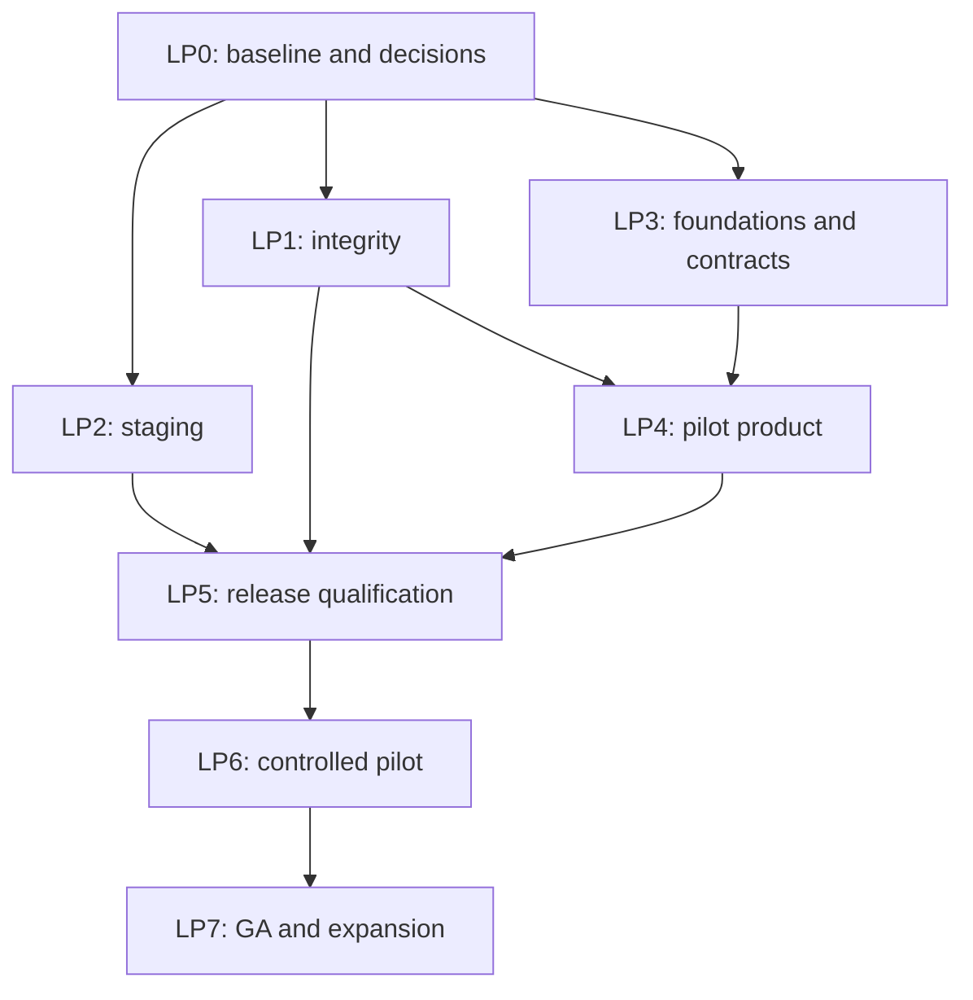

# TonyAI — Launch Phases and Parallel Delivery Contract

**Version:** 1.0 · **Created:** 2026-09-27 · **Language:** English, per repository policy.

**Audience:** the project owner and any implementation/review platform, including Claude, Gemini and Codex. No platform-specific memory, agent name, tool or previous conversation is required to understand an assigned task.

**Purpose:** turn the [architecture assessment](project_status_updated.md) into bounded, assignable work with dependencies and evidence of completion. This file is the execution plan; the assessment explains the findings; [project-status.md](project-status.md) retains accepted decisions and delivery history.

**This document is a plan, not proof that a task has started or finished.** Its creation does not deploy anything, assign a platform, authorise a merge or establish that earlier findings still exist on a newer commit.

## 1. Start here — instructions for every platform

1. Read this section, the project's [CLAUDE.md](../../CLAUDE.md), the assigned task card, and its referenced findings in [project_status_updated.md](project_status_updated.md). CLAUDE.md contains repository conventions even if your platform has another name; your platform's applicable system and user instructions still govern execution.
2. Read only the relevant current sections of [project-status.md](project-status.md), then inspect the actual code. A dated audit or old “Next up” paragraph is not a substitute for checking the assigned baseline.
3. Receive **one task ID**, an owner, a base commit, a branch/worktree, an allowed file list and a test environment from the coordinator. Do not independently choose work another platform may already own.
4. Verify dependencies have been integrated, contracts are identified and file reservations do not conflict. If implementation cannot start, prepare a bounded design/test proposal and state the blocker; do not invent the missing API or factor values.
5. Work within the assigned task and preserve existing changes. Report any needed expansion of file ownership to the coordinator before editing those files.
6. Deliver code or a reviewable patch, tests, limitations and the standard handoff in section 9. A chat message saying “done” is not release evidence.
7. Do not commit/push without the user's authorisation. The user merges PRs. Do not resolve another worker's merge or change the shared checkout on its behalf.

**Access note:** saving this file does not automatically load it into every platform. For a repository-connected tool, use the starter prompt in section 9. For a chat-only tool, provide this file, the relevant finding excerpts and assigned source files. Its output is a proposal/patch until an implementation worker applies and verifies it. Never claim local commands or cloud checks were run without access to that environment.

### Baseline warning for this edition

The assessment was made against `410a259`. While preparing this plan, local HEAD was `0888d78`; staged import/parser changes were present, and Git still reported `docs/roadmap_docs/project-status.md` as unmerged in the index. Its working text described #133 as merged. These observations do **not** establish a clean integrated release or fresh verification of that fix.

The owner of that in-progress Git operation must complete it before the coordinator selects a clean implementation baseline. Do not repeat the XLSX fix merely because F17 exists in the older report. `LP1-04` is first a verification task. No application changes, index changes or conflict resolution are part of creating this document.

## 2. Fixed pilot scope and architectural rules

### Pilot must deliver

- One real holding company, with its subsidiaries and applicable locations.
- Authoritative UK and Türkiye factors for the agreed reporting years.
- Applicable Scope 1 and Scope 2 sources, including mobile combustion and refrigerants.
- Turkish and English journeys, messages and reports, with explicit numeric-input rules.
- All four roles: `super_admin`, `consultant`, `data_entry`, `executive_viewer`.
- Tenant provisioning and user lifecycle without ad hoc database edits.
- Consistent, traceable inventory reports; reliable evidence, audit and correction paths.
- A repeatable deployment, tested recovery, operational ownership and signed pilot acceptance.

### Outside the pilot

Scope 3, suppliers, report sharing, advanced analytics, dark mode and extra report templates. Full linked-revision UX is deferred unless the pilot domain owner requires it; the pilot still needs a documented and tested correction procedure. Do not introduce these features as prerequisites without a recorded scope decision.

### Preserve these boundaries

- Keep the Next.js web + NestJS modular API + PostgreSQL/Supabase architecture.
- `apps/web` calls the backend through `apps/web/lib/api.ts`; no browser database bypass.
- Shared contracts live in `packages/shared-types`; web imports through its existing type re-export.
- Persist application data through the existing Prisma layer; controllers do not become business-logic containers.
- The API guard derives access, but each query must remain tenant-scoped. Owner-backed Prisma is not automatically protected by end-user RLS.
- Never weaken RLS, role checks, snapshot immutability, period controls or append-only audit semantics to make tests pass.
- Never invent emission factors. Record authoritative provenance, version, methodology and permitted use.
- Inspect migrations for accidental removal of the raw `NULLS NOT DISTINCT`/non-voided uniqueness index. Preserve composite evidence tenant constraints.
- Keep code, identifiers, comments and documents English. Turkish catalogue values and relevant fixtures are the established exception.
- Use an existing library where appropriate; do not replace the bounded XLSX parser or add microservices/queues as unrelated cleanup.
- Do not run seed/reset/E2E cleanup against customer production. A local test helper is not automatically cloud-safe.

## 3. Parallel working agreement

### 3.1 Responsibilities are portable between platforms

| Responsibility | Owns | Typical output |
|---|---|---|
| Coordinator / integrator | Task claims, base commits, dependency order, shared-file reservations, final integration evidence | Assignment, conflict resolution plan, updated central status |
| Integrity worker | Record/evidence transactions, concurrency and tenant invariants | Small backend PRs and real-database failure/race tests |
| Cloud worker | Infrastructure, deployment, environment configuration and recovery | Reproducible environment, exact-image smoke, operational evidence |
| Product worker | Reporting context, customer flows and localisation | UI/API integration and role/locale acceptance |
| Domain/data worker | Factor model, sources, inventory boundaries and golden calculations | Reviewed contracts, source manifest, imports and domain examples |
| Independent reviewer / QA | Security, domain-contract and acceptance review | Findings with file references and reproducible evidence |

These are roles, not a recommendation that a particular model is more capable. One platform may perform different roles in separate tasks. Sensitive changes require a review context independent of their implementation, using the project's required security/QA/architecture review responsibilities. Human domain, customer, legal and launch decisions remain with the appropriate people.

### 3.2 Isolation rules

1. **One task, one branch, one isolated worktree or clone.** Start from the coordinator's exact commit. Branch example: `codex/lp1-01-record-integrity`; equivalent platform prefixes are acceptable under the user's Git conventions.
2. **No simultaneous writers in the same checkout.** Read-only reviews can share source access; implementation must use isolated checkouts.
3. **One owner per shared resource.** A file reservation is agreed by the coordinator, not acquired by racing edits to a Markdown table. Independent chats do not automatically synchronise with each other.
4. **Test data also needs isolation.** Allocate separate database/Supabase instances, storage namespaces, ports and environment files where feasible. Otherwise reserve the shared test stack exclusively and serialise data-changing tests. Separate worktrees alone do not isolate a database.
5. **Use stable interfaces.** A consumer starts executable integration after its dependency contract is merged. Before that, it may prepare design or a clearly labelled fixture against an agreed draft, but cannot claim end-to-end completion.
6. **Recheck after integration.** Individually green branches can break when combined. Merge one change at a time, update the next branch and rerun affected checks on the combined commit.
7. **No automatic takeover.** A stalled owner must hand off or have the task reassigned by the coordinator. Do not assume inactivity permits a second implementation.

### 3.3 Shared resources requiring an explicit reservation

| Resource | Why it conflicts | Coordination rule |
|---|---|---|
| Prisma schema, migration directory and seed | Multiple tasks reshape related data and raw SQL constraints | One schema/migration integrator; reserve a slot, review ordering and test the full chain. Never run concurrent schema generation on a shared DB. |
| `packages/shared-types/src/index.ts` | Roles, factors, reports, pagination and errors share one contract surface | Publish a small contract change first; one writer at a time; give consumers its commit. |
| `apps/web/lib/api.ts`, auth store, shared shell | Most UI tasks need them | Reserve changes; integrate foundation changes before consumers. |
| Record, evidence and period services | Their checks, locks and transactions must share one protocol | LP1 tasks run in the declared order; no independent competing lifecycle refactor. |
| Report and emissions services/pages | Coverage, dataset, year and localisation touch the same paths | Land context/contracts first; localise a feature's final copy with its owner. |
| Root package manifests and lockfile | Tool/dependency additions conflict | Batch dependency decisions through one owner; never resolve by deleting lockfile sections. |
| CI, Dockerfiles, shared test setup | All workers depend on them | Cloud/QA owner reserves edits; test consumers receive the changed commit/config. |
| This plan, README and `project-status.md` | Every worker could rewrite the status | Coordinator edits central status once in the integration PR; workers provide proposed status text in handoff. Preserve required documentation updates without concurrent writers. |

### 3.4 Status and ownership protocol

Use: `BACKLOG → READY → IN_PROGRESS → IN_REVIEW → INTEGRATED → DONE`. Use `BLOCKED` with a named dependency/decision; use `DEFERRED` only for approved exclusions or post-pilot work.

- `READY`: dependencies integrated, relevant decisions settled, owner and resources assigned.
- `IN_REVIEW`: implementation and handoff available, required checks stated honestly.
- `INTEGRATED`: the user has merged the change; combined verification is pending.
- `DONE`: acceptance criteria pass on the integrated commit, required reviews are closed, and documentation is current.
- An accepted contract can release its consumers before every task in its broader phase finishes.
- All pilot task cards below begin **unassigned / BACKLOG**; LP7 expansion tasks begin **DEFERRED**. Dates are targets; no checkbox implies work has been run.

The coordinator maintains one assignment ledger in the chosen shared tracker or in this document. Workers do not maintain separate competing status boards. A handoff file, if used, is uniquely named for its task, for example `docs/roadmap_docs/handoffs/LP1-01.md`.

| Task ID | State | Owner/platform + session | Base → integrated SHA | Branch/worktree | Reserved files + test stack | Dependency/decision | Evidence / next action |
|---|---|---|---|---|---|---|---|
| Unassigned template | BACKLOG | — | — | — | — | — | Coordinator fills before dispatch |

## 4. Phase overview and dependency map

**IDs use `LP` to avoid confusion with the old Phase 0–5 and WP numbers.** LP0 here is launch coordination, not rebuilding the foundation already delivered. Phase numbers group work; they do not require every phase to execute sequentially.

| Phase | Outcome | Start condition | Parallel opportunity | Exit gate |
|---|---|---|---|---|
| LP0 | Clean baseline, ownership and pilot decisions | Immediately | Domain/access preparation and read-only investigation | G0: assignable, agreed work |
| LP1 | Reliable record, evidence and tenant invariants | LP0-01; relevant policies from LP0-02 | LP2 and foundation work in LP3 | G1: integrity demonstrated |
| LP2 | Reproducible controlled staging | LP0-01; cloud access | LP1 and LP3 | G2: labelled staging works |
| LP3 | Published contracts and product foundations | LP0-01; relevant decisions | Disjoint foundation tasks with reserved shared files | G3: downstream contracts stable |
| LP4 | Complete pilot product | Task-specific LP1/LP3 dependencies | Separate customer, factor and report tasks | G4: complete agreed pilot scope |
| LP5 | Qualified release candidate | Integrated LP1–LP4 | Independent assessments on isolated environments | G5: production go/no-go evidence |
| LP6 | One customer live and first close reconciled | G5 + user launch approval | Support/monitoring and controlled fixes | G6: pilot validated |
| LP7 | Post-pilot expansion / GA | G6 + prioritisation | Only with isolated contracts/resources | G7: separately agreed GA scope |



The diagram is phase-level. **The `Depends on` field on each task is the executable dependency list.** Tasks may be split into smaller PRs, keeping the parent ID and acceptance gate. Do not mark the parent done because its first PR merged.

## 5. Task cards

Every card states dependencies, suggested owner, edit area, deliverables and acceptance. “Edit area” is a reservation request, not permission to modify every file under it. Record the exact allowed file list at dispatch.

### LP0 — Establish the shared starting point

#### LP0-01 — Baseline and work allocation

- **Depends on:** none. **Owner:** coordinator. **Area:** central planning and integration metadata; no product edits.
- [ ] Let the owner finish the existing Git operation; record a clean base SHA and inspect whether #133 is actually included.
- [ ] Reconcile F01–F18 against that SHA; record already-fixed findings instead of opening duplicate work.
- [ ] Record current test evidence; allocate one owner, worktree/branch, file reservation and test stack per initial task.
- [ ] Ensure all platforms can access this plan and the referenced assessment at the agreed version; a local untracked file is not available in another machine's checkout.
- **Done when:** assignments have complete context and no overlapping write/test-stack ownership. No unresolved integration state is mistaken for a release baseline.

#### LP0-02 — Pilot inventory and governance decisions

- **Depends on:** LP0-01. **Owner:** product/domain lead, with engineering support. **Area:** decision records, source manifest and acceptance scope.
- [ ] List actual pilot sources, gases/fuels, locations, reporting years and evidence obligations; name unsupported or non-applicable sources explicitly.
- [ ] Decide reporting basis, factor-year mapping, base-year/restatement policy, company/site attribution and overlapping monthly/quarterly/annual data.
- [ ] Decide self-approval, non-author submission, rejected records in closed periods, correction procedure and final/partial report meaning.
- [ ] Decide locale input/report-language rules and multi-organisation consultant scope.
- [ ] Start factor licence/source review, privacy/retention review and security-assessment scheduling; name the external decision owners.
- **Done when:** decisions have IDs, dates and accountable owners; unresolved items block only their named dependent tasks. Discovery can continue in parallel; authoritative decisions cannot be invented by an implementation tool.

**G0:** LP0-01 is complete; each dispatched task has the subset of LP0-02 decisions it needs. Long-lead approvals are tracked explicitly.

### LP1 — Protect inventory and evidence integrity

#### LP1-01 — Atomic lifecycle and concurrent-state protection

- **Depends on:** LP0-01 and relevant LP0-02 workflow decisions. **Owner:** integrity worker. **Area:** record, period-lock and audit services; targeted schema/contract reservation if needed. **Findings:** F02, F03.
- [ ] Define one transaction/expected-state protocol before changing writers; include empty-period creation and deterministic lock ordering.
- [ ] Commit the business mutation and mandatory audit entry through the same transaction client.
- [ ] Recheck state, access and period conditions under the protocol; refuse stale updates rather than overwrite approval/closure.
- [ ] Cover create/update/submit/review/approve/reject/void/delete and importer reuse of these paths; define retries and typed conflicts.
- **Done when:** real PostgreSQL rollback and controlled interleaving tests prove no unaudited mutation, approval regression or write into a closed period. Existing API behaviour remains compatible except documented conflict responses. Independent security and QA review complete.

#### LP1-02 — Evidence concurrency and recoverable storage operations

- **Depends on:** LP1-01, plus the retention/correction decisions relevant to files. **Owner:** integrity/storage worker. **Area:** evidence/storage/reclamation, associated migrations and tests. **Findings:** F02, F03, F14.
- [ ] Apply the lifecycle protocol to shared uploads, detaches and deletion; protect evidence-required submission against races.
- [ ] Record recoverable intent for cross-database/Storage effects; retry cleanup without long external calls inside database transactions.
- [ ] Detect both orphan files and metadata pointing to missing bytes; establish content identity and import-source retention rules.
- [ ] Define MIME/content validation, safe downloads and the chosen scanning/quarantine policy.
- **Done when:** failure injection at each DB/Storage boundary is recoverable; concurrent approval cannot silently lose evidence; cleanup is bounded, observable and safe during restoration. Security/QA review complete.

#### LP1-03 — Tenant and administrative invariants

- **Depends on:** LP0-01 and LP0-02 role/provisioning decisions. **Owner:** security/backend worker. **Area:** auth, access policies, runtime DB roles and migrations. **Finding:** F06.
- [ ] Enforce same-organisation access grants in the API and direct database policy/write paths.
- [ ] Separate migration privileges from runtime privileges; document owner-backed Prisma versus end-user RLS.
- [ ] Establish the safe role/access mutation boundary used by onboarding; do not create a cross-tenant tenant-admin role.
- [ ] Exercise two organisations, all four roles, foreign identifiers and malformed grants through API and PostgREST.
- **Done when:** discriminating isolation tests pass, intended runtime privileges are verified in the target environment, and independent security/QA/contract reviews close. Implementation may proceed before LP2; deployed privilege verification waits for LP2-01. Reserve schema changes against LP1-01/02.

#### LP1-04 — Verify or finish the XLSX escape follow-up

- **Depends on:** LP0-01; handoff from the existing parser-task owner. **Owner:** assigned parser worker or QA. **Area:** bounded import/parser tests only. **Finding:** F17.
- [ ] Inspect the integrated #133-equivalent fix and its evidence before writing code.
- [ ] Verify shared/inline strings, escaped NUL, lone surrogates, valid emoji pairs, escaped literals and header refusal semantics.
- [ ] Confirm refusal timing cannot cause partial corrupt data/audit writes; update the relevant UAT case.
- **Done when:** current-baseline regression evidence proves the outcomes. If already fixed, record “verified existing implementation”; do not reimplement it.

**G1:** all LP1 acceptance criteria pass on integrated code. Database-mock tests alone do not close the concurrency/rollback gate.

### LP2 — Deliver controlled staging

#### LP2-01 — Environment and infrastructure foundation

- **Depends on:** LP0-01 and assigned cloud access. **Owner:** cloud worker. **Area:** `infra/`, deployment configuration and environment examples.
- [ ] Codify Azure Container Apps, registry, secret references, managed identities/OIDC and logging under the accepted regional design.
- [ ] Provision isolated Supabase staging with migration handling, private `evidence` and import-source buckets, intended Auth redirects/signup policy and CORS.
- [ ] Keep cloud configuration distinct from local/test settings; document environment-bound web builds and secret handling.
- **Done when:** staging can be recreated from versioned instructions/configuration without demo credentials or exposed service keys. Actual cloud execution is evidenced; generated infrastructure files alone are insufficient. **Findings:** F11, F12.

#### LP2-02 — Candidate image and CI/deployment path

- **Depends on:** LP2-01 for cloud deployment; lint/container preparation may start after LP0-01. **Owner:** cloud/CI worker. **Area:** workflows, Dockerfiles, ESLint ignores and test-environment helpers.
- [ ] Fix root lint traversal of nested worktrees without suppressing application checks.
- [ ] Build and identify images; start the actual images in smoke tests; push/deploy using the intended identity mechanism.
- [ ] Record candidate SHA, migrations and image digests; build web artefacts with the target environment values.
- [ ] Adapt cloud isolation/smoke fixtures to dedicated synthetic tenants; prevent local demo seed or broad cleanup from targeting production.
- **Done when:** the exact deployed artefact passes startup/login/export smoke, with controlled fixture cleanup and a documented release check sequence. **Findings:** F10, F11.

#### LP2-03 — Health, observability and staging acceptance

- **Depends on:** LP2-02; coordinate runtime privilege checks with LP1-03. **Owner:** cloud/backend worker. **Area:** health/observability, probes, alerts and staging runbook.
- [ ] Separate liveness, bounded dependency readiness and authenticated synthetic checks.
- [ ] Test error reporting, secret rotation procedure and delivery of alerts to a named operator.
- [ ] Exercise migration compatibility and staging rollback; use labelled demo factors until authoritative releases are ready.
- **Done when:** login → entry → evidence → review → report works on the staging URL; environment failure is observable; rollback is rehearsed. **Findings:** F11, F16.

**G2:** repeatable labelled staging is available. G2 does not imply G1 or production readiness; keep real customer inventory out until the production gate.

### LP3 — Publish foundations and domain contracts

#### LP3-01 — Localisation and error-code foundation

- **Depends on:** LP0-01 and LP0-02 locale decisions. **Owner:** product/frontend worker. **Area:** i18n infrastructure, shared shell, error contracts and API client.
- [ ] Choose and wire the framework/catalogue convention; connect the user's language preference.
- [ ] Define stable error codes and locale-neutral numeric/date wire values; localise display separately.
- [ ] Document catalogue namespaces and report/email language selection so parallel feature workers can use the same convention.
- **Done when:** a representative screen/error round-trip works in TR/EN, numeric inputs have explicit rules, and downstream teams receive the integrated contract commit. **Finding:** F09.

#### LP3-02 — Reporting context and year rollover

- **Depends on:** LP3-01 foundation; reserve shared contracts/pages. **Owner:** product/frontend worker. **Area:** store/URL state, API client, dashboard/emissions/report/intensity consumers.
- [ ] Carry one selected year/entity context through reads, refreshes and export requests.
- [ ] Support 2027 rollover without claiming factor coverage where none exists.
- [ ] Reconcile all-year versus selected-year behaviour explicitly; preserve intended comparison features.
- **Done when:** a two-year/two-subsidiary fixture produces consistent dashboard, absolute/intensity and report results. **Finding:** F08.

#### LP3-03 — Factor model and calculation contracts

- **Depends on:** LP0-02 factor/methodology decisions and a schema reservation. **Owner:** domain/backend worker. **Area:** factors, normalisation, shared contracts and migrations.
- [ ] Model gas/fuel dimensions, units, reporting basis, publication/licence provenance and sortable releases.
- [ ] Replace category-blind conversion assumptions with sourced/versioned inputs and explicit missing-coverage outcomes.
- [ ] Decide activity identity for multiple fuels/meters before changing uniqueness; preserve legacy snapshots and constraints.
- [ ] Publish the factor/import/form contracts and migration compatibility requirements before consumers start implementation.
- **Done when:** contract tests distinguish gas/fuel/basis/version/year; source-independent structural tests pass; historical snapshots stay unchanged. Real factor loading belongs to LP4-02. **Finding:** F01.

#### LP3-04 — Inventory coverage and report-dataset contracts

- **Depends on:** LP0-02 boundary/report decisions and LP3-03's published factor/provenance contract. **Owner:** domain/report worker. **Area:** coverage, report DTOs, applicability/boundary schema.
- [ ] Separate review status, inventory coverage and calculation/provenance quality.
- [ ] Define required sites/categories/periods, effective boundaries, exclusions and overlap attribution.
- [ ] Define a consistent `ReportDataset`, issuance identity/fingerprint and final-output retention/reproduction policy.
- [ ] State “Scope 3: not covered” and distinguish an excluded source from a measured zero.
- **Done when:** examples for one approved record, a mid-year site, missing factors, exclusions and withdrawals have unambiguous expected outcomes; API/DB contracts are integrated for consumers. **Findings:** F04, F05, F15.

**G3:** contracts have identifiable commits and agreed examples. Reserve schema/shared-types work serially; frontend consumers must not maintain hand-written competing DTOs.

### LP4 — Complete the agreed pilot product

#### LP4-01 — Organisation onboarding and user lifecycle

- **Depends on:** LP1-03, LP3-01 and relevant LP0-02 decisions. **Owner:** customer-flow worker. **Area:** provisioning/user APIs, Auth/email integration and their UI; schema slot reserved.
- [ ] Implement audited organisation/first-admin provisioning with a separate operator boundary.
- [ ] Implement invite/accept/reset, role/access management and account disabling for all four roles.
- [ ] Make partial Auth/profile/email failures retryable and observable; define revocation behaviour for existing tokens.
- [ ] Build new screens/emails on the TR/EN foundation; avoid adding untranslatable strings for a later rewrite.
- **Done when:** a new holding and all four roles onboard, recover access and leave without ad hoc DB edits; cross-tenant escalation fails; required audit/failure-path tests pass. **Findings:** F07, F09, F15.

#### LP4-02 — Authoritative UK/TR factors and missing source forms

- **Depends on:** LP3-03, LP3-04, LP1-01, LP3-01 and source/licence approvals from LP0-02.
- **Owner:** domain/data worker with product support. **Area:** factor import/release tooling, calculations, mobile/refrigerant forms and fixtures.
- [ ] Load reviewed authoritative releases with licence/source metadata and an errata/update procedure.
- [ ] Complete mobile-combustion and refrigerant inputs for the pilot's actual inventory.
- [ ] Cover required factor years and missing-coverage behaviour; prevent demo factors/conversions in production.
- [ ] Derive golden expected values independently from the cited source, including conversion and rounding policy.
- **Done when:** every applicable pilot source is supported or explicitly excluded by a scope decision; golden calculations reconcile; old snapshots remain unchanged after a new release. **Finding:** F01.

#### LP4-03 — Consistent reports and honest completeness

- **Depends on:** LP1-01, LP1-02, LP3-02 and LP3-04. **Owner:** report/backend worker. **Area:** report assembly/writers, emissions/coverage consumers and report UI.
- [ ] Read one consistent dataset and derive totals, ledger, factors and status from it; render after the database read finishes.
- [ ] Expose expected-versus-covered obligations and exclusions consistently across dashboard, entry and exports.
- [ ] Identify final issued outputs and retain the agreed dataset/artefact; keep live previews explicitly distinct.
- [ ] Preserve shared evidence, withdrawal disclosure and export safety; use the agreed report language.
- **Done when:** simultaneous inventory changes cannot make a report contradict its ledger; PDF/Excel/CSV reconcile for the same dataset; a one-record partial year is not certified complete; issued output is retrievable/reproducible. **Findings:** F04, F05, F15.

#### LP4-04 — Complete TR/EN and current UAT catalogue

- **Depends on:** LP4-01/02/03 for final full acceptance; catalogue preparation and feature-local translations start after LP3-01.
- **Owner:** product/localisation + QA. **Area:** catalogues, final UI/report/email copy and UAT documents. Do not rewrite another worker's active page.
- [ ] Cover every pilot screen, error, toast, email and report; obtain Turkish domain-language review.
- [ ] Verify Turkish numeric form/CSV/XLSX cases and ensure language changes cannot change quantities.
- [ ] Refresh bulk/shared-evidence cases, executive-viewer coverage and the 16 round-1 feedback dispositions.
- **Done when:** the catalogue describes the candidate build and all four-role/two-tenant TR/EN journeys have explicit expected outcomes; no placeholder acceptance is recorded. **Findings:** F09, F16.

#### LP4-05 — Runtime limits and bounded data access

- **Depends on:** LP2-02 and LP1-01/02 for implementation; baseline limits and this task's contract proposal can be designed earlier.
- **Owner:** backend/performance worker. **Area:** API limits, record pagination and its consumers, PDF concurrency, containers and connection budgets.
- [ ] Apply endpoint-aware throttling/security headers, correct proxy handling and size/time limits.
- [ ] First publish the pagination/error contract in a reserved shared-contract change; then paginate record reads and update all consumers against that integrated contract.
- [ ] Bound PDF/import concurrency and memory use; define replica/throttle and DB pool budgets.
- [ ] Slim runtime images/process handling as needed; keep queue introduction conditional on measured requirements.
- **Done when:** overload produces controlled responses, unbounded history reads are eliminated, and limits have configuration/contract tests. Capacity claims wait for LP5-03. **Finding:** F13.

**G4:** LP4 tasks meet their acceptance criteria with real authoritative pilot examples. Final UI/export verification follows the last integrated feature change.

### LP5 — Qualify the release candidate

Test design and external scheduling start earlier; a qualification result only applies to the candidate it actually exercised.

#### LP5-01 — Integrated regression and product sign-off

- **Depends on:** G1, G2, G3 and G4. **Owner:** independent QA + product/domain owner. **Area:** acceptance tests, UAT evidence and release manifest.
- [ ] Run lint, typecheck, build, relevant unit/integration suites, full E2E and isolation checks on the integrated candidate.
- [ ] Confirm candidate image/config/schema identity; test all roles, two organisations, years, locales, imports, corrections and final reports.
- [ ] Reconcile a representative inventory independently; close UAT feedback with named sign-off.
- **Done when:** evidence records the exact SHA/environment, results and limitations; critical/high failures are fixed and rerun. **Findings:** F10, F16.

#### LP5-02 — Security and privacy qualification

- **Depends on:** G1–G4 for the final assessment; appointment, policy work and test design start in LP0.
- **Owner:** independent security reviewer + responsible privacy/legal owner. **Area:** assessment evidence, reviewed policies and narrowly assigned remediation.
- [ ] Assess API and PostgREST tenant isolation, role mutation, JWT/auth configuration, uploads, audit access and resource abuse.
- [ ] Verify runtime privileges, cloud secret handling and a performed rotation.
- [ ] Resolve retention and personal data in audit diffs/free-text exports; record applicable processor/customer terms and operational responsibilities.
- **Done when:** no unresolved critical/high finding; fixes retested; policy decisions reviewed by the responsible people. An AI-written policy is not legal sign-off. **Findings:** F06, F13, F14, F15.

#### LP5-03 — Capacity and recovery proof

- **Depends on:** LP4-05, LP1-02 and LP2-03; final numbers bind the release candidate after G4.
- **Owner:** cloud/performance worker with independent reviewer. **Area:** isolated load/restore environments and runbooks.
- [ ] Agree p95/error/memory targets, expected data volumes, RPO/RTO and concurrency ceilings before measuring.
- [ ] Measure steady-state load separately from cold starts; exercise PDF/import contention and DB pools.
- [ ] Restore database plus evidence/import-source bytes/configuration; reconcile hashes, relationships and report totals.
- [ ] Exercise previous-version recovery, migration compatibility and rollback; ensure reclamation jobs are safe around recovery.
- **Done when:** measured budgets pass; login and a reconciled report work after restoration; recovery times/data age and all limitations are recorded. **Findings:** F11, F12, F13, F14.

#### LP5-04 — Release manifest and operational handover

- **Depends on:** LP5-01/02/03. **Owner:** coordinator + operations owner. **Area:** release checklist, runbooks and central documentation.
- [ ] Identify candidate SHA/images/migrations/config, factor releases, policies, UAT and security evidence.
- [ ] Name deployment, incident, support, user administration, factor release and restore owners.
- [ ] Confirm production isolation, no-demo checks, monitoring and a concrete rollback/communication plan.
- [ ] Present the final go/no-go package to the user; deployment/merge approval is tied to this exact candidate.
- **Done when:** G5 below is complete and the launch decision is recorded. No platform self-approves the release.

**G5 — production gate:**

- [ ] G1–G4 achieved on the integrated candidate.
- [ ] Atomic mutation and concurrency tests pass on PostgreSQL.
- [ ] All applicable pilot calculations use reviewed sources; no production demo path.
- [ ] Reporting totals, coverage, boundary and issued artefacts reconcile.
- [ ] Tenant isolation and four-role lifecycle pass; TR/EN/year semantics pass.
- [ ] Actual release containers, migration and rollback pass.
- [ ] Capacity and DB-plus-Storage recovery meet agreed budgets.
- [ ] Security findings closed/retested; privacy/retention decisions recorded.
- [ ] Product/domain acceptance and operational handover complete.
- [ ] User approves opening this candidate to the pilot customer.

A later change invalidates affected evidence. The coordinator reruns the appropriate subset and broadens regression when the risk requires it; an earlier green SHA is not evidence for an untested candidate.

### LP6 — Open and validate the pilot

#### LP6-01 — Controlled customer opening

- **Depends on:** G5 and explicit user launch approval. **Owner:** release operator + product/customer owner. **Area:** approved deployment/onboarding procedure.
- [ ] Deploy the approved candidate and perform production smoke with safe fixtures.
- [ ] Provision the first holding and users; validate the initial data import and reconcile totals with its domain owner.
- [ ] Train users, communicate scope/corrections/support and monitor early activity.
- **Done when:** the named customer completes the supported flow, evidence is recorded, and rollback/support owners are available.

#### LP6-02 — First reporting close and pilot review

- **Depends on:** LP6-01 and a real reporting cycle. **Owner:** product/domain + operations.
- [ ] Review import errors, pending reviews, completeness, reports, incidents and capacity.
- [ ] Reconcile the first real close and test the customer-facing correction procedure.
- [ ] Record pilot feedback and choose GA scope using observed needs and support capacity.
- **Done when:** the pilot owner signs off the first close and the GA decision has explicit conditions. **G6:** a validated pilot, not merely a running URL.

### LP7 — Post-pilot expansion

All LP7 tasks start `DEFERRED`; they do not block the agreed pilot.

- **LP7-01 — Scope 3:** depends on G6 and approved expanded inventory/factor contracts. Deliver category-specific methodology, factors, inputs, evidence and tests before claiming coverage.
- **LP7-02 — Report sharing:** depends on G6 and LP4-03's issued-output identity. Deliver access/expiry/revocation, abuse controls and the approved redaction/privacy policy; reuse the existing email transport.
- **LP7-03 — Suppliers:** depends on LP7-01 and an agreed supplier boundary/permission model. Deliver real data-backed workflows; no fabricated ESG scores.
- **LP7-04 — GA and selected maintenance:** depends on G6 and the chosen GA scope. Decide support/commercial requirements, operational capacity and only then prioritise advanced analytics, templates, dark mode, linked revisions and F18 maintenance. No automatic microservice rewrite.

**G7:** independently defined GA acceptance passes. Scope 3, sharing and suppliers are not all mandatory for GA unless the user explicitly makes them part of that release.

## 6. Practical parallel dispatch

With three implementation platforms, use this rotation as a starting point. The coordinator is a responsibility the project owner or a dedicated session may hold; it is not permission for several tools to merge independently.

| Wave | Worker A — backend integrity | Worker B — cloud | Worker C — product/domain | Outside implementation |
|---|---|---|---|---|
| After G0 | LP1-01; LP1-04 verification after existing owner handoff | LP2-01 | LP3-01 | LP0-02 domain/source/privacy decisions; independent test design |
| After relevant dependencies | LP1-02, then LP1-03 using reserved schema slots | LP2-02, then LP2-03 | LP3-02, then LP3-03/04 or hand these to a domain worker | Review each integrated slice; confirm source permissions |
| After contracts | LP4-01 or LP4-03, not both in one task | LP4-05 with reserved API/page edits | LP4-02; feature-local translation under LP3-01 | Independent review/UAT preparation |
| Integrated candidate | Fix assigned integrity/customer-flow findings | LP5-03 and operational handover | LP4-04, then LP5-01 support | Independent LP5-01/02 reviews and human sign-off |

The second wave is a queue, not a promise that one worker completes several tasks simultaneously. More workers are useful for **disjoint** tasks and independent review, not for concurrent edits to the same schema, core service or page.

Explicitly incompatible assignments without sequencing:

- Two workers both changing record/period transaction semantics.
- Factor-model and onboarding migrations generated independently against a shared evolving schema without a schema integrator.
- Report coverage and report rendering workers inventing different report DTOs.
- Whole-app localisation while another worker rewrites the same pages.
- Parallel E2E runs sharing resettable fixtures or a common cloud test tenant.
- Every platform rewriting `project-status.md` or the central plan after its own turn.

## 7. Dates and re-planning rules

| Milestone | Existing target | Conditions |
|---|---|---|
| Controlled staging | 2026-10-11 | G2; labelled demo data allowed, no production-readiness claim. |
| Foundations and authoritative pilot scope | October–November 2026 | G1/G3/G4, source approvals and contract integration. |
| Qualification | 2026-11-30 to 2026-12-20 | G5 evidence against one integrated candidate. |
| Pilot opening | 2027-01-08 | G5 and user launch decision; existing contingency through 2027-02-15. |
| GA | 2027-03-31, provisional | G6 plus a separately agreed and verified GA scope. |

Review the assignment ledger weekly and at each gate. Rebaseline when source approvals, integrity fixes or staging access move the critical path. Do not compress security/recovery/UAT gates to preserve a calendar date. Model output speed does not remove review, integration, human decisions or external dependencies.

## 8. Traceability and definition of done

| Assessment finding | Delivery tasks |
|---|---|
| F01 — authoritative factors/model | LP0-02, LP3-03, LP4-02 |
| F02 — audit atomicity | LP1-01, LP1-02 |
| F03 — lifecycle/period/evidence races | LP1-01, LP1-02 |
| F04 — consistent report dataset | LP3-04, LP4-03 |
| F05 — approval versus completeness | LP0-02, LP3-04, LP4-03 |
| F06 — tenant trust boundary/grants | LP1-03, LP5-02 |
| F07 — provisioning/user lifecycle | LP4-01 |
| F08 — reporting context/year | LP3-02 |
| F09 — localisation/numeric correctness | LP3-01, LP4-01/02/03, LP4-04 |
| F10 — release checks | LP2-02, LP5-01, LP5-04 |
| F11 — deployment/readiness/rollback | LP2-01/02/03, LP5-03/04 |
| F12 — recovery of DB and files | LP1-02, LP5-03 |
| F13 — resource bounds | LP4-05, LP5-02/03 |
| F14 — recoverable file operations | LP1-02, LP5-02/03 |
| F15 — boundary/governance policies | LP0-02, LP3-04, LP4-03, LP5-02 |
| F16 — UAT/documentation drift | LP4-04, LP5-01/04 |
| F17 — XLSX escape follow-up | LP1-04: verify current implementation first |
| F18 — maintainability | LP7-04; required lint-scope fix is LP2-02 |

Every implementation task is done only when:

1. Its acceptance criteria are satisfied, with proof appropriate to the claim.
2. Tests cover meaningful failures as well as successful behaviour. Mock tests do not establish database isolation, browser wiring, Storage recovery or actual cloud configuration.
3. Relevant checks pass: `pnpm lint`, `pnpm typecheck`, `pnpm build`, `pnpm test`; run live API/browser/E2E/RLS checks when the affected risk calls for them. Use uncached affected tests when cache freshness is uncertain; label cached results honestly.
4. Schema/contract changes receive architecture review; calculation, auth/RLS, tenancy and lifecycle changes receive security and QA review under repository rules. Reviewers state what they verified and any unavailable environment.
5. Results name the tested SHA, environment, commands, outcome and limitations. No copied historical test count is presented as current verification.
6. The user-approved integration is verified and the coordinator folds documentation/status updates into that work's PR. There are no unrelated code changes, secret values, generated artefacts or destructive cleanup of another worker's data.

A documentation-only task needs link/ID/dependency/consistency verification; it does not require booting the product simply to prove prose was written. Cloud operations and externally visible actions follow the user's actual authorisation and the platform's permissions, not blanket authority inferred from this plan.

## 9. Copyable assignment and handoff templates

### Starter prompt — give this to any platform

```text
Work on TonyAI task <TASK_ID> from docs/roadmap_docs/project_launch_phases.md.

Read that file's sections 1–4, your task card, sections 8–9, CLAUDE.md,
and the relevant findings in docs/roadmap_docs/project_status_updated.md.
Check current code and accepted decisions; do not rely on another chat's memory.

Coordinator: <NAME / SHARED TRACKER>
Your role and owner/session ID: <ROLE / ID>
Mode: <IMPLEMENTATION | READ_ONLY_REVIEW | DESIGN_ONLY>
Base commit: <EXACT_SHA>
Branch and isolated checkout: <BRANCH / PATH>
Allowed files: <EXACT FILES OR NARROW DIRECTORIES>
Reserved shared resources: <FILES / SCHEMA SLOT>
Test environment: <LOCAL ISOLATED STACK / RESERVED STACK; NO SECRETS IN PROMPT>
Dependencies and contract commits: <TASK IDS / SHAS>
Relevant decision IDs: <DECISIONS>
Acceptance criteria: <COPY THE TASK CRITERIA + ANY APPROVED REFINEMENTS>
Git/external action authorisation: <WHAT THE USER HAS ACTUALLY AUTHORISED>

Implement only this task, or perform only the assigned read-only/design work.
Before writing outside your reservation, send the coordinator a change request.
Do not duplicate a task already fixed or owned by someone else.
Do not merge, reset, seed a shared/customer database or alter another worker's checkout.
If access or a decision is missing, state the exact dependency and continue only
independent authorised work. Never fabricate factors, test runs or cloud results.
Return the standard handoff; distinguish implementation, integration and verification.
```

### Handoff — worker to coordinator/reviewer

```text
Task ID / title:
Owner / platform / session:
State: <IN_REVIEW | BLOCKED | other accurate state>
Base SHA / tested SHA / branch / checkout:
PR or patch location (if authorised and created):

Delivered behaviour:
Changed files:
Contract/schema/migration changes and compatibility:
Decision IDs applied:
Dependencies used, including contract commit IDs:

Acceptance evidence:
- Criterion → command/scenario → result → environment/SHA → evidence location
Cached checks:
Checks not run and why:
Known risks, open findings and required retests:
Reviewer findings and resolution:

Integration order and conflicts to expect:
Deployment/rollback implications:
Proposed README / project-status update:
Next owner action:
Resources to release or keep reserved:
```

### Independent review prompt

```text
Review TonyAI task <TASK_ID> without modifying the implementation.
Use base <SHA> and candidate <SHA/DIFF>; read its task card and handoff.
Review role: <SECURITY | QA | ARCHITECTURE/CONTRACT | DOMAIN>.
Check the acceptance criteria, negative cases and interaction with integrated work.
Do not treat mocked tests or historical green runs as proof of live guarantees.
Return prioritised findings with file/line evidence, reproduction or reasoning,
what you actually verified, what you could not verify, and the conditions for closure.
Do not expand into unrelated refactors or declare a release approved on the user's behalf.
```

### Coordinator resume prompt

```text
Resume TonyAI launch coordination using project_launch_phases.md and the shared ledger.
Inspect the current integration state and worker handoffs; do not assume prior chats
are synchronised. Reconcile task state with actual commits and acceptance evidence.
Identify ready tasks, blocked decisions and file/test-stack conflicts.
Propose the next bounded assignments and integration order.
Preserve ongoing work; merges and deployment require the user's actual authorisation.
```

**The first dispatch is LP0-01.** After it publishes a clean baseline, dispatch non-conflicting LP1, LP2 and LP3 tasks with the templates above. The next platform receives a specific job and proof requirements, rather than a request to “finish the whole project”.
