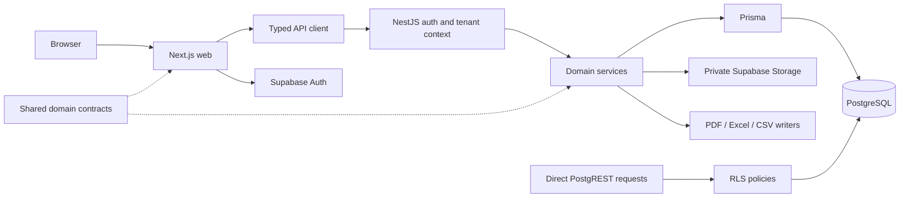

# TonyAI — Updated Project Status, Architecture Review and Launch Roadmap

**Assessment date:** 2026-09-27

**Code baseline:** local `main`, commit `410a259` (merge of PR #132).

**Planning baseline:** the working-tree launch decisions dated 2026-09-21.

**Decision:** **NO-GO for real-customer production today. Proceed with controlled, clearly labelled staging after the staging gate below.**

This is an evidence-based assessment and proposed delivery plan, not a record of completed remediation. No application code, database data, cloud resources or existing planning documents were changed during this review. The pre-existing edits to `CLAUDE.md`, `README.md` and `project-status.md` were preserved. Repository policy requires this document to be English; the accompanying user-facing summary is Turkish.

## 1. Executive assessment

TonyAI has a functioning, substantial MVP. Authentication, tenant-scoped APIs, subsidiary/location management, calculation snapshots, review, period locking, evidence, bulk import, completeness views, targets/intensity, audit viewing and three export formats already exist. The modular monolith is appropriate for the pilot. There is no evidence that a microservice rewrite, a second analytics backend or a general-purpose job platform would improve launch readiness now.

The gap is between **feature availability** and **reliable operation with authoritative customer data**. The existing plan correctly identifies authoritative factors, onboarding, localisation and cloud deployment. This review adds several material integrity gaps that must be part of that critical path:

1. Several business mutations and their audit entries commit separately. An audit failure can leave a successful mutation behind a failed API response.
2. Lifecycle checks and writes are not consistently protected against concurrent requests. A delayed review operation can overwrite an approval.
3. A report reads its totals, status and ledger independently. It has neither a consistent database snapshot nor a durable identity for a final issued dataset.
4. Report approval is derived from the statuses of existing records, not from the completeness of the declared inventory. One approved record can yield an `approved` report.
5. The documented RLS safety net does not protect the owner-backed Prisma path from a missing tenant predicate. In addition, an erroneous cross-organisation access grant is treated differently by the API guard and the direct database policies.
6. Reporting year and scope are not a single product-wide context. The emissions page can display all-year absolute totals alongside a single-year intensity view; selectable years stop at 2026.
7. Database backup alone cannot restore evidence and import-source files. The launch plan needs an end-to-end recovery exercise, not only PITR configuration.

**Keep the accepted pilot scope:** one real holding company; UK and Türkiye; applicable Scope 1 and Scope 2 sources, including mobile combustion and refrigerants; Turkish and English; all four roles; onboarding without ad hoc database edits. Scope 3, suppliers, sharing, advanced analytics and dark mode remain outside the pilot.

**Dates remain conditional targets:** staging 2026-10-11, pilot 2027-01-08, existing contingency through 2027-02-15. The 2027-03-31 GA date is an aspiration pending pilot evidence and a defined GA scope. Merged PR counts are not a reliable measure of the remaining engineering effort or domain validation.

## 2. Scope, method and confidence

The review covered the 24 existing documents under `docs/`: 16 product/design documents, four technical documents, three UAT documents and the roadmap/history document. Appendix A maps every document to the assessment. Active requirements and decisions were reconciled with implementation; the long historical status/session log was used to distinguish delivered work, superseded proposals and deliberately deferred decisions. Historical test claims were not treated as fresh verification.

Code inspection covered both applications, shared contracts, Prisma models and migrations, seed/bootstrap tooling, authentication/RLS, calculation and aggregation paths, lifecycle/evidence/import/report services, frontend state, Docker configuration, CI workflows and test setup. This is a repository-wide architecture review with deeper inspection of launch-critical paths, not a line-by-line security certification of every source file or dependency.

Evidence labels used below:

- **Verified:** directly observed in code/configuration or in the commands run during this review.
- **Service reproduction:** actual compiled application service methods exercised with controlled in-memory dependencies; no database writes.
- **Static risk:** a reachable failure ordering inferred from code, not reproduced against live PostgreSQL in this session.
- **Unverified externally:** Azure/Supabase cloud configuration, deployed versions, GitHub protection settings, customer readiness and legal/factor approvals were not inspected.

No live API/browser, E2E, RLS, penetration, load or restore tests were run in this assessment. Existing cloud resources may exist outside the repository; the absence of deployment code is not proof that no cloud project exists. The local baseline does not include a later fix simply because a roadmap references its PR number. In particular, the `_xHHHH_` follow-up referred to as #133 is not established as delivered by this checkout.

### Fresh verification results

| Check | Result | Interpretation |
|---|---|---|
| `pnpm test` | **1,982 passed:** API 1,579; web 280; shared types 82; DB tooling 41. Six successful tasks, zero cached. | Strong regression baseline; does not prove transaction isolation or cloud readiness. |
| `pnpm typecheck` | **Passed**, including the separate E2E TypeScript check. | Six successful tasks; two prerequisite tasks cached. The API does not enable the full TypeScript `strict` family. |
| `pnpm build` | **Passed on retry**, four successful tasks; three cached. | First attempt failed fetching Google Fonts in the restricted network; the permitted retry compiled Next.js successfully. This was a build check, not a deployed login/container smoke test. |
| `pnpm lint` | **Failed in this working directory:** 7,785 errors and six warnings. | The root scan traverses ignored `.claude/worktrees/` checkouts, including generated code. This is not 7,785 defects in the primary application. |
| `pnpm exec eslint . --ignore-pattern '.claude/worktrees/**'` | **Zero errors, six React hook warnings.** | Confirms the worktree-scanning problem. The standard command still needs a permanent ignore fix. |
| Controlled service probes | **Three gaps reproduced**, described below. | Used real service methods with mocked persistence; not a substitute for PostgreSQL integration tests. |
| Full E2E and RLS | **Not rerun.** | The repository records 116 E2E tests and 42 RLS checks from earlier work. Those are historical evidence only. |

The service probes showed:

- Start `startReview()` on a submitted record and pause it at the period check; complete `approve()`; resume the first request. Final state becomes `under_review`, after having been `approved`. Both updates use only `{ id }` as their predicate.
- Make the audit writer throw during `approve()`. The method rejects with the simulated audit error while the mocked persisted record is already `approved`.
- Call `ReportsService.meta()` with a single approved record. It returns `status: approved`, `incompleteRatio: 0`, with no inventory-obligation input.

## 3. Architecture that should be retained

The Prisma and direct PostgREST paths have different enforcement boundaries. The diagram deliberately does not put RLS in front of owner-backed Prisma as if it applied the end user's permissions automatically.

Strengths worth preserving:

- The web client uses a central API layer; shared types are a common contract rather than a separate frontend model.
- Tenant access is computed from the server-side profile, with default-deny behaviour for organisation-less users. The API guard intersects data-entry grants with the user's organisation.
- Calculation results retain factor/version/conversion provenance. Read paths do not simply recalculate history using today's factor library.
- Missing calculations have an explicit representation, and withdrawn records remain available for disclosure rather than disappearing from history.
- Bulk import reuses the single-record domain path. Bounded parsing, dry runs, source retention, batch identity and shared evidence have already received substantial implementation work.
- Composite foreign keys prevent evidence links crossing subsidiary boundaries. The custom record uniqueness index handles null locations and excludes withdrawn rows.
- Export formats share column definitions and include withdrawal disclosure. CSV formula neutralisation and UTF-8 handling are implemented.
- CI contains real RLS checks, unit/type/build checks and container builds. Structured logs, request IDs and optional Sentry integration are present.

Recommended evolution: keep NestJS modules and PostgreSQL transactions; strengthen invariants at the existing boundaries. Add a small persisted job/outbox mechanism only for operations that require recovery across database/storage/email boundaries. Introduce queues, caching or additional services only after measured capacity or delivery semantics justify them.

## 4. Capability status

| Area | Current evidence | Pilot readiness |
|---|---|---|
| Authentication and role-aware access | Supabase JWT verification, profile lookup, scoped services, four canonical roles | Partial: user lifecycle, revocation and complete four-role acceptance remain. |
| Organisation hierarchy | Subsidiary/location CRUD and control panels | Partial: top-level tenant provisioning and reporting-boundary semantics remain. |
| Calculation | Working prototype engine and immutable stored snapshots | Blocked: authoritative factors, model dimensions, release ordering and sourced conversions. |
| Record workflow | Draft, submission, review, approval/rejection, withdrawal and period locks | Blocked: audit atomicity and concurrent transition integrity. |
| Evidence and import | Private storage, signed downloads, many-to-many evidence, CSV/XLSX and import batches | Partial: lifecycle races, cross-service recovery, retention and outstanding escape handling. |
| Completeness | Location/month tracking, review-aware cell status, missing-data drill-down | Partial: report status, applicability and effective reporting boundaries do not share a complete model. |
| Analytics and intensity | Live backend aggregation, targets and denominators | Partial: year/context consistency and some group-denominator semantics. |
| Reports | Live PDF, Excel and CSV; factor and withdrawal disclosure | Blocked for final issuance: consistent snapshot, completeness semantics and dataset identity. |
| Turkish/English | Language field exists | Missing end-to-end localisation and explicit numeric-input policy. |
| Cloud delivery | Dockerfiles and CI builds; Azure plan | Deployment automation and deployed-environment evidence absent from this checkout. |
| Operations | Logging and Sentry hooks; storage reclamation tooling | Alerts, capacity limits, restoration and incident/rollback exercises unproven. |
| Product acceptance | Round-1 feedback and round-2 catalogue | No completed current-release sign-off found; round-2 scope is stale. |

## 5. Prioritised findings

Priority here is a **launch-readiness classification**, not a CVSS score: **P0** means unacceptable for real inventory use; **P1** means required before pilot opening, or a precisely scoped and explicitly accepted limitation; **P2** means scheduled maintenance or post-pilot work. Owners are suggested responsibilities, not assigned people.

### F01 — P0: Authoritative calculations need a richer model before factor import

**Evidence — verified:** `packages/db/prisma/seed.ts:119` labels the factor source as prototype/demo. `apps/api/src/calculations/normalization.ts:59` documents the unsourced `11.36` volume-to-energy assumption. `calculations.service.ts:90` orders factor versions lexicographically. `packages/db/prisma/schema.prisma:446` keys factors by category, geography, year and string version; it lacks an explicit gas/fuel subtype, reporting basis and structured publication/licence metadata.

**Impact:** loading real values alone cannot fulfil the pilot's mobile-combustion/refrigerant requirements. Multiple gases, fuel variants or Scope-2 bases cannot safely be selected through the current key. A category-only activity uniqueness key also needs an explicit policy for multiple fuels/meters within one reporting period. Lexical ordering can select `2024.2` over `2024.10`.

**Required:** define the supported inventory and factor dimensions first; category-aware units; sourced and versioned calorific/conversion assumptions; explicit publication/release ordering; source URL, publication date, licence and review provenance; reporting-year/factor-year policy; Scope-2 basis and GWP methodology where applicable. Keep factor releases append-only. Do not overwrite old approved snapshots or silently substitute latest-year factors.

**Acceptance:** source-derived golden examples cover every applicable pilot source/geography/year/unit; `2024.10` outranks `2024.2`; distinct fuels/gases remain distinct; historical snapshot hashes stay unchanged after an import; production rejects unsupported coverage and contains no demo tenants, credentials, factors or prototype conversion paths. Preserve demo rows only in environments/history where they legitimately already exist. **Owner:** backend + carbon-accounting domain reviewer. **Already planned, sharpened here.**

### F02 — P0: Business writes and audit writes are not consistently atomic

**Evidence — verified and service reproduction:** `activity-records.service.ts:715`, `:754`, `:873`, `:889`, `:927` and `:1290`; `evidence.service.ts:389`, `:443` and `:489`. Record creation/update/transition and several evidence mutations audit after the database mutation. Record removal uses a transaction for row locking/deletion but audits afterwards. Some other paths, including period locking, already audit inside a transaction; the gap is inconsistent adoption.

**Impact:** an audit failure leaves an unaudited mutation, potentially with a 500 response. Retrying can produce conflicts or a misleading bulk-import result. Append-only storage does not guarantee a complete trail.

**Required:** put the business mutation and mandatory audit insert in one database transaction using the same transaction client. Separate external blob/email side effects into recoverable work; do not make database integrity depend on a later network call. Define retry/idempotency semantics for imports and lifecycle mutations.

**Acceptance:** inject an audit failure into create, update, submit, approve, reject, void, delete and evidence mutations. No successful business mutation may remain without its audit row. A retry must produce one logical mutation and a coherent response. Use an actual PostgreSQL integration test for rollback proof. **Owner:** backend. **Additional critical-path finding.**

### F03 — P0: Lifecycle, period and evidence checks can race

**Evidence — service reproduction for review/approve; static risk for the other orderings:** `activity-records.service.ts:1030`, `:1051`, `:1251`; `period-locks.service.ts:119` checks pending reviews before its transaction; `evidence.service.ts:423` checks mutability before deleting a link. Only the void transition adds the expected status to its update predicate. Existing row locks protect some delete/upload races but do not establish one protocol across all mutations.

**Impact:** a late `startReview` can regress an approval; a stale draft edit can change data accepted by another request; submit can race period closure or removal of the last required evidence. The comment claiming other transition windows are harmless does not hold for the reproduced interleaving.

**Required:** establish a common concurrency protocol: re-check state and authorisation inside the transaction; expected-state/version compare-and-set or row locking; one serialisation mechanism for every writer of a period, including creation when there is no period-lock row yet; deterministic lock ordering for multi-record evidence operations. Map conflicts to an explicit retry/refetch response. A transaction alone at default isolation is insufficient if checks still run outside it or unrelated writers never acquire the same lock.

**Acceptance:** PostgreSQL race tests cover review/approve, edit/submit/approve, submit/period-lock, create/period-lock, detach/submit and shared-file deletion/approval. No invalid final state or audit transition is possible; a losing operation returns a conflict. **Owner:** backend + QA. **Additional critical-path finding.**

### F04 — P0: A generated report has no single consistent data snapshot

**Evidence — verified structure, static concurrency risk:** `reports.service.ts:211` reads summary, metadata and subsidiary names through separate calls, then loads counted and withdrawn records separately at `:261`. The shared aggregation logic is useful, but no shared repeatable-read dataset spans these reads. Report audit rows do not identify a retained issued dataset.

**Impact:** an approval or withdrawal during generation can make summary totals disagree with ledger rows or disclosure counts. Re-downloading a report later can produce different content under the same apparent year/template selection. Immutable individual calculations do not make the report itself reproducible.

**Required:** assemble one `ReportDataset` from a consistent database read and derive totals/meta/factor lists from that dataset. Complete the database read before expensive PDF rendering. Capture dataset/generation ID, timestamp, filters, tenant/reporting boundary, methodology/factor releases and a content fingerprint. For a final issued report, retain either the immutable dataset plus renderer version or the resulting artefact under an agreed retention policy. This is a proposed extension to the earlier decision that audit rows alone were sufficient; report sharing remains out of scope.

**Acceptance:** concurrent changes during generation cannot alter equality between ledger sums and summary totals; PDF/Excel/CSV for one dataset reconcile; an issued report can be identified and reproduced or retrieved. Preview is explicitly live/draft when it is not the issued dataset. **Owner:** backend + domain reviewer. **Additional critical-path finding.**

### F05 — P0: Approval, completeness and reporting coverage are conflated

**Evidence — verified and service reproduction:** `reports.service.ts:134`–`:189` only groups existing records by status. It does not receive expected location/month/category obligations. `Subsidiary.includedScopes` is stored and returned by subsidiary CRUD but is not used by the inspected emissions/report aggregation paths. Scope-3 totals default to numeric zero. The UAT catalogue itself describes many missing matrix cells while the seeded report is approved.

**Impact:** a reviewed subset can appear to be a complete inventory. A missing source, an excluded scope and a measured zero are different facts. The current warning ratio cannot count a record that was never created.

**Required:** separate `reviewStatus`, coverage/completeness and calculation/provenance quality. Establish per-tenant/year source applicability, explicit exclusions and their reasons. Show Scope 3 as not covered for the pilot. A final report must declare its boundary and unresolved gaps; approving individual records must not automatically certify the inventory.

“Complete Scope 1 & 2” must mean all applicable sources for the actual pilot holding. Adding mobile combustion and refrigerants does not by itself demonstrate coverage of every possible industrial or purchased-energy source. Confirm applicability with the domain owner; do not advertise unsupported sources as zero.

**Acceptance:** a one-record year is not declared complete; missing applicable periods prevent final issuance or produce an explicitly accepted partial report; genuinely not-applicable categories do not artificially lower completeness; dashboards, entry screens and all exports explain the same boundary. **Owner:** product/domain + backend/frontend. **Expanded beyond the existing Scope-3 label task.**

### F06 — P1: Tenant isolation has an overstated database safety net and a grant invariant gap

**Evidence — verified:** `auth/auth.guard.ts:85`–`:125`, `prisma/prisma.service.ts:1`, `20260630204830_rls_policies/migration.sql:8` and `:96`, and `schema.prisma:431`. The documented owner-backed Prisma path does not set an end-user database/JWT context. The guard computes accessible IDs; service queries still have to apply them. The RLS explicit-grant branch checks the grant but does not also require the profile and subsidiary to belong to the same organisation. The access table does not enforce that cross-table invariant.

**Impact:** RLS is useful for direct PostgREST clients, but it does not automatically catch an omitted tenant predicate on the owner-backed API path. A stray cross-organisation grant can be refused by the API's intersection while being accepted by direct RLS. This review did not demonstrate a normal API tenant leak or that an ordinary user can create such a grant today.

**Required:** document the real trust boundary; introduce a least-privilege runtime database role separate from migration administration; centralise tenant-scoped access patterns and test every externally reachable path. Enforce same-organisation grants in both policy and write/database invariants before exposing role/access management. Give runtime audit access only the operations it needs. Do not simply enable `FORCE RLS` on the existing connection: role privileges and user context must be designed together.

**Acceptance:** two real organisations, all four roles, foreign IDs and a deliberately malformed access grant are exercised through API and direct PostgREST. Removing a tenant predicate must fail a discriminating test. Verify actual deployed runtime privileges. PostgreSQL documents the owner/BYPASSRLS distinction in its [row-security documentation](https://www.postgresql.org/docs/17/ddl-rowsecurity.html). **Owner:** backend/security. **Threat-model correction and onboarding prerequisite.**

### F07 — P1: Tenant provisioning and the complete user lifecycle are missing

**Evidence — verified:** the auth module exposes the current profile, while `Profile` has role/language/organisation fields without a product-level disabled/revocation state. There is no complete organisation-create/invite/reset/role-management onboarding flow in the inspected API/web. Seeded demo users do not establish customer onboarding.

**Required:** an audited operator provisioning boundary for creating an organisation and its first administrator; tenant-admin invitations, acceptance, password reset, role/access changes and account disabling. Make partial Auth/profile/invite failures recoverable. Tenant `super_admin` is not a platform-wide superuser. Explicitly define whether multi-organisation consultants are unsupported in the pilot; the current profile belongs to one organisation.

**Acceptance:** a new holding and all four roles can start, reset credentials, change access and leave without direct DB edits. Disabling a user denies subsequent API requests despite a previously issued token, under the selected revocation design. Cross-tenant invitations and privilege escalation fail; administrative changes are audited. **Owner:** full-stack + security. **Already planned.**

### F08 — P1: Reporting year is inconsistent across screens and stops at 2026

**Evidence — verified:** `apps/web/lib/store.ts:1` stores authentication only. `apps/web/app/emissions/page.tsx:202` calls summary without a year and loads the full record history, then derives an intensity year from the maximum record/default year at `:247`. `packages/shared-types/src/index.ts:275` has a fixed 2015–2026 list. Dashboard and reports have their own year choices/defaults.

**Impact:** after a second year is populated, annual reports, absolute totals and intensity can answer different questions. A January 2027 pilot may legitimately report 2026, but it must not be unable to select 2027 or silently treat all years as one inventory.

**Required:** one explicit reporting context (year, subsidiary/reporting entity and applicable filters), persisted in a shareable URL or consistent state. Thread it through all API calls, export requests and refreshes. Keep supported year selection separate from factor availability; unsupported factor coverage must remain an explicit refusal.

**Acceptance:** a two-year/two-subsidiary fixture reconciles dashboard, emissions, intensity and reports for each selection; 2027 rollover is tested. **Owner:** frontend + API contracts. **Additional critical-path finding.**

### F09 — P1: Localisation includes numeric correctness, not only translated labels

**Evidence — verified:** `Profile.language` exists but the end-to-end i18n system does not. The web displays many API `message` strings directly. The import grammar deliberately rejects comma-based numbers; a text value `1.234` is still a valid decimal even if a Turkish user intended 1,234 units.

**Required:** build the catalogue/error-code foundation before invitations and new factor forms. Define UI numeric input separately from the canonical numeric wire representation. Declare the CSV numeric grammar and give a clear preview; preserve actual numeric XLSX cells. Add a report-language option/policy, locale-aware display, emails and reviewed carbon-accounting terminology. Never reinterpret historic numeric values during localisation.

**Acceptance:** TR/EN lifecycle and exports are usable; `1.234,5`, `1,5`, `1.234`, negative/zero values and XLSX numeric/text cells have explicit, tested outcomes. A locale change cannot change stored quantities. **Owner:** frontend/full-stack + Turkish domain reviewer. **Already planned.**

### F10 — P1: Release checks do not yet prove the artefact being deployed

**Evidence — verified:** `.github/workflows/ci.yml` runs RLS per PR and builds Docker images with `push: false`; it does not start those images. `e2e.yml` runs nightly/manual, not on PRs. Root ESLint ignores omit nested worktrees. The status log reports historical branch-protection limitations; current GitHub account settings were not checked.

**Required:** fix the standard lint scope; add container startup/login/report smoke tests with realistic environment settings; run critical tenant/lifecycle/report acceptance on the exact release candidate. Full E2E need not run on every small documentation push, but a release must not rely on an unrelated nightly result. If branch protection is unavailable, use an explicit release checklist and exact-commit evidence until a technical gate is available.

**Important cloud-probe gap:** `scripts/rls-probes.mjs:48` hardcodes demo accounts and subsidiary IDs and creates fixture data; E2E setup performs cleanup and seeds a fixture factor. Do not point local test tooling or `db:seed` at customer production. Build an environment-aware isolation test using dedicated synthetic tenants, credentials and tightly scoped cleanup. The existing “run probes against prod” roadmap item needs this prerequisite.

**Acceptance:** exact candidate SHA, migrations, dependency lockfile and image digest are recorded; startup and smoke pass against the candidate image; both tenant isolation and critical browser flow results are attached; no demo seed or broad cleanup can target production. **Owner:** DevOps + QA. **Expanded existing CI task.**

### F11 — P1: Cloud deployment, readiness and rollback remain unproven

**Evidence — verified in repository, cloud unverified:** Dockerfiles and a deployment design exist; no `infra/` implementation or deployment workflow is present. `apps/api/src/health.controller.ts:9` always returns process health. It does not establish database readiness. The web embeds `NEXT_PUBLIC_*` at build time. The evidence many-to-many migration is an example of a schema change older binaries cannot necessarily consume.

**Required:** codify the accepted Azure/Supabase staging design, environment separation, managed identities/OIDC, secret references, private buckets, Auth redirects, signup policy and CORS. Pin cloud auth configuration. Separate process liveness from bounded dependency readiness and an authenticated synthetic flow. Test the complete migration chain on fresh and representative previous databases. Use compatible expand/contract migrations or an explicit maintenance window; an image rollback is not automatically a database rollback.

**Acceptance:** staging can be recreated from versioned configuration; both private storage buckets work; deployment smoke passes; wrong auth configuration fails safely; readiness responds to DB loss; a rollback is rehearsed using an identified previous image and a compatible schema/data plan. Validate web build arguments per environment. **Owner:** DevOps + backend. **Already planned, with stronger operational gates.**

### F12 — P1: Disaster recovery must include file bytes and configuration

**Evidence:** the roadmap plans PITR/restore, but no executed recovery evidence was found. Evidence and retained import sources are external storage objects referenced by database rows. Supabase explicitly states that database backups do not include the stored file bytes: [Supabase backups](https://supabase.com/docs/guides/platform/backups).

**Required:** define business-approved RPO/RTO; protect database, evidence, import-source files and the configuration needed to restore access. Include bucket policies, Auth settings and secure secret recovery/rotation procedures. Inventory objects and verify checksums; coordinate reclamation jobs with backup/restore so restored references are not immediately reclaimed or left dangling.

**Acceptance:** restore into an isolated environment and reconcile record/audit counts, factor snapshots, evidence links, source-file availability and checksums; log in and generate a reconciled report. Measure elapsed recovery time and recovered-data age against the agreed RTO/RPO. **Owner:** DevOps + product/data owner. **Expanded existing DR task.**

### F13 — P1: Resource protection is incomplete for public deployment

**Evidence — verified:** `app.module.ts:31` configures an in-memory throttler but only bulk upload opts into its guard; `main.ts` has no Helmet setup. Record lists are unpaginated. PDF rendering shares a browser without an explicit application-wide concurrency budget. The API image copies the builder tree, including development material, into runtime.

**Required:** security-header/CSP policy compatible with the application; endpoint-sensitive rate and size limits; correct proxy/IP handling; bounded pagination; PDF concurrency/timeout and memory limits; reviewed DB connection pool budgets. Choose shared throttling when scaling horizontally, or record and enforce a single-replica pilot limit. Keep the synchronous bounded importer unless measurements show it needs a worker. Slim the runtime image and add a process reaper where appropriate for Chromium.

**Acceptance:** load tests on production-shaped containers demonstrate agreed p95, error-rate and memory budgets for the pilot dataset; imports/PDFs cannot starve normal reads; overload receives a controlled refusal. Separate cold-start measurements from steady-state throughput. Numeric budgets must be agreed before the test, not selected after observing results. **Owner:** DevOps/backend. **Already partly planned.**

### F14 — P1: Database and file operations need recoverable failure semantics

**Evidence — verified structure, static failure risk:** `evidence.service.ts:484` deletes the blob before deleting its database row. If the latter fails, surviving metadata can point to missing bytes. Upload and deletion also span database, Storage and audit operations. The existing orphan-reclamation tool handles part of the opposite failure direction; it cannot reconstruct lost bytes. `assertFile` checks declared MIME and size, not file-content classification.

**Required:** define file states and retryable cleanup, with a database intent/outbox or equivalent durable record before irreversible external effects. Coordinate this with F02/F03. Store content hashes where evidence identity matters. Specify content validation, allowed download behaviour and a risk-based scanning/quarantine policy. Retained import files need their own access/retention/deletion rules rather than inheriting assumptions from evidence.

**Acceptance:** inject failure after each storage/DB boundary; no approved record loses its only evidence silently; pending cleanup is observable/retryable; hash checks and a reverse reconciliation detect missing objects, not only orphans. **Owner:** backend + operations. **Additional critical-path finding.**

### F15 — P1: Inventory boundaries and governance decisions must be closed before customer data

**Evidence — verified current contracts and existing open decisions:** activity uniqueness separates company/location and monthly/quarterly/annual tuples; coexistence is deliberate, so both can contribute to totals. Location-based completeness uses locations existing by year-end, without effective operating dates per month. Group intensity sums compatible units without a full intercompany/commodity boundary model. Current permissions allow `super_admin` self-approval and some non-author draft submissions; a rejected record can remain inside a locked period.

**Required product/domain decisions:**

1. Define whether company-level values include site values, whether different reporting granularities overlap, and how one physical activity contributes exactly once. Do not introduce a blanket rejection that reverses the user's accepted coexistence decision; choose and document attribution semantics first.
2. Declare which sites/categories/months are applicable, including mid-year openings/closures and boundary changes. Snapshot or version the boundary used by a final report.
3. Decide segregation of duties, draft-submission ownership, and whether unresolved rejected records prevent closure.
4. Specify the pilot correction procedure: audited unlock/withdraw/re-entry can be a controlled limitation; linked revisions and restatement lineage remain a separate feature unless the pilot requires them.
5. Define retention, access removal and handling of personal information in immutable audit diffs and free-text withdrawal reasons. Record a reviewed policy; this audit does not make a legal-compliance determination.
6. Restrict group intensity to meaningful denominators, or qualify the commodity/consolidation basis so equal units do not mask double counting.

**Acceptance:** signed decision records, coherent UI/report disclosures and tests for the chosen semantics. A limited pilot can explicitly exclude an unsupported scenario; it cannot silently present it as supported. **Owner:** product + domain/compliance reviewer + backend. **Mostly existing decisions, consolidated and extended.**

### F16 — P1: UAT and the documentation no longer describe one release

**Evidence — verified:** `uat_round2.md` still excludes bulk upload and executive-viewer testing and records older test counts. Bulk upload, batches and shared evidence are now implemented. Technical/design documents describe consultant approval, older routes, frontend-only architecture or planned libraries as current; the code follows later decisions. Active status summaries still mention old seed counts. Sign-off fields are not evidence of completed acceptance.

**Required:** refresh one pilot acceptance catalogue against the candidate build; cover all four roles, two organisations, imports/shared evidence, year selection, partial reports, corrections and TR/EN. Trace the 16 round-1 feedback items to delivered evidence, pilot work or an accepted exclusion. Keep legacy design/history labelled as such. Record current decisions once and link to them.

**Acceptance:** each pilot requirement has an owner, test, result and candidate version; named product/domain approvers close the round; no unresolved critical/high defect remains. Separate internal demo acceptance from customer acceptance. **Owner:** product + QA. **Already needed, currently incomplete.**

### F17 — P1: The filed XLSX escape issue is still relevant to this baseline

**Evidence — verified code and historical finding, not freshly reproduced end to end:** `apps/api/src/bulk-upload/xlsx-reader.ts:376` decodes `_xHHHH_` sequences; the current status log explicitly records decoded NUL/lone-surrogate handling as follow-up #133. Byte-level UTF-8 validation does not prove the decoded text is safe for every downstream storage field.

**Required:** verify the final fix on the release candidate, preserving valid surrogate pairs and the intended header-refusal behaviour. Keep this bounded to data fidelity and failure handling; do not restart a general parser rewrite.

**Acceptance:** shared and inline strings with valid emoji, escaped controls and unpaired surrogates have explicit outcomes; refused input cannot partially corrupt a saved row or audit trail. Refresh the bulk UAT cases after the fix. **Owner:** backend + QA. **Existing outstanding follow-up.**

### F18 — P2: Maintainability needs targeted work, not a launch rewrite

Large page/service files and the broad `shared-types/src/index.ts` concentrate change risk. The API's tsconfig does not enable full `strict`, and stale mock modules coexist with real implementations. Documentation has grown into a large historical log with contradictory live summaries.

Incrementally extract domain-specific contracts, workflow policy/transaction helpers and smaller page components when touching those areas. Tighten compiler options in a separately scoped change; keep dependency-boundary lint rules. Remove demonstrably unused mock modules, and archive old design text with clear status headers. Do not spend the launch window splitting every file, introducing CQRS/event sourcing, replacing the custom parser or adding a Python service without a concrete need.

**Acceptance:** each cleanup reduces a demonstrated maintenance risk and preserves behaviour. This work is not a prerequisite to staging, except the lint-scope fix in F10. **Owner:** engineering.

## 6. Revised route to launch

### Delivery principles

- Keep the 2026-09-21 scope decisions. Add the integrity work above to the critical path instead of waiting until a final hardening week.
- Staging may host labelled demo data while authoritative factors are being validated. A staging milestone is not production approval.
- One primary developer has one implementation capacity. Domain review, access procurement, tester scheduling and external assessment can proceed concurrently; a roadmap with overlapping rows does not create several engineering teams.
- Use small, coherent changes with failure-path tests. Prioritise accepted inventory integrity over a large count of cosmetic or documentation PRs.
- Estimate from reviewed work packages and actual gate completion. Keep a contingency window; do not promise a precise completion percentage from feature/test counts.

### Milestones and exit evidence

| Stage | Proposed window | Work and dependencies | Exit evidence |
|---|---|---|---|
| A — Freeze pilot contract and close immediate integrity defects | 2026-09-28 to 2026-10-11 | F02/F03 design and implementation; verify #133; select report/boundary decisions; refresh critical UAT; fix lint scope. Start factor source/licence review and external review scheduling immediately. | Atomic rollback tests and real-DB race tests; explicit decisions; candidate UAT catalogue. If this overruns, keep customer data out of staging. |
| B — Reproducible staging | Target 2026-10-11; conditional on access and deployment work | Supabase staging, private buckets, Azure configuration, images, OIDC/secrets, migrations, runtime smoke and alerts. Can use clearly labelled demo factors. | Recreate/deploy/login/import/review/export flow works on the staging URL; image/config version recorded; isolated tenant probes; rollback exercise. |
| C — Product foundation | 2026-10-12 to 2026-11-08 | F06/F07 tenant invariants and lifecycle; F08 reporting context; F09 i18n foundation before new screens/emails; F04/F05 report dataset and coverage contract. | A holding and four users onboard without DB edits; years/scope agree across screens; consistent draft/final report semantics. |
| D — Authoritative inventory | 2026-10-12 to 2026-11-22 | F01 dimensions/conversions first, then reviewed UK/TR factors and mobile/refrigerant forms; F15 inventory/governance decisions. Authoritative import follows the model, never precedes it. | Golden source examples, declared applicability, released factor versions, unchanged historical snapshots, no demo calculation path in production configuration. |
| E — Complete localisation and pilot UAT | 2026-11-02 to 2026-11-29 | Finish TR/EN screens, errors, reports and emails; test numeric conventions and imports; close current-release feedback. | Four-role/two-tenant TR/EN sign-off on the exact candidate, with source-supported report reconciliation. |
| F — Production qualification | 2026-11-30 to 2026-12-20, only after C–E | F10–F14 release, capacity, security assessment/retest, DB+Storage recovery, secret rotation, production provisioning and reviewed policies. | Candidate release evidence; no unresolved critical/high issues; measured recovery/capacity; environment and incident runbooks. |
| G — Controlled pilot opening | 2026-12-21 to 2027-01-08 | Import a validated initial inventory, reconcile totals with the domain owner, train users and open one holding. | All go-live checks below pass; owner available for support; rollback and customer communication paths agreed. |
| Contingency | Through 2027-02-15 | Reserved for factor/licensing, integrity rework, acceptance, security retest or operational failures. | Same gates, no reduced correctness bar. |
| H — GA planning and expansion | After pilot stabilisation; 2027-03-31 remains provisional | Decide multi-tenant operational capacity, support/commercial model, then Scope 3, sharing, suppliers and advanced analytics in dependency order. | Defined GA scope and measured pilot operation; pilot success alone is not delivery of all postponed features. |

These windows overlap for sequencing and external review; they are not additive staffing commitments. **2027-01-08 is plausible only if the newly identified integrity work is absorbed early and factor/domain approvals progress on time.** If staging is still unverified on 2026-10-11, rebaseline the pilot date rather than consuming all qualification time. A cloud deployment alone does not resolve the newly identified data-integrity work.

### First ten working days: concrete queue

1. **Baseline and decisions:** record candidate SHA, current tests and F01–F17 owners; decide report finalisation/partial-report meaning and the period concurrency protocol. Confirm the real pilot source inventory with its domain owner.
2. **Atomic mutation slice:** implement business-write/audit transactions for the main record lifecycle, prove rollback, then extend the same contract to evidence and remaining writes. Keep external storage operations out of long database transactions.
3. **Concurrency slice:** add expected-state/version checks and the shared period/evidence locking protocol, with deterministic PostgreSQL interleaving tests. Do not rely solely on mock assertions.
4. **Staging foundation:** codify environment creation, private buckets, exact-image startup, migration and smoke checks; isolate synthetic fixtures from real data. Allocate explicit engineering time rather than assuming this is free parallel work.
5. **Report contract slice:** define the consistent dataset and three separate status dimensions: review, coverage and provenance. Agree the final-artifact retention/identity policy before implementation.
6. **UAT and source procurement:** verify #133, update the bulk/evidence cases, arrange testers, obtain factor source/licence decisions and schedule the external security review. Begin the i18n catalogue/error-code convention before new customer-facing flows.

Review progress by closed acceptance criteria at the end of the ten days. If F02/F03 remain open, continue their correction before any real customer inventory is entered. If cloud access is delayed, the integrity and factor-model work can still proceed locally.

## 7. Go/no-go checklists

### Staging gate — controlled demo/UAT use

- [ ] Candidate SHA and environment configuration are identifiable and reproducible.
- [ ] Authentication works with intended cloud settings; no insecure-local-auth override or public service key.
- [ ] Both evidence and import-source buckets are private; signed download paths work.
- [ ] Migrations run on a clean staging project; tenant isolation is exercised using dedicated fixtures.
- [ ] The deployed containers start and pass login → entry → evidence → review → report smoke.
- [ ] Demo factors/data and non-final report status are visible; no customer is told these figures are authoritative.
- [ ] Alerts reach a named operator; rollback is documented and exercised.
- [ ] UAT instructions match the deployed build; destructive local reset/cleanup commands cannot target customer production.

### Production pilot gate — all required before opening

| Gate | Required evidence | Accountable responsibility |
|---|---|---|
| Inventory integrity | F02/F03 rollback and real-DB concurrency tests pass; auditable corrections and retry semantics demonstrated. | Backend lead + QA |
| Factor authority | Source/licence review, methodology/boundary approval, golden tests and production no-demo check. | Carbon-accounting domain owner |
| Report reliability | Single dataset; cross-format reconciliation; complete/partial/excluded states; identifiable issued output. | Backend + domain owner |
| Tenant isolation | API and direct database tests with two organisations/four roles, malformed grants, restricted runtime privileges. | Security/backend owner |
| Customer lifecycle | Tenant provisioning, invitation/reset, access changes, disabling and all four role journeys pass without manual DB edits. | Full-stack + product owner |
| Localisation and context | TR/EN, numeric input/import, selected year/entity and 2027 rollover acceptance pass. | Frontend + domain reviewer |
| Release and migration | Exact-candidate results, image digests, migration compatibility and rollback rehearsal. | DevOps/release owner |
| Capacity and abuse controls | Pre-agreed load/error/memory budgets pass; PDF/import overload is controlled. | DevOps/backend owner |
| Recoverability | DB + file-byte restoration, object reconciliation and measured RPO/RTO pass in isolation. | Operations/data owner |
| Security assessment | Scoped two-tenant assessment completed; high/critical findings closed and retested. | Security owner |
| Data handling | Reviewed retention, audit-diff/PII handling, processor and customer terms appropriate to the chosen operation. | Product + qualified legal/privacy reviewer |
| Product acceptance | Current candidate UAT signed off; pilot inventory reconciled; training/support and incident ownership agreed. | Product owner + pilot representative |

No unresolved P0 can be accepted by changing its label. A P1 limitation can only be accepted if the affected scenario is explicitly excluded and no security, calculation or data-integrity guarantee is misrepresented.

## 8. Operational handover and the first month

Before opening, name the person responsible for deployment, incident triage, factor releases, user administration, restoration and customer support. Document escalation and access recovery. Operational acceptance is incomplete if only the author can run the system.

During the pilot, review failed imports, review turnaround, report reconciliation, error rates, resource saturation, unavailable storage objects and restoration readiness. Reconcile the first real monthly close with an independently checked source inventory. Keep internal/test tenants separate from customer reporting. Set factor update/errata review and dependency update cadences.

Consider GA only after the pilot has completed a real reporting cycle and incident/recovery ownership has been demonstrated. Decide whether billing/subscriptions are required for GA; they are not a reason to delay a controlled contracted pilot unless its commercial arrangement depends on them.

## 9. Documentation reconciliation

The existing documents are useful evidence of product intent but do not have equal authority. Use this precedence when resolving contradictions: **dated accepted product decisions → current canonical API/domain contracts and verified behaviour → current acceptance criteria → older design/mock documents**. A current bug is not made correct merely because code differs from an older specification; record the decision or defect explicitly.

Specific corrections to schedule with the relevant work:

| Drift | Correct current framing |
|---|---|
| Frontend-only/no-backend descriptions and proposed mock architecture | Label as historical design; link to the implemented Next/Nest/Supabase architecture. |
| Consultant as an approval authority | Current consultant is review/reject-only; tenant `super_admin` approves. |
| `super_admin` described as global across holdings | Current API visibility is organisation-scoped; platform provisioning requires a separate boundary. |
| `/dashboard/*` route references | Current routes include `/`, `/data-entry`, `/emissions`, `/reports`, `/review`, `/audit` and `/subsidiaries`. |
| Original six-state workflow and one-record-per-evidence assumptions | Include withdrawal and the current subsidiary-owned many-to-many evidence model. |
| Four report templates described as delivered | Two are implemented; comparison/supplier templates are deferred. |
| Scope 3/suppliers/analytics treated as prerequisites | They are post-pilot by the 2026-09-21 decision. |
| RLS described as stopping every API scoping mistake | Explain owner-backed Prisma separately from direct authenticated PostgREST. |
| Azure credit still described as pending in some text | Accepted planning input is “approved on 2026-09-21”; actual cloud deployment remains unverified here. |
| Seed summaries of 102 records / 10 denominators | Later implementation/docs use 96 records / 12 denominators; do not use old counts as current live DB measurements. |
| Round-2 test counts and bulk/viewer exclusions | Refresh for the candidate; date counts and keep historical results clearly historical. |
| “Approved report” and “audit-ready” language | State review, completeness, calculation provenance and final-issuance status independently. |
| “PITR enabled” presented as full DR | Include evidence/source bytes and an executed end-to-end restoration. |

Keep `project-status.md` as the existing decision/history log. Use this file as the dated assessment and launch checklist; reconcile or replace it when findings close. Do not grow another parallel chronological diary. Add status/last-verified/source-of-truth headers to older specifications when touching them, rather than making every historical line appear current.

## Appendix A — Document coverage register

All 24 pre-existing files under `docs/` were included. No new document is counted as evidence for its own conclusions.

| Document | Role in this review / result |
|---|---|
| [product_overview.md](../md_docs/product_overview.md) | Holding-company product purpose, reporting audience and high-level scope. |
| [functional_requirements.md](../md_docs/functional_requirements.md) | End-to-end feature/workflow promises; revision and applicability gaps distinguished from delivered MVP. |
| [permissions_and_roles.md](../md_docs/permissions_and_roles.md) | Four-role policy and later consultant decisions; onboarding/governance acceptance. |
| [calculation_logic.md](../md_docs/calculation_logic.md) | Prototype factors and unit assumptions; basis for F01, not an authoritative production factor source. |
| [validation_anomaly_rules.md](../md_docs/validation_anomaly_rules.md) | Anomaly, mandatory evidence, workflow and future configuration requirements. |
| [api_shapes_and_state_logic.md](../md_docs/api_shapes_and_state_logic.md) | Intended global context and API flow; compared with current per-screen state. |
| [data_models_and_json_mocks.md](../md_docs/data_models_and_json_mocks.md) | Original entities/mock contracts; current Prisma/shared types supersede structural mismatches. |
| [data_entry_page.md](../md_docs/data_entry_page.md) | Reporting entity, import, evidence and form acceptance; compared with current implemented pipeline. |
| [overview_page.md](../md_docs/overview_page.md) | Tracking matrix and KPI intent; completeness and scope semantics. |
| [emissions_page.md](../md_docs/emissions_page.md) | Analytics, history, targets/intensity and filter intent; year/context gap. |
| [report_page.md](../md_docs/report_page.md) | Export/approval expectations; two-versus-four templates and final-report semantics. |
| [subsidiaries_page.md](../md_docs/subsidiaries_page.md) | Hierarchy and management UX; compared with delivered control panels and missing top-level provisioning. |
| [suppliers_page.md](../md_docs/suppliers_page.md) | Retained product intent; explicitly outside the accepted pilot. |
| [component_inventory_and_wireframes.md](../md_docs/component_inventory_and_wireframes.md) | Original screen/component scope; treated as design reference, not proof of deployed behaviour. |
| [ui_spec.md](../md_docs/ui_spec.md) | UI consistency, presentation and state requirements; localisation remains unfinished. |
| [arda_vercel.md](../md_docs/arda_vercel.md) | Historical prototype/build instructions; not authority for current backend or launch status. |
| [technical_analysis.md](../tech_docs/technical_analysis.md) | Headless monorepo rationale; stale RLS, role, tooling and phasing assumptions identified. |
| [tech_stack_ve_mimari_anlatimi.md](../tech_docs/tech_stack_ve_mimari_anlatimi.md) | Stack/deployment rationale; intent separated from current cloud evidence. |
| [carbon_dashboard_design_explanation.md](../tech_docs/carbon_dashboard_design_explanation.md) | Detailed original frontend architecture; legacy mock/global-context assumptions reconciled. |
| [yapay_zeka_takim_yapisi.md](../tech_docs/yapay_zeka_takim_yapisi.md) | Engineering responsibility model; automation/review roles do not replace domain and operational sign-off. |
| [uat_phase1.md](../uat/uat_phase1.md) | Original MVP scenarios and acceptance baseline; not proof of current candidate acceptance. |
| [uat_phase1_feedback_round1.md](../uat/uat_phase1_feedback_round1.md) | Sixteen feedback items; refrigerants/mobile combustion remain pilot work, other items trace into delivered work or explicit limits. |
| [uat_round2.md](../uat/uat_round2.md) | Most detailed acceptance catalogue; stale bulk/viewer exclusions and old measurements require refresh. |
| [project-status.md](project-status.md) | Current accepted launch decisions and extensive delivery history; historical/superseded entries separated from live blockers. |

## Appendix B — Key implementation references

Paths and line numbers refer to the assessment baseline and may move after remediation.

| Concern | Primary source |
|---|---|
| Domain/schema and tenant relationships | [Prisma schema](../../packages/db/prisma/schema.prisma) — Profile 73; Location 145; ActivityRecord 171; access 431; factors 446; audit 466. |
| Auth/tenant enforcement | [Auth guard](../../apps/api/src/auth/auth.guard.ts), [Prisma service](../../apps/api/src/prisma/prisma.service.ts), [RLS migration](../../packages/db/prisma/migrations/20260630204830_rls_policies/migration.sql). |
| Calculation provenance/resolution | [Calculation service](../../apps/api/src/calculations/calculations.service.ts), [normalisation](../../apps/api/src/calculations/normalization.ts), [seed](../../packages/db/prisma/seed.ts). |
| Mutation/audit/concurrency | [Activity record service](../../apps/api/src/activity-records/activity-records.service.ts), [period locking](../../apps/api/src/period-locks/period-locks.service.ts), [audit service](../../apps/api/src/audit/audit.service.ts). |
| Evidence/Storage boundaries | [Evidence service](../../apps/api/src/evidence/evidence.service.ts), [Storage service](../../apps/api/src/storage/storage.service.ts). |
| Reports and aggregation | [Report service](../../apps/api/src/reports/reports.service.ts), [report columns](../../apps/api/src/reports/report-columns.ts), [emissions service](../../apps/api/src/emissions/emissions.service.ts). |
| Reporting context and years | [Emissions page](../../apps/web/app/emissions/page.tsx), [auth store](../../apps/web/lib/store.ts), [shared contracts](../../packages/shared-types/src/index.ts). |
| Import fidelity | [XLSX reader](../../apps/api/src/bulk-upload/xlsx-reader.ts), [row parser](../../apps/api/src/bulk-upload/parse-rows.ts). |
| Deploy/release/runtime | [CI](../../.github/workflows/ci.yml), [E2E workflow](../../.github/workflows/e2e.yml), [API Dockerfile](../../apps/api/Dockerfile), [web Dockerfile](../../apps/web/Dockerfile), [health endpoint](../../apps/api/src/health.controller.ts). |
| Test-environment safety | [RLS probes](../../scripts/rls-probes.mjs), [E2E setup](../../e2e/global-setup.ts), [ESLint configuration](../../eslint.config.mjs). |

External verification was limited to primary technical documentation where needed. In addition to PostgreSQL row security and Supabase backup behaviour cited above, the domain owner should ground the reporting-basis decision in the applicable [GHG Protocol Scope 2 Guidance](https://ghgprotocol.org/scope-2-guidance?page=1). This report does not certify GHG/ISO conformity or legal compliance and does not establish current cloud pricing, contracts or account configuration.
